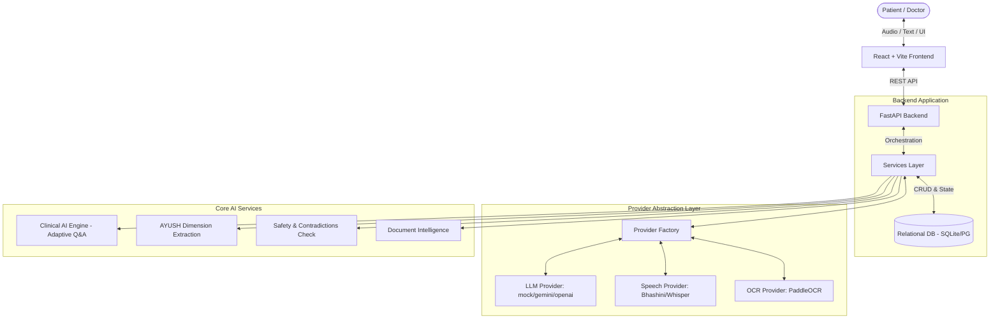

# SwasthyaVaani Backend Architecture Technical Documentation

This document provides a comprehensive, end-to-end walkthrough of the SwasthyaVaani backend based strictly on the current state of the repository. It is designed to serve as your primary technical reference for the Smart India Hackathon presentation and Q&A.

---

## 1. Repository & Architecture Overview

SwasthyaVaani is built as a decoupled, microservices-ready monolithic architecture.

### Technology Stack
* **Frontend:** React 19 + Vite + Wouter (routing) + TypeScript. Uses Tailwind CSS v4, shadcn/ui, Radix UI, and Framer Motion.
* **Backend:** FastAPI + Python (Uvicorn server).
* **Database:** SQLAlchemy ORM (SQLite for local dev/testing, PostgreSQL intended for production) managed by Alembic migrations.
* **AI/LLM Components:** Abstracted Provider Pattern. Uses a factory to switch between `mock_provider` (for testing reliability) and external providers (Gemini/OpenAI) for adaptive questioning and clinical safety validation.
* **Voice/STT/TTS:** Abstracted `speech_provider` integrating services like BHASHINI, Sarvam, or Whisper.
* **OCR/Document Processing:** Abstracted `ocr_provider` (e.g., PaddleOCR) supported by `document_intelligence` services for extracting medical context from prescriptions/lab reports.
* **Authentication:** JWT-based system implemented in `api/v1/auth.py`.
* **AYUSH Logic:** Deeply integrated into the schema via `AyushAssessmentModel` which captures the 8 *Dashavidha* dimensions (prakriti, vikriti, etc.).
* **State Management:** Backend controls conversation state (State Machine). Frontend is a "dumb terminal" rendering the current `ClinicalState`.

### High-Level Architecture Diagram

---

## 2. API Inventory

The system exposes several API endpoints categorized by domain in `backend/app/api/v1/`.

### Core Intake APIs (`intakes.py`)
* `POST /api/v1/intakes` - Initializes a new patient intake session.
* `POST /api/v1/intakes/{session_id}/answer` - **The most critical endpoint.** Receives user answers (text/audio), processes them through the `adaptive_engine`, updates the `ClinicalState`, extracts potential AYUSH dimensions, and returns the next adaptive question or terminates the session if sufficient data is gathered.
* `POST /api/v1/intakes/{session_id}/submit` - Finalizes the intake, triggering safety checks and generating the clinical summary for the doctor.

### Doctor APIs (`doctor.py`)
* `GET /api/v1/doctor/queue` - Fetches the list of pending/completed patient intakes.
* `GET /api/v1/doctor/patients/{display_id}` - Fetches the complete patient dossier, including the clinical summary, extracted AYUSH dimensions, and uploaded documents.

### Speech APIs (`speech.py`)
* `POST /api/v1/speech/stt` - Converts base64 audio from the frontend into text.
* `POST /api/v1/speech/tts` - Converts backend-generated text questions into audio for frontend playback.

### Document APIs (`documents.py`)
* `POST /api/v1/documents/upload` - Handles file uploads and triggers the `ocr_provider` and `document_intelligence` extraction pipelines.

### Interoperability APIs (`fhir.py`, `abdm.py`)
* Contains endpoints for FHIR resource generation and ABDM (Ayushman Bharat Digital Mission) compliance mapping.

---

## 3. Backend Directory Structure & File Explanations

Located under `backend/app/`:

* **`api/v1/`**: Contains the FastAPI routers. Each file (e.g., `intakes.py`, `doctor.py`) defines the REST endpoints for a specific domain.
* **`core/`**: System-level configurations.
  * `config.py`: Environment variable definitions (secrets, provider keys).
  * `database.py`: SQLAlchemy engine and session management.
  * `security.py`: Password hashing and JWT generation.
* **`models/`**: SQLAlchemy declarative base models (Database Schema).
  * `intake.py`: `IntakeSession` (the root entity).
  * `ayush.py`: `AyushAssessmentModel` (stores the 8 dimensions).
* **`schemas/`**: Pydantic models for request/response validation.
  * `clinical_state.py`: Defines the strict state machine structure for the adaptive engine.
  * `ayush.py`: Defines the AYUSH data contracts.
* **`services/`**: The core business logic.
  * **`clinical_ai/`**: 
    * `adaptive_engine.py`: Orchestrates the flow of an intake session.
    * `question_scorer.py`: Ranks the next best question to ask based on information gaps.
    * `mock_provider.py`: Deterministic fallback logic used for testing and reliability when external LLMs fail.
  * **`providers/`**: The abstraction layer implementing `base.py`, `llm_provider.py`, `speech_provider.py`, and `ocr_provider.py`.
  * **`safety/`**: `contradictions.py` and `red_flags.py` evaluate patient responses for clinical safety and escalation protocols.
  * **`document_intelligence/`**: Logic to map OCR text into structured medical history.

---

## 4. The AYUSH Engine (Deep Dive)

SwasthyaVaani deeply integrates AYUSH (Ayurveda, Yoga and Naturopathy, Unani, Siddha and Homeopathy) methodologies.

### How it Works
1. **Triggering:** The AYUSH engine is activated if the `workflow_type` is explicitly set to `"AYUSH"` OR if the `adaptive_engine` implicitly detects AYUSH terminology during a standard intake.
2. **Extraction:** During `process_intake_answer_core()` (in `intakes.py`), the patient's textual answer is analyzed to extract canonical AYUSH dimensions.
3. **Storage:** The data is serialized into the `AyushAssessmentModel` linked to the `IntakeSession`.
4. **Dimensions Tracked (The Dashavidha):**
   The backend explicitly looks for keys mapped from `assessment_json`:
   - `prakriti` (Body constitution)
   - `vikriti` (Disease susceptibility)
   - `sara` (Tissue quality)
   - `samhanana` (Compactness)
   - `pramana` (Measurement)
   - `satmya` (Adaptability)
   - `sattva` (Mental constitution)
   - `ahara_shakti` (Digestive capacity)
   - `vyayama_shakti` (Exercise capacity)
   - `vaya` (Age/Vitality)
   - `koshtha` (Bowel nature)
   - `agni` (Digestive fire)

*Note: The frontend `AyushAssessmentSection.tsx` component safely parses this `assessment_json` blob, failing gracefully if the assessment is pending.*

---

## 5. The AI Pipeline (Adaptive Engine)

The Q&A process is driven by the backend, not the frontend.

1. **State Machine:** The session's `ClinicalState` tracks what information is known (symptoms, duration, severity) and what is missing.
2. **Evaluation:** When an answer is received, the `adaptive_engine` evaluates it to update the `ClinicalState`.
3. **Scoring:** `question_scorer.py` evaluates the remaining information gaps and scores potential next questions.
4. **Safety Net:** `safety/red_flags.py` intercepts answers. If severe symptoms (e.g., "chest pain") are detected, it bypasses standard questioning and triggers a clinical escalation.
5. **Fallback:** If the LLM provider times out or fails, `mock_provider.py` ensures the application falls back to a deterministic, safe line of questioning, ensuring zero downtime.

---

## 6. Voice and Audio Pipeline

1. **Frontend Capture:** `PatientVoiceChat.tsx` records the user's voice using the MediaRecorder API.
2. **STT:** The frontend converts this to a Base64 blob and sends it to the backend `POST /api/v1/speech/stt`, or uses native Web Speech API as a fallback.
3. **Processing:** The converted text is sent to the `adaptive_engine` via the standard `/answer` endpoint.
4. **TTS:** The backend returns the next question. The frontend requests TTS audio for this question.
5. **Playback Authority:** A strict mutual exclusion mechanism (using `pendingAudioBase64Ref`) in the frontend guarantees that only ONE voice plays at a time, eliminating dual-playback echoes.

---

## 7. Document Intelligence (OCR)

When a patient uploads a document (e.g., an old prescription):
1. **Extraction:** PaddleOCR (via `ocr_provider.py`) extracts raw text.
2. **Intelligence:** `document_intelligence/extractor.py` processes the raw text to identify medications, past diagnoses, and lab values.
3. **Seeding:** This structured data "seeds" the `ClinicalState`. The `adaptive_engine` is aware of the patient's history *before* asking the first question, allowing it to skip redundant questions (e.g., "Are you taking any medications?").

---

## 8. Hackathon Q&A: 15-Minute Crash Course

### Q: "How does your system prevent the AI from hallucinating a diagnosis?"
**A:** "We explicitly do not allow the AI to diagnose. SwasthyaVaani is an intake triage tool. The LLM acts purely as an information extractor to populate a rigid `ClinicalState` state machine. Safety rules and contradictions are evaluated deterministically on the backend, and the final decision is always presented to the human physician."

### Q: "What happens if your LLM provider (OpenAI/Gemini) goes down during a demo?"
**A:** "Our architecture utilizes an abstracted Provider Factory. If an external API fails, our system automatically falls back to a `mock_provider` which uses deterministic, rule-based extraction to ensure the clinical intake continues uninterrupted."

### Q: "How did you integrate AYUSH principles?"
**A:** "We extended our standard clinical state model with an `AyushAssessmentModel` that tracks specific Ayurvedic dimensions like Prakriti, Agni, and Koshtha. During the NLP extraction phase, we run a parallel domain classifier that maps patient colloquialisms (e.g., 'digestive issues') to canonical AYUSH dimensions (e.g., 'Manda Agni'), presenting this as a specialized dossier to AYUSH practitioners."

### Q: "How does the voice system handle connectivity issues?"
**A:** "We use a hybrid approach. The backend supports full STT/TTS via external APIs (like Bhashini for Indic languages). However, our frontend incorporates a fallback to the browser's native Web Speech API, allowing the intake to degrade gracefully to text or native voice if network latency spikes."

### Q: "Where is the state stored during the conversation?"
**A:** "The frontend is stateless regarding clinical logic. All state is maintained in the backend database within the `IntakeSession` and `ClinicalState` JSON models. This prevents client-side manipulation of the medical record and allows patients to resume dropped sessions."
