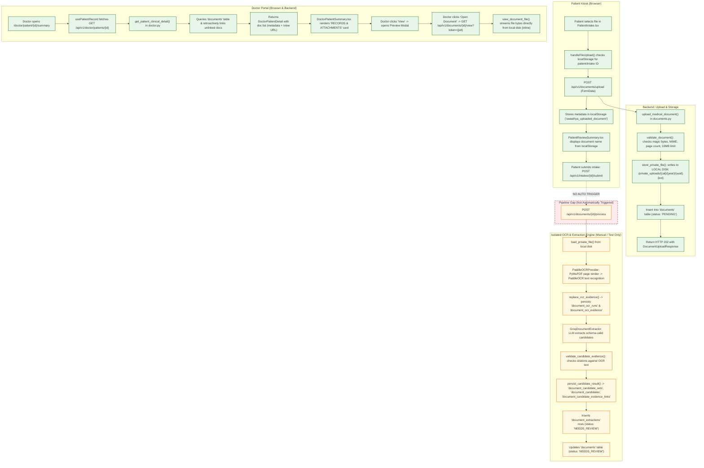

# SwasthyaVaani — Current Implemented Medical Document & OCR Flow

**Inspection Date**: September 4, 2026  
**Scope**: Actual implemented codebase reality (Frontend, Backend, Database, Storage, OCR, and Doctor Dashboard).  
**Source of Truth**: Active source files inspected in `backend/` and `src/`.

---

## 1. Actual End-to-End Flow

```
[Patient on Kiosk UI] (/patient/intake - SubStep 1: Records)
       │
       ▼ (1) Select file (PDF/PNG/JPEG)
[src/pages/PatientIntake.tsx: handleFileUpload()]
       │
       ▼ (2) Resolves patient_id & intakeSessionId from localStorage
       │     Sends POST /api/v1/documents/upload (multipart/form-data)
[backend/app/api/v1/documents.py: upload_medical_document()]
       │
       ├──► (3) Validates bytes/MIME/pages (backend/app/services/document_intelligence.py: validate_document())
       ├──► (4) Stores bytes to LOCAL DISK: ./private_uploads/{category}/{year}/{uuid}.{ext}
       │        (backend/app/services/document_intelligence.py: store_private_file())
       │        [NOTE: Supabase Storage is NOT called]
       └──► (5) Inserts row into `documents` table (status: 'PENDING')
       │
       ▼ (6) Returns HTTP 202 with DocumentUploadResponse (document_id, storage_url: /api/v1/documents/{id}/view)
[src/pages/PatientIntake.tsx]
       │
       ├──► (7) Stores upload record in localStorage ('swasthya_uploaded_document')
       └──► (8) Patient proceeds to /patient/intake (Review Summary) -> shows attached document name from localStorage
       │
       ▼ (9) Patient submits intake: POST /api/v1/intakes/{id}/submit
[backend/app/api/v1/intakes.py: submit_intake_for_review()]
       │
       ├──► (10) Marks IntakeSession status="SUBMITTED", evaluates Red Flags, broadcasts WS event to Doctor Queue
       └──► [CRITICAL BREAK: Neither submit nor upload triggers OCR processing!]
       │
═════════════════════════════════════════════════════════════════════════════════════════════════════════════
[ISOLATED / ON-DEMAND OCR PIPELINE] (Only runs if POST /api/v1/documents/{document_id}/process is called)
       │
[backend/app/api/v1/documents.py: process_document_ocr()]
       │
       ├──► Loads raw file from local disk via load_private_file()
       ├──► Runs PaddleOCRProvider (or MockOCRProvider) -> extracts raw text & bounding box blocks
       ├──► Persists OCR evidence: `document_ocr_runs` & `document_ocr_evidence`
       ├──► Runs GroqDocumentExtractor (or GeminiDocumentExtractor) with strict JSON schema
       ├──► Validates evidence citations (validate_candidate_evidence())
       ├──► Persists semantic candidates: `document_candidate_sets`, `document_candidates`, `document_candidate_evidence_links`
       ├──► Inserts `document_extractions` rows (status: 'NEEDS_REVIEW')
       └──► Updates `documents.status` = "NEEDS_REVIEW"
═════════════════════════════════════════════════════════════════════════════════════════════════════════════
       │
       ▼ (11) Doctor logs in and opens patient record: /doctor/patient/{intake_id}/summary
[src/pages/DoctorPatientSummary.tsx] via [src/hooks/usePatientRecord.ts]
       │
       ▼ (12) GET /api/v1/doctor/patients/{intake_id}
[backend/app/api/v1/doctor.py: get_patient_clinical_detail()]
       │
       ├──► Queries `documents` table by intake_session_id OR patient_id
       ├──► Links any orphaned documents to this intake_session_id
       ├──► Builds document list with metadata and url: "/api/v1/documents/{doc.id}/view"
       └──► [NOTE: Does NOT query document_extractions, document_ocr_runs, or document_candidates]
       │
       ▼ (13) Doctor Dashboard Display:
[src/pages/DoctorPatientSummary.tsx]
       ├──► "RECORDS & ATTACHMENTS" card lists file name, size, and upload date
       ├──► Doctor clicks "View" -> Opens Preview Modal with metadata
       └──► Doctor clicks "Open Document" -> Opens `/api/v1/documents/{id}/view?token={jwt}` in new browser tab
            (Backend streams file bytes with Content-Disposition: inline)
```

---

## 2. Frontend Files & Components Involved

| File / Component | Responsibility in Document Flow |
| :--- | :--- |
| [`src/pages/PatientIntake.tsx`](file:///c:/Users/ACER/Downloads/SwasthyaVaani/src/pages/PatientIntake.tsx) | File input UI (`accept="application/pdf,image/png,image/jpeg"`, camera capture), `handleFileUpload()` handler, sends `POST /api/v1/documents/upload`, writes upload metadata to `localStorage`, renders file tag or upload options. |
| [`src/lib/documentUploadState.ts`](file:///c:/Users/ACER/Downloads/SwasthyaVaani/src/lib/documentUploadState.ts) | LocalStorage state helper (`getStoredDocumentUpload`, `storeDocumentUpload`, `clearStoredDocumentUpload`) under key `swasthya_uploaded_document`. |
| [`src/pages/PatientReviewSummary.tsx`](file:///c:/Users/ACER/Downloads/SwasthyaVaani/src/pages/PatientReviewSummary.tsx) | Displays "Attached Medical Records" card based on `localStorage` stored document name. |
| [`src/pages/PatientComplete.tsx`](file:///c:/Users/ACER/Downloads/SwasthyaVaani/src/pages/PatientComplete.tsx) | Displays submission receipt summary including document count (`documentCount`). |
| [`src/hooks/usePatientRecord.ts`](file:///c:/Users/ACER/Downloads/SwasthyaVaani/src/hooks/usePatientRecord.ts) | Custom React hook that fetches `GET /api/v1/doctor/patients/{id}` and exposes `patientDetail` (including `patientDetail.documents`). |
| [`src/lib/clinicianData.ts`](file:///c:/Users/ACER/Downloads/SwasthyaVaani/src/lib/clinicianData.ts) | Type definitions for `PatientDetail`, including `documents: Array<Record<string, unknown>>`. |
| [`src/pages/DoctorPatientSummary.tsx`](file:///c:/Users/ACER/Downloads/SwasthyaVaani/src/pages/DoctorPatientSummary.tsx) | Primary Doctor workstation screen. Renders "RECORDS & ATTACHMENTS" card, preview modal, and "Open Document" new-window trigger. |
| [`src/components/doctor/PatientAttachments.tsx`](file:///c:/Users/ACER/Downloads/SwasthyaVaani/src/components/doctor/PatientAttachments.tsx) | Standalone reusable component for displaying attachments and triggering secure inline view. |

---

## 3. Backend Files & Services Involved

| File / Module | Responsibility in Document Flow |
| :--- | :--- |
| [`backend/app/api/v1/documents.py`](file:///c:/Users/ACER/Downloads/SwasthyaVaani/backend/app/api/v1/documents.py) | API router for documents: `/upload`, `/{id}/view`, `/{id}/download`, `/{id}/status`, `/{id}/process`. |
| [`backend/app/api/v1/doctor.py`](file:///c:/Users/ACER/Downloads/SwasthyaVaani/backend/app/api/v1/doctor.py) | Clinician detail endpoint `GET /patients/{intake_id}` querying and linking `DocumentModel` records. |
| [`backend/app/api/v1/intakes.py`](file:///c:/Users/ACER/Downloads/SwasthyaVaani/backend/app/api/v1/intakes.py) | Intake submission `POST /{intake_id}/submit` (pushes case to triage queue). |
| [`backend/app/models/document.py`](file:///c:/Users/ACER/Downloads/SwasthyaVaani/backend/app/models/document.py) | SQLAlchemy relational models: `DocumentModel`, `DocumentExtractionModel`, `DocumentOCRRunModel`, `DocumentOCREvidenceModel`, `DocumentCandidateSetModel`, `DocumentCandidateModel`, `DocumentCandidateEvidenceLinkModel`. |
| [`backend/app/schemas/document.py`](file:///c:/Users/ACER/Downloads/SwasthyaVaani/backend/app/schemas/document.py) | Pydantic schemas for upload responses, candidate structures, evidence blocks, and extraction results. |
| [`backend/app/services/document_intelligence.py`](file:///c:/Users/ACER/Downloads/SwasthyaVaani/backend/app/services/document_intelligence.py) | File validation (`validate_document`), local storage helpers (`store_private_file`, `load_private_file`), storage key generation (`create_storage_key`), and OCR evidence replacement (`replace_ocr_evidence`). |
| [`backend/app/services/document_extraction.py`](file:///c:/Users/ACER/Downloads/SwasthyaVaani/backend/app/services/document_extraction.py) | LLM candidate extraction engine (`GroqDocumentExtractor`, `GeminiDocumentExtractor`), evidence verification (`validate_candidate_evidence`), and candidate persistence (`persist_candidate_result`). |
| [`backend/app/services/providers/ocr_provider.py`](file:///c:/Users/ACER/Downloads/SwasthyaVaani/backend/app/services/providers/ocr_provider.py) | OCR engine adapters: `PaddleOCRProvider` (PyMuPDF + cv2 + PaddleOCR) and `MockOCRProvider`. |
| [`backend/app/services/providers/factory.py`](file:///c:/Users/ACER/Downloads/SwasthyaVaani/backend/app/services/providers/factory.py) | Provider registry and dependency injector `get_ocr_service()`. |
| [`backend/app/core/config.py`](file:///c:/Users/ACER/Downloads/SwasthyaVaani/backend/app/core/config.py) | App configuration settings (`DOCUMENT_STORAGE_DIR`, `DOCUMENT_MAX_FILE_SIZE_BYTES`, `PROVIDER_OCR`, etc.). |

---

## 4. API Endpoints Involved

| HTTP Method & Path | Auth Required | Function / Handler | Actual Behavior |
| :--- | :--- | :--- | :--- |
| `POST /api/v1/documents/upload` | No | `upload_medical_document` in `documents.py` | Receives multipart form with `file`, `patient_id`, `intake_session_id`, `document_type`. Validates file, saves to local disk, writes `documents` row (`status="PENDING"`). Returns HTTP 202. |
| `GET /api/v1/documents/{document_id}/view` | Optional Bearer token or `?token=` query param | `view_document_file` in `documents.py` | Reads raw bytes from local disk via `load_private_file()` and streams response with `Content-Disposition: inline; filename="{safe_filename}"`. |
| `GET /api/v1/documents/{document_id}/download` | Optional Bearer token or `?token=` query param | `download_document_file` in `documents.py` | Streams raw bytes from local disk with `Content-Disposition: attachment; filename="{safe_filename}"`. |
| `GET /api/v1/documents/{document_id}/status` | No | `get_document_status` in `documents.py` | Queries document status, extraction count, and review candidates. *(Not called by any frontend component)* |
| `POST /api/v1/documents/{document_id}/process` | No | `process_document_ocr` in `documents.py` | Runs OCR, persists OCR evidence, runs Groq/Gemini semantic extraction, creates candidates and `document_extractions` rows. *(Not called automatically by frontend or backend intake flow)* |
| `GET /api/v1/doctor/patients/{intake_id}` | Yes (Doctor role) | `get_patient_clinical_detail` in `doctor.py` | Retrieves patient intake details including `documents: List[Dict]` with document metadata and `/view` URLs. |

---

## 5. Supabase / Database Tables Involved

All models are defined in [`backend/app/models/document.py`](file:///c:/Users/ACER/Downloads/SwasthyaVaani/backend/app/models/document.py) and mapped via SQLAlchemy:

| Table Name | Primary Key | Foreign Keys | Actual Usage in Current Codebase |
| :--- | :--- | :--- | :--- |
| `documents` | `id` (UUID str) | `patient_id` -> `patients.id`<br>`intake_session_id` -> `intake_sessions.id` | **Active**: Created upon upload (`POST /upload`). Queried by Doctor API (`GET /doctor/patients/{id}`). |
| `document_ocr_runs` | `id` (UUID str) | `document_id` -> `documents.id` | **Partially Active**: Only written to if `POST /{id}/process` is invoked. Stores provider name, version, aggregate confidence, raw text. |
| `document_ocr_evidence` | `id` (UUID str) | `ocr_run_id` -> `document_ocr_runs.id`<br>`document_id` -> `documents.id` | **Partially Active**: Only written to if `POST /{id}/process` is invoked. Stores block index, text snippet, confidence, bounding box JSON. |
| `document_candidate_sets`| `id` (UUID str) | `document_id` -> `documents.id`<br>`ocr_run_id` -> `document_ocr_runs.id` | **Partially Active**: Only written to if `POST /{id}/process` is invoked. Identifies LLM extractor provider and model. |
| `document_candidates` | `id` (UUID str) | `candidate_set_id` -> `document_candidate_sets.id`<br>`document_id` -> `documents.id`<br>`ocr_run_id` -> `document_ocr_runs.id` | **Partially Active**: Only written to if `POST /{id}/process` is invoked. Stores candidate type (`MEDICATION`, `LAB`, `HISTORICAL`), value JSON, extraction confidence, status (`NEEDS_REVIEW`). |
| `document_candidate_evidence_links` | (`candidate_id`, `evidence_id`) composite | `candidate_id` -> `document_candidates.id`<br>`evidence_id` -> `document_ocr_evidence.id` | **Partially Active**: Provenance junction table linking structured candidates to specific OCR evidence blocks. |
| `document_extractions` | `id` (UUID str) | `document_id` -> `documents.id` | **Partially Active**: Legacy / flattened extraction table written during `POST /{id}/process`. Contains `field_type`, `field_name`, `value_json`, `status='NEEDS_REVIEW'`. |

---

## 6. Supabase Storage Bucket / Path Involved

### Documentation vs. Actual Implementation:

- **Documented / Intended**: Supabase Storage bucket named `medical-documents` configured in `settings.SUPABASE_STORAGE_BUCKET`.
- **Actual Reality**:
  - **Supabase Storage is NOT used**.
  - No code in `backend/app/api/v1/documents.py` or `backend/app/services/document_intelligence.py` calls `supabase.storage.from_()`.
  - In [`backend/app/core/database.py`](file:///c:/Users/ACER/Downloads/SwasthyaVaani/backend/app/core/database.py), a `get_supabase_client()` helper is defined, but it is **never called anywhere** in the backend.
  - **Actual Storage Mechanism**: Local filesystem storage managed by `store_private_file()` and `load_private_file()` in [`backend/app/services/document_intelligence.py`](file:///c:/Users/ACER/Downloads/SwasthyaVaani/backend/app/services/document_intelligence.py).
  - **Actual Root Directory**: `settings.DOCUMENT_STORAGE_DIR` (defaults to `./private_uploads`).
  - **Actual Key Structure**: `{document_type.lower()}/{year}/{uuid}{extension}`  
    *Example*: `./private_uploads/prescription/2026/3b999a07-8bc8-43bb-81da-45c163013d10.pdf`

---

## 7. OCR Provider & Implementation

Located in [`backend/app/services/providers/ocr_provider.py`](file:///c:/Users/ACER/Downloads/SwasthyaVaani/backend/app/services/providers/ocr_provider.py). Configured via `PROVIDER_OCR` in `backend/.env` (configured as `paddle`).

### Implemented Providers:
1. **`PaddleOCRProvider`** (`PROVIDER_OCR=paddle`):
   - **PDF Handling**: Uses `pymupdf` (PyMuPDF) to render each page at 2.0x zoom matrix to PNG bytes.
   - **Image Handling**: Decodes PNG/JPEG bytes into numpy array using `cv2.imdecode`.
   - **OCR Inference**: Instantiates `PaddleOCR(lang="en", device="cpu", enable_mkldnn=False)`. Calls `engine.ocr(image, cls=True)` or `engine.predict(image)`.
   - **Result Normalization**: Parses line bounding boxes and recognition tuples `(text, confidence)`. Flattens polygon bounding boxes to `[x1, y1, x2, y2, ...]`. Computes mean document confidence.
   - **Output**: Returns `OCRExtractionResult(document_type="UNCLASSIFIED", raw_text=..., text_blocks=..., confidence_score=...)`.
2. **`MockOCRProvider`** (`PROVIDER_OCR=mock`):
   - Deterministic test/fallback provider.
   - Inspects filename for `"presc"` vs other names. Returns synthetic raw text and text blocks for Paracetamol 650 mg (Prescription) or Hemoglobin 13.2 g/dL (Lab Report).

---

## 8. Extracted Fields & Data Structure

When semantic extraction is executed ([`backend/app/services/document_extraction.py`](file:///c:/Users/ACER/Downloads/SwasthyaVaani/backend/app/services/document_extraction.py)):

### Extractor Engine:
- Provider configured via `KUNAL_DOCUMENT_EXTRACTOR_PROVIDER` (defaults to `"groq"` in `.env`, or `"gemini"`).
- Uses `GroqDocumentExtractor` with model `openai/gpt-oss-20b` (or `GeminiDocumentExtractor` with `gemini-2.5-flash-lite`).
- Strict JSON Schema output enforcing zero hallucination: candidates must cite evidence IDs, and string values must match OCR text.

### Data Structures ([`backend/app/schemas/document.py`](file:///c:/Users/ACER/Downloads/SwasthyaVaani/backend/app/schemas/document.py)):
1. **MedicationCandidate**:
   - `name`: string | null
   - `strength_or_dose`: string | null
   - `frequency`: string | null (e.g., `"TDS"`, `"OD"`)
   - `duration`: string | null (e.g., `"5 days"`)
   - `source_evidence`: `List[DocumentEvidenceReference]` (evidence IDs)
   - `extraction_confidence`: float (0.0 to 1.0)
   - `status`: `"NEEDS_REVIEW"`
2. **LabCandidate**:
   - `test_name`: string | null
   - `observed_value`: string | null
   - `unit`: string | null
   - `reference_range`: string | null
   - `date`: string | null
   - `source_evidence`: `List[DocumentEvidenceReference]`
   - `extraction_confidence`: float
   - `status`: `"NEEDS_REVIEW"`
3. **HistoricalCandidate**:
   - `fact_type`: string | null
   - `value`: string | null
   - `date`: string | null
   - `source_evidence`: `List[DocumentEvidenceReference]`
   - `extraction_confidence`: float
   - `status`: `"NEEDS_REVIEW"`

---

## 9. How Extracted Data Is Persisted

In [`backend/app/services/document_extraction.py`](file:///c:/Users/ACER/Downloads/SwasthyaVaani/backend/app/services/document_extraction.py) (`persist_candidate_result`):

1. Prior candidate sets and evidence links for that `(ocr_run_id, provider, model)` are deleted to avoid duplicates.
2. A row is inserted into `document_candidate_sets`:
   - `document_id`, `ocr_run_id`, `provider_name`, `model_name`.
3. For each medication, lab, and history candidate:
   - A row is inserted into `document_candidates`:
     - `candidate_set_id`, `document_id`, `ocr_run_id`, `candidate_type`, `value_json`, `extraction_confidence`, `status="NEEDS_REVIEW"`.
   - For every cited evidence block, a row is inserted into `document_candidate_evidence_links`:
     - `candidate_id`, `evidence_id`.
4. In [`backend/app/api/v1/documents.py`](file:///c:/Users/ACER/Downloads/SwasthyaVaani/backend/app/api/v1/documents.py) (`process_document_ocr`):
   - Flattens candidates into legacy rows in `document_extractions`:
     - `document_id`, `field_type`, `field_name`, `value_json`, `ocr_confidence`, `extraction_confidence`, `source_page`, `original_source_text`, `ocr_engine`, `extractor_version`, `status="NEEDS_REVIEW"`.
   - Updates `DocumentModel.status = "NEEDS_REVIEW"`.

---

## 10. How Patient / Intake / Document Relationships Are Maintained

1. **Patient Association**:
   - When uploading via `POST /api/v1/documents/upload`, `patient_id` is passed in form data.
   - `DocumentModel.patient_id` foreign-keys to `patients.id`.
2. **Intake Association**:
   - `intake_session_id` is passed in form data if available.
   - If missing from form data, backend queries the most recent `IntakeSession` for that `patient_id`:
     ```python
     recent_session = db.query(IntakeSession).filter(IntakeSession.patient_id == patient_id).order_by(IntakeSession.started_at.desc()).first()
     ```
   - If still unlinked, `DocumentModel.intake_session_id` is set to `None`.
3. **Doctor Association & Healing**:
   - Intake sessions have a `doctor_id` column referencing `doctors.id`.
   - When the doctor opens the intake summary (`GET /api/v1/doctor/patients/{intake_id}` in `backend/app/api/v1/doctor.py`):
     - The query retrieves documents matching:
       `DocumentModel.intake_session_id == session.id` **OR** `(DocumentModel.patient_id == session.patient_id AND DocumentModel.intake_session_id IS NULL)`
     - If any unlinked documents for the patient exist, it retroactively assigns `doc.intake_session_id = session.id` and commits to database.

---

## 11. How Doctor Dashboard Retrieves the Information

1. Clinician navigates to `/doctor/patient/:id/summary`.
2. [`src/hooks/usePatientRecord.ts`](file:///c:/Users/ACER/Downloads/SwasthyaVaani/src/hooks/usePatientRecord.ts) executes:
   ```typescript
   authorizedClinicianFetch(`/api/v1/doctor/patients/${patientId}`)
   ```
   (attaching JWT Bearer token from clinician session).
3. Backend [`backend/app/api/v1/doctor.py`](file:///c:/Users/ACER/Downloads/SwasthyaVaani/backend/app/api/v1/doctor.py) (`get_patient_clinical_detail`):
   - Looks up `IntakeSession` by `id`, `token`, or `patient_id`.
   - Queries `DocumentModel` for this intake / patient.
   - Constructs `documents` array:
     ```json
     {
       "id": "doc_uuid",
       "document_id": "doc_uuid",
       "name": "prescription.pdf",
       "file_name": "prescription.pdf",
       "size": "245.2 KB",
       "file_size": 251084,
       "mime_type": "application/pdf",
       "type": "prescription",
       "document_type": "PRESCRIPTION",
       "status": "PENDING",
       "uploaded_at": "2026-09-04T10:00:00Z",
       "uploadedAt": "04 Sep 2026, 15:30",
       "url": "/api/v1/documents/doc_uuid/view",
       "storage_url": "/api/v1/documents/doc_uuid/view",
       "localOnly": false
     }
     ```
   - Packages `DoctorPatientDetail` with `clinical_state` and `documents`.
   - **Crucial Implementation Fact**: `get_patient_clinical_detail` does **NOT** read from `document_extractions`, `document_candidates`, or `document_ocr_runs`.

---

## 12. What the Doctor Currently Sees

In [`src/pages/DoctorPatientSummary.tsx`](file:///c:/Users/ACER/Downloads/SwasthyaVaani/src/pages/DoctorPatientSummary.tsx):

### What Is Visible:
1. **"RECORDS & ATTACHMENTS" Card**:
   - Header displaying file count (e.g. `1 file`).
   - Row showing file icon, file name (`prescription.pdf`), formatted size (`245.2 KB`), and formatted upload date (`04 Sep 2026, 15:30`).
   - "View" button beside each attached document.
2. **Document Attachment Preview Modal** (upon clicking "View"):
   - Displays file name, attachment type (`PRESCRIPTION`), status (`PENDING` or `NEEDS_REVIEW`).
   - An **"Open Document"** button.
3. **Inline Document Viewer**:
   - Clicking "Open Document" executes:
     ```typescript
     const viewUrl = `${previewDoc.url}?token=${encodeURIComponent(token)}`;
     window.open(viewUrl, '_blank', 'noopener,noreferrer');
     ```
   - Opens a new browser tab streaming the actual PDF or image from `GET /api/v1/documents/{id}/view`.

### What Is NOT Visible to the Doctor:
- **No OCR Extracted Text**: The raw OCR transcription is never shown in the UI.
- **No Extracted Medication Candidates**: Medications extracted by Groq/Gemini from the document are not listed under the Clinical Summary or Attachments.
- **No Extracted Lab Candidates**: Lab results from documents do not appear in any table.
- **No Evidence Bounding Boxes or Verification UI**: The doctor cannot approve, edit, or reject individual OCR extractions because no UI for `DocumentCandidateModel` or `DocumentExtractionModel` exists on the Doctor Dashboard.
- The "AI-STRUCTURED CLINICAL SUMMARY" card solely displays interview facts extracted from patient speech/text answers (`clinical_state`), completely omitting document extractions.

---

## 13. Error & Failure Handling

| Failure Scenario | Where Detected | Handling Mechanism & Response |
| :--- | :--- | :--- |
| **Empty or corrupt file** | `validate_document()` in `document_intelligence.py` | Raises `DocumentValidationError("EMPTY_FILE")`. Handled in `upload_medical_document()` -> returns **HTTP 400 Bad Request** (`{"code": "EMPTY_FILE", ...}`). |
| **File > 10 MB** | `validate_document()` | Raises `DocumentValidationError("FILE_TOO_LARGE")` -> returns **HTTP 400**. |
| **Unsupported MIME / Disallowed extension** | `validate_document()` | Magic byte check for PDF (`%PDF-`), PNG (`\x89PNG`), JPEG (`\xff\xd8\xff`). Disallowed format raises `UNSUPPORTED_FILE` -> returns **HTTP 400**. |
| **PDF > 20 pages** | `validate_document()` | Regex counts `/Type /Page` tokens. If > 20, raises `TOO_MANY_PAGES` -> returns **HTTP 400**. |
| **Duplicate upload** | `upload_medical_document()` | SHA-256 computed on bytes. If identical hash exists for the same `intake_session_id`, returns **HTTP 409 Conflict** (`{"code": "DUPLICATE_DOCUMENT", ...}`). |
| **Storage write or DB failure on upload** | `upload_medical_document()` | `db.rollback()`. If partial file was written to disk, `stored_path.unlink()` removes it to prevent orphaned files. Re-raises exception -> **HTTP 500**. |
| **Document not found on view/download** | `view_document_file()` in `documents.py` | If ID not in DB, returns **HTTP 404**. If DB row exists but file missing on disk (`FileNotFoundError`), returns **HTTP 404** (`"Underlying document file not found on disk"`). |
| **OCR / Extraction execution failure** | `process_document_ocr()` in `documents.py` | `db.rollback()`. Sets `doc.status = "PROCESSING_FAILED"`, records `doc.failure_code = type(exc).__name__`, commits failure status. Preserves original file on disk. Returns **HTTP 502 Bad Gateway**. |
| **Doctor summary with no uploaded documents** | `DoctorPatientSummary.tsx` | Renders clean empty state: folder icon with *"No additional records uploaded. Files uploaded by the patient will appear here."* |

---

## 14. Gaps, Broken Links, & Architectural Inconsistencies

1. **OCR Pipeline is Completely Disconnected from User Flow**:
   - `POST /api/v1/documents/{document_id}/process` is fully implemented in Python and passes unit tests, but is **never triggered in real application usage**.
   - Neither `POST /upload` nor `POST /intakes/{id}/submit` triggers OCR in a background task.
   - The frontend never calls `/process`. Documents remain in `status="PENDING"` forever unless manually processed via API tools.
2. **Supabase Storage Discrepancy**:
   - Architectural documents (`PRD.md`, `TRD.md`, `architecture.md`) state documents reside in Supabase Storage (`medical-documents` bucket).
   - In reality, all files are stored on the local filesystem in `./private_uploads/`. The Supabase client in `backend/app/core/database.py` is never called.
3. **Doctor Summary Ignores Document Extractions**:
   - Even if `/process` is manually triggered, the Doctor endpoint (`GET /api/v1/doctor/patients/{id}`) does not load `document_extractions` or `document_candidates`.
   - The Doctor UI (`DoctorPatientSummary.tsx`) has no UI cards, tables, or buttons to view or review document candidates.
4. **Candidate Review / Verification Endpoints Missing**:
   - Pydantic schemas `DocumentFieldReviewRequest` and `DocumentFieldReviewRecord` exist in `backend/app/schemas/document.py`.
   - However, no corresponding API endpoints (e.g. `POST /api/v1/documents/{id}/review` or `POST /candidates/{id}/approve`) exist in `backend/app/api/v1/documents.py`.
5. **Hardcoded Document Type on Patient Upload**:
   - In `src/pages/PatientIntake.tsx` (line 127), `document_type` is hardcoded as `'PRESCRIPTION'`. Regardless of whether a patient uploads a lab test or discharge summary, it is categorized as a prescription upon upload.
6. **Contradiction Engine Disconnection**:
   - `backend/app/services/safety/contradictions.py` checks `state.medications` for contradictions against patient statements.
   - Because document-extracted medications are never merged into `ClinicalState`, cross-checking prescriptions against verbal answers cannot trigger during live intakes.
7. **Patient Review Summary Relies on Browser LocalStorage**:
   - `PatientReviewSummary.tsx` reads the uploaded document name from `localStorage`. If the patient refreshes on another device, the summary displays "None added" even though the document is stored in the database.

---

## 15. Mermaid Flow Diagram of Actual Implementation


