<div align="center">

# SwasthyaVaani

### AI-Assisted Clinical Intake for Faster, Structured Doctor Consultations

**Your story, structured before the consultation.**


</div>

SwasthyaVaani is an AI-assisted pre-consultation clinical intake platform designed for healthcare workflows in India. It collects a patient's symptoms and medical context through voice or text, adapts its questions based on the evolving clinical story, structures the information into a **ClinicalState**, and presents a concise, physician-reviewable summary before the consultation.

**Patient explains naturally → AI structures the story → Doctor reviews and decides.**

> Runs fully offline out of the box: SQLite database, mock LLM/speech/OCR providers, zero API keys required. See [Quickstart](#quickstart-under-2-minutes).

---

## At a Glance

| | |
|---|---|
| **Problem** | Clinical consultations lose time to repetitive, generic history-taking that isn't adapted to the patient or accessible in their language. |
| **Solution** | An adaptive AI intake that asks only the questions that matter, structures the answer into a doctor-reviewable `ClinicalState`, and hands off a concise summary before the consultation starts. |
| **Built for** | Smart India Hackathon 2026, Problem Statement 26047 |
| **Maturity** | Not a mockup — ABDM (Sandbox/Simulation) integration, FHIR R4 (NRCES) export, full AYUSH Dashavidha Pariksha, deterministic safety rules, and realtime doctor dashboards are implemented and runnable locally today. |
| **Try it in** | Under 2 minutes, no API keys — see [Quickstart](#quickstart-under-2-minutes) |

<!-- TODO: Replace with your actual PS 26047 title/theme/organization and a one-row-per-requirement mapping, e.g.:
| PS Requirement | What We Built | Where |
|---|---|---|
| ... | ... | ... |
-->

## Demo

[](https://youtu.be/SzdWJoTa6Is)

**[▶ Watch the full demo on YouTube](https://youtu.be/SzdWJoTa6Is)**

**Screens at a glance:**

<table>
<tr>
<td align="center"><br/><sub>Kiosk home page</sub></td>
<td align="center">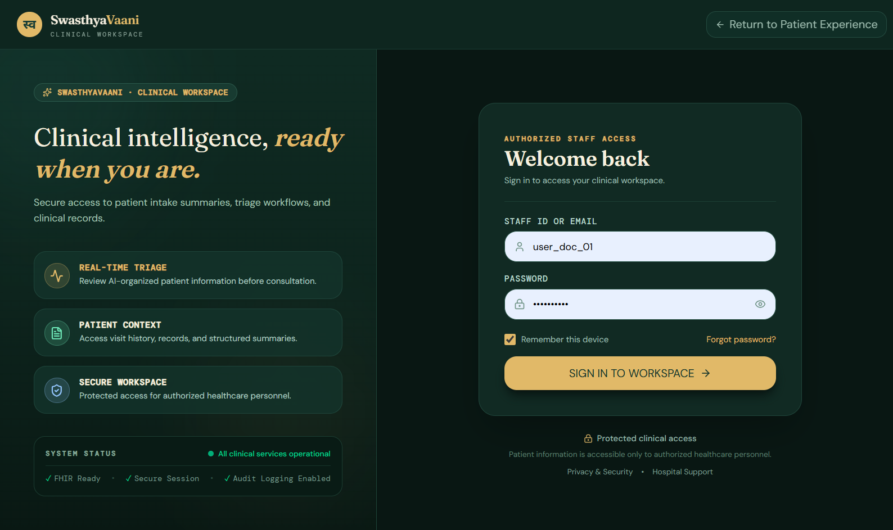<br/><sub>Doctor / Admin login</sub></td>
<td align="center"><br/><sub>Doctor dashboard</sub></td>
<td align="center"><br/><sub>AYUSH assessment</sub></td>
</tr>
</table>

More screenshots are included throughout the [Core Capabilities](#core-capabilities) section below.

---

## Table of Contents

- [At a Glance](#at-a-glance)
- [Demo](#demo)
- [The Problem](#the-problem)
- [Our Approach](#our-approach)
- [Quickstart (Under 2 Minutes)](#quickstart-under-2-minutes)
- [Repository Structure](#repository-structure)
- [Core Capabilities](#core-capabilities)
  - [Multilingual Voice and Text Intake](#multilingual-voice-and-text-intake)
  - [Adaptive Clinical Interview](#adaptive-clinical-interview)
  - [Structured ClinicalState](#structured-clinicalstate)
  - [Safety and Red-Flag Awareness](#safety-and-red-flag-awareness)
  - [Medical Document Intelligence](#medical-document-intelligence)
  - [Modern Medicine and AYUSH](#modern-medicine-and-ayush)
  - [Doctor Dashboard and Realtime Queue](#doctor-dashboard-and-realtime-queue)
  - [Healthcare Interoperability — ABDM and FHIR R4](#healthcare-interoperability--abdm-and-fhir-r4)
  - [Kiosk Privacy Safeguards](#kiosk-privacy-safeguards)
  - [LLM Provider Benchmarking](#llm-provider-benchmarking)
- [System Architecture](#system-architecture)
- [Tech Stack](#tech-stack)
- [Core Data Flow](#core-data-flow)
- [Core Data Model](#core-data-model)
- [AI Design Philosophy](#ai-design-philosophy)
- [Reliability Principles](#reliability-principles)
- [Product Modules](#product-modules)
- [Environment Configuration](#environment-configuration)
- [Verification, Testing and Benchmarking](#verification-testing-and-benchmarking)
- [Documentation](#documentation)
- [Troubleshooting](#troubleshooting)
- [Roadmap](#roadmap)
- [What Makes SwasthyaVaani Different](#what-makes-swasthyavaani-different)
- [Clinical Safety Philosophy](#clinical-safety-philosophy)
- [Project Status](#project-status)
- [Team](#team)
- [License](#license)
- [Disclaimer](#disclaimer)
- [Vision](#vision)

---

## The Problem

A large part of a clinical consultation can be spent collecting basic patient history: the main complaint, onset, severity, location, associated symptoms, aggravating or relieving factors, medicines, allergies, and previous records.

Traditional digital forms often solve this with the same long checklist for everyone. This leads to:

- Irrelevant questions for the patient
- Fragmented information for the doctor
- Poor accessibility for patients who prefer voice or regional Indian languages
- Valuable consultation time spent on repetitive history-taking

SwasthyaVaani treats this as an **adaptive clinical intake problem**, rather than simply another medical chatbot.

---

## Our Approach

**Traditional intake:**

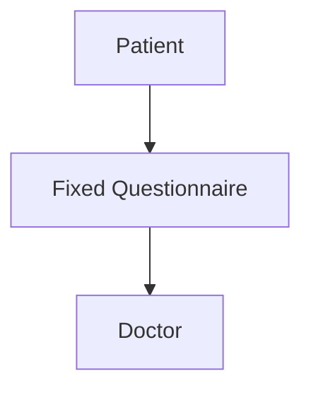

**SwasthyaVaani's intake:**

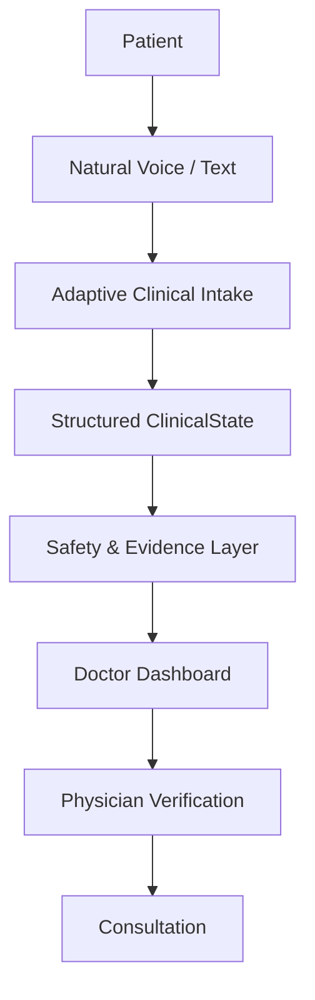

The system aims for **Minimum Sufficient History**: ask enough relevant questions to make the patient's story useful, without forcing every patient through the same checklist.

---

## Quickstart (Under 2 Minutes)

The backend runs on a zero-config **SQLite** database and defaults every AI/speech/OCR provider to **mock mode** — you can run the entire platform locally with no external services and no API keys.

### 1. Clone the repository

```bash
git clone https://github.com/OmkarD09/SwasthyaVaani.git
cd SwasthyaVaani
```

### 2. Backend (FastAPI, port 8000)

```bash
cd backend
python -m venv .venv
```

**Windows**
```bash
.venv\Scripts\activate
```

**macOS / Linux**
```bash
source .venv/bin/activate
```

```bash
pip install -r requirements.txt
uvicorn app.main:app --reload
```

Environment variables are optional for local evaluation — copy `backend/.env.example` to `backend/.env` if you want to override defaults (e.g. to plug in a real Groq/Gemini key or a Postgres URL instead of SQLite). See [Environment Configuration](#environment-configuration).

On first run, the backend seeds default accounts automatically (see below).

### 3. Frontend (React + Vite, port 5173)

Run this from the **repository root** — the frontend is not in a separate `frontend/` folder, its `package.json` and `vite.config.ts` live at the project root:

```bash
npm install
npm run dev
```

Vite proxies `/api` requests and WebSocket connections through to the backend on `http://127.0.0.1:8000`, so start the backend first.

### 4. Access the app

| Portal | URL |
|---|---|
| Patient Kiosk | http://localhost:5173 |
| Doctor / Admin login | http://localhost:5173 (login with credentials below) |
| Backend API (Swagger docs) | http://127.0.0.1:8000/docs |

### 5. Seed test credentials

The backend automatically provisions these accounts on startup:

| Role | Email | Password |
|---|---|---|
| Doctor | `ananya.rao@district-hospital.in` | `Doctor@123` |
| Admin | `admin.rohan@district-hospital.in` | `Admin@123` |

> Change or rotate these before any deployment beyond local development — they are seed/demo credentials only.

---

## Repository Structure

```text
SwasthyaVaani/
├── package.json                  # Frontend package manifest (root, not frontend/)
├── vite.config.ts                # Vite config incl. /api and WS proxy to :8000
├── src/                          # Frontend source
│   ├── components/                 # e.g. AbhaQrScanner.tsx
│   ├── pages/                       # e.g. DoctorPatientAyush.tsx
│   ├── lib/                         # e.g. kioskState.ts, parseAbhaQr.ts, useKioskIdleTimer.ts
│   └── App.tsx
├── backend/
│   ├── app/
│   │   ├── main.py
│   │   ├── core/                    # config.py, database.py, events.py (WS manager)
│   │   ├── models/                  # SQLAlchemy models, e.g. knowledge.py
│   │   ├── schemas/                 # Pydantic schemas, e.g. ayush.py, clinical_state.py
│   │   ├── services/
│   │   │   ├── rag/                    # rag_service.py — in-memory cosine similarity RAG
│   │   │   ├── safety/                 # red_flags.py — deterministic red-flag rules
│   │   │   └── fhir/                   # mapper.py, FHIR R4 NRCES generation
│   │   ├── api/v1/                  # doctor.py, abdm.py, fhir.py, ...
│   │   └── seed/                    # seed_data.py — default accounts
│   ├── tests/                       # pytest suite
│   ├── alembic/                     # DB migrations
│   ├── requirements.txt
│   ├── requirements-dev.txt
│   ├── .env.example                 # Real location of the env template
│   └── benchmark.py                 # LLM provider benchmarking CLI
├── docs/
│   ├── SwasthyaVaani_PRD.md
│   ├── SwasthyaVaani_TRD.md
│   ├── SwasthyaVaani_architecture.md
│   ├── SwasthyaVaani_backend_schema.md
│   ├── SwasthyaVaani_rules.md
│   ├── SwasthyaVaani_appflow.md
│   ├── SwasthyaVaani_AYUSH_Specification.md
│   ├── SwasthyaVaani_Current_Project_State.md
│   └── TEAM_CONTRACTS.md
├── CURRENT_OCR_FLOW.md
└── BENCHMARK_RESULTS.md
```

---

## Core Capabilities

### Multilingual Voice and Text Intake

Patients can communicate through voice or text. The kiosk UI supports **13 Indic languages**, with deeper support — full audio consent flows and i18n bundles — for English, Hindi, and Marathi.

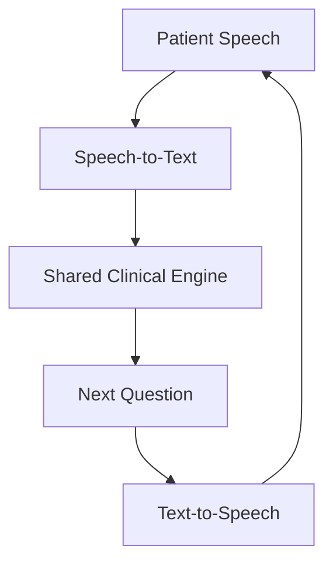

Voice and text use the same underlying clinical reasoning and state-management system.

<table>
<tr>
<td align="center"><br/><sub>Language selection</sub></td>
<td align="center"><br/><sub>Choose voice or text</sub></td>
<td align="center">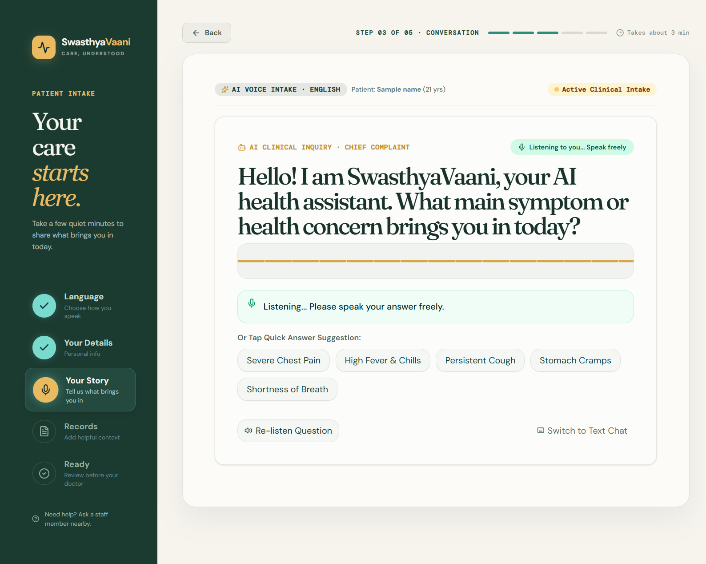<br/><sub>Voice intake</sub></td>
<td align="center">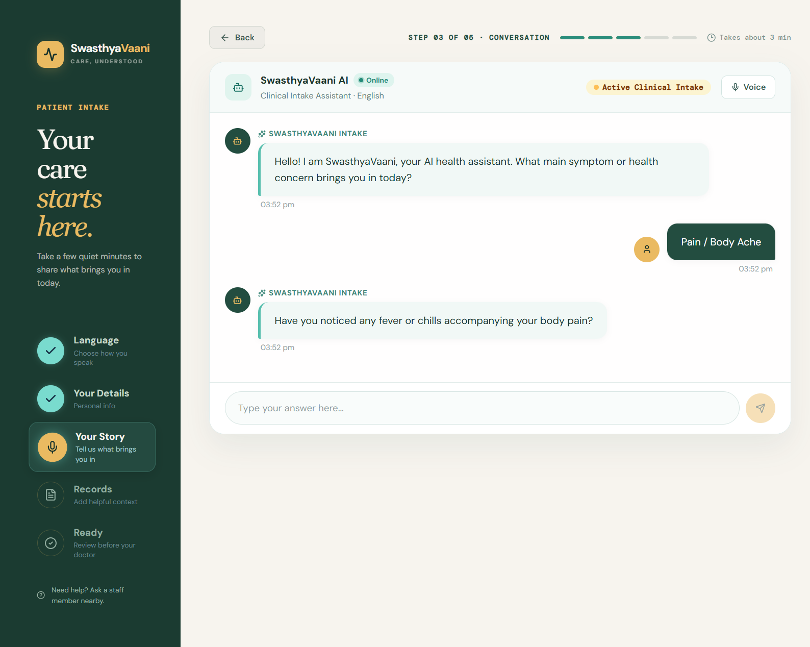<br/><sub>Text intake</sub></td>
</tr>
</table>

### Adaptive Clinical Interview

The interview is designed to be adaptive rather than a rigid questionnaire. For each meaningful response, the system can:

1. Extract clinical facts
2. Update ClinicalState
3. Identify the relevant clinical domain
4. Recalculate information gaps
5. Generate candidate follow-ups
6. Score candidates using relevance, information gain, and safety priority
7. Prevent redundant questions
8. Decide whether more information is useful
9. Ask the next question or complete the intake

**Example:**

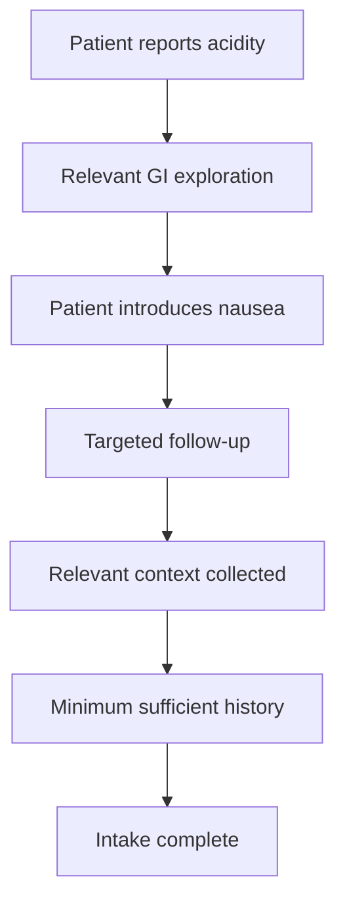

<table>
<tr>
<td align="center"><br/><sub>Adaptive conversation</sub></td>
<td align="center"><br/><sub>Intake complete</sub></td>
</tr>
</table>

### Structured ClinicalState

Instead of keeping the patient's story only as an unstructured transcript, SwasthyaVaani maintains a structured representation of the evolving clinical information.

ClinicalState can capture:

- Chief complaint
- Duration / onset
- Severity
- Location
- Character
- Associated symptoms
- Aggravating / relieving factors
- Medical history
- Medications
- Allergies
- Safety findings
- Contradictions
- Uncertainty
- AYUSH information
- Document-derived facts
- Provenance

Each dimension is tracked as one of the following states:

`UNKNOWN` · `KNOWN_TRUE` · `KNOWN_FALSE` · `AMBIGUOUS` · `KNOWN_WITH_VALUE`

This prevents missing or ambiguous information from being treated as confirmed fact.

<table>
<tr>
<td align="center"><br/><sub>Patient details</sub></td>
<td align="center"><br/><sub>Patient history</sub></td>
</tr>
</table>

### Safety and Red-Flag Awareness

Safety evaluation runs throughout the intake, using a deterministic, configurable rule engine rather than relying solely on an LLM.

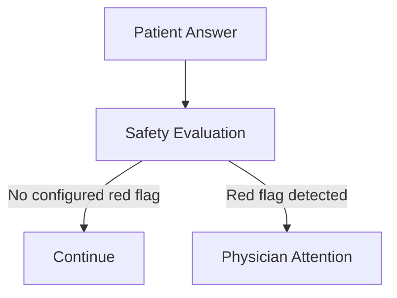

**Currently active rules:**

| Rule ID | Trigger |
|---|---|
| `RF-CP-001` | Cardiac warning signs, including Hindi vernacular symptom terms |
| `RF-SEV-001` | Reported pain severity ≥ 8 |
| `RF-SO-001` | Febrile respiratory distress |
| `RF-GI-001` | GI bleeding / melena indicators |

Acute visual-threat and neurological red-flag rules are **planned but not yet implemented** in the active engine (see [Roadmap](#roadmap)).

A red flag is an attention signal — **not an autonomous diagnosis**.

### Medical Document Intelligence

Patients can attach relevant previous records such as prescriptions and diagnostic reports.

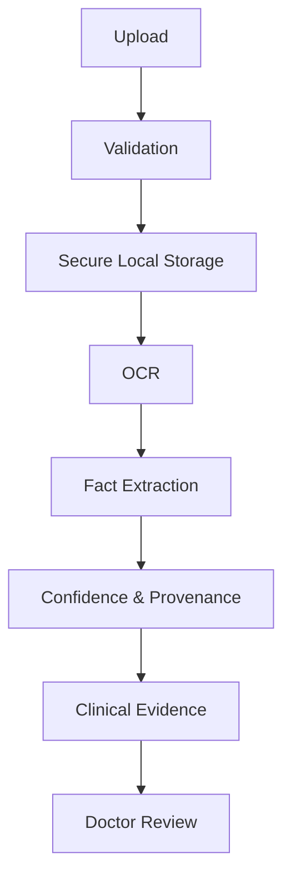

Uploaded files are written to a secure local directory (`./private_uploads/`) rather than a cloud object store. OCR-derived information remains reviewable evidence rather than unquestionable truth — see `CURRENT_OCR_FLOW.md` for the full pipeline.

<p align="center"><br/><sub>Document upload</sub></p>

### Modern Medicine and AYUSH

SwasthyaVaani supports modern clinical history-taking and AYUSH-oriented assessment within one platform.

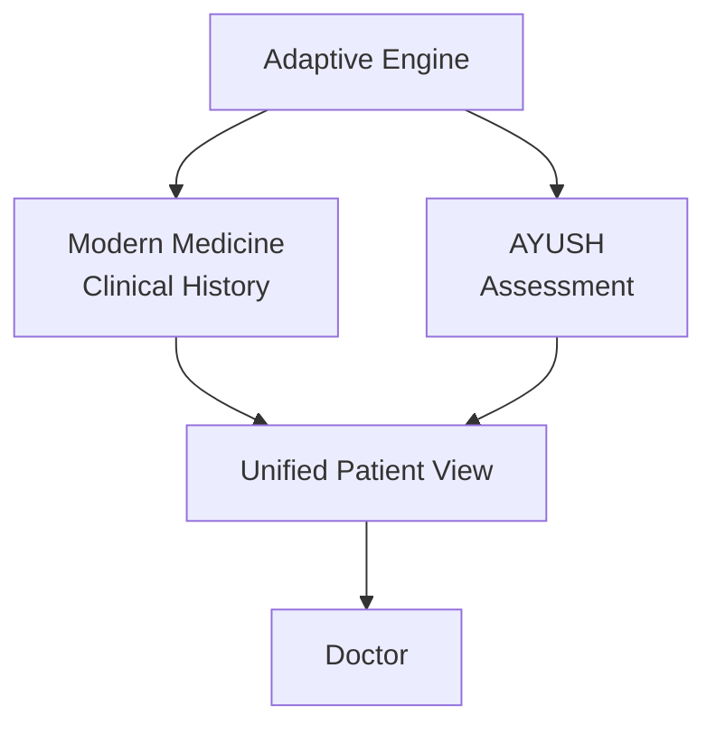

Baseline AYUSH concepts include **Prakriti**, **Vikriti**, **Agni**, and **Koshtha**.

The **full Dashavidha Pariksha** is implemented — all eight dimensions (Sara, Samhanana, Pramana, Satmya, Sattva, Ahara Shakti, Vyayama Shakti, and Vaya) are evaluated through adaptive question scoring and rendered directly in the doctor portal's AYUSH view, alongside Ahara-Vihara context.

AYUSH information supports physician review and is not intended for autonomous diagnosis or treatment.

<p align="center"><br/><sub>AYUSH assessment (Dashavidha Pariksha)</sub></p>

### Doctor Dashboard and Realtime Queue

The patient-side intake becomes a structured clinical handoff. Doctors can view:

- Patient information
- Main concern
- AI-structured clinical summary
- Relevant clinical facts
- Red flags
- Uncertainty
- Contradictions
- Conversation / transcript
- Uploaded records
- OCR-derived information
- AYUSH assessment, where applicable
- Intake status and priority

New submissions, triage priority changes, and confirmations are pushed to connected doctor dashboards **live** over a WebSocket connection (an async connection manager mounted at `/api/v1/doctor/ws`) — dashboards do not need to be manually refreshed.

The doctor remains the final clinical authority.

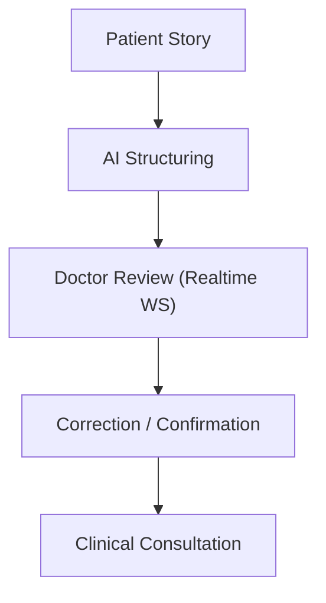

Patient interaction language and doctor-facing structured language can differ — for example, a Hindi voice conversation is understood by the AI and rendered as a standardized English clinical summary, while the original transcript remains available as evidence.

<table>
<tr>
<td align="center"><br/><sub>Doctor dashboard</sub></td>
<td align="center">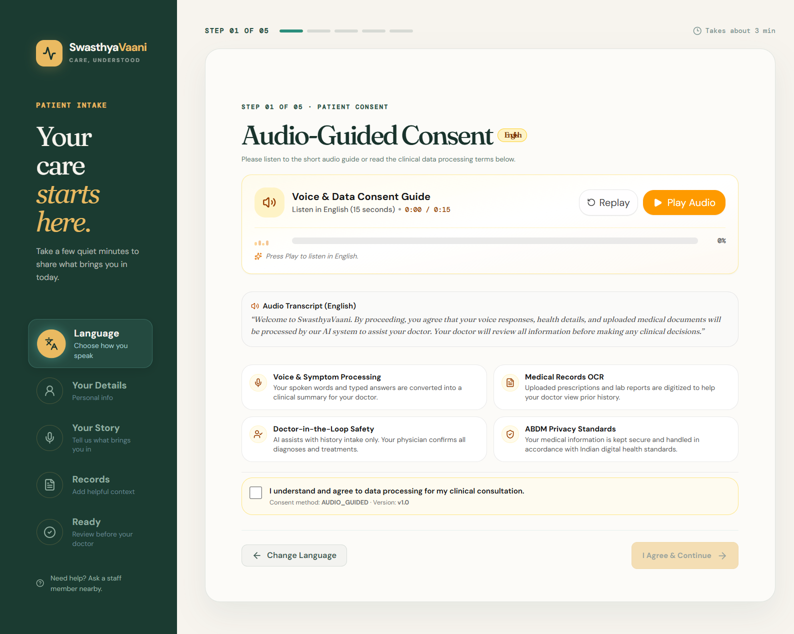<br/><sub>Consultation view</sub></td>
<td align="center"><br/><sub>Structured patient report</sub></td>
</tr>
</table>

### Healthcare Interoperability — ABDM and FHIR R4

Both ABDM and FHIR R4 support are implemented, not just planned:

- **ABDM Gateway** — a dual-mode gateway (Sandbox and Simulation) handles ABHA authentication, including camera/file-based ABHA QR scanning and demographic parsing, OTP login, and pushing clinical records to a Health Information Provider (HIP) endpoint (`/api/v1/abdm/hip/push`).
- **FHIR R4** — confirmed clinical records are transformed into NRCES India Core–compliant `OPConsultRecord` Document Bundles (Composition, Patient, Condition, Observation, MedicationStatement, AllergyIntolerance, plus AYUSH/NAMASTE extensions), with a dedicated validator.

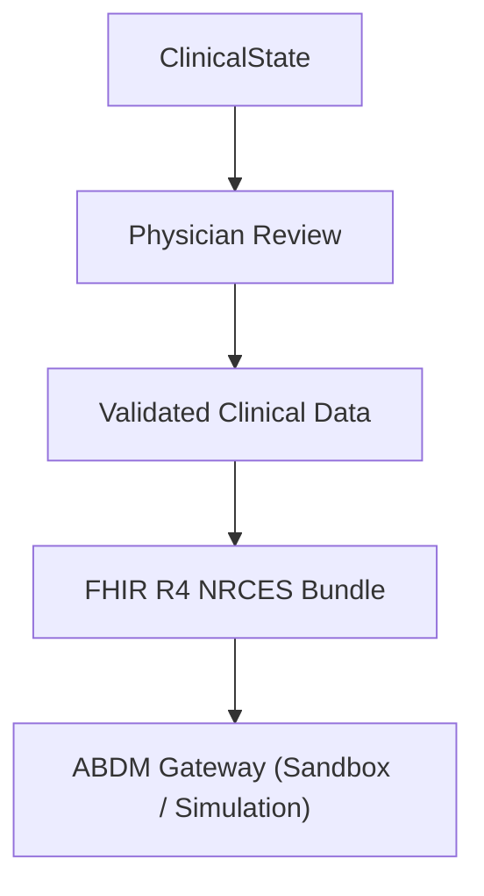

The gateway currently operates in sandbox/simulation mode; production ABDM registration is a deployment-time configuration step, not a code change.

### Kiosk Privacy Safeguards

Because the patient kiosk is often used in a shared or public waiting-room setting, an inactivity watcher monitors the session, shows an audio warning modal before timeout, and automatically purges session data to reduce PHI exposure risk between patients.

<p align="center"><br/><sub>Consent, shown before submission</sub></p>

### LLM Provider Benchmarking

A benchmarking CLI (`backend/benchmark.py`) evaluates Groq, Gemini, and the Mock LLM provider against a set of standard patient scenarios, tracking latency, information gain, stop accuracy, and hallucination rate. Results are recorded in `BENCHMARK_RESULTS.md`.

<!-- TODO: Pull 2–3 headline numbers from BENCHMARK_RESULTS.md here, e.g.:
> Groq averaged **X.Xs** median response time and **XX%** stop accuracy across N scenarios, vs. XX% for Gemini — see BENCHMARK_RESULTS.md for the full breakdown.
Concrete numbers here do more to convince a judge than the paragraph above. -->

---

## System Architecture

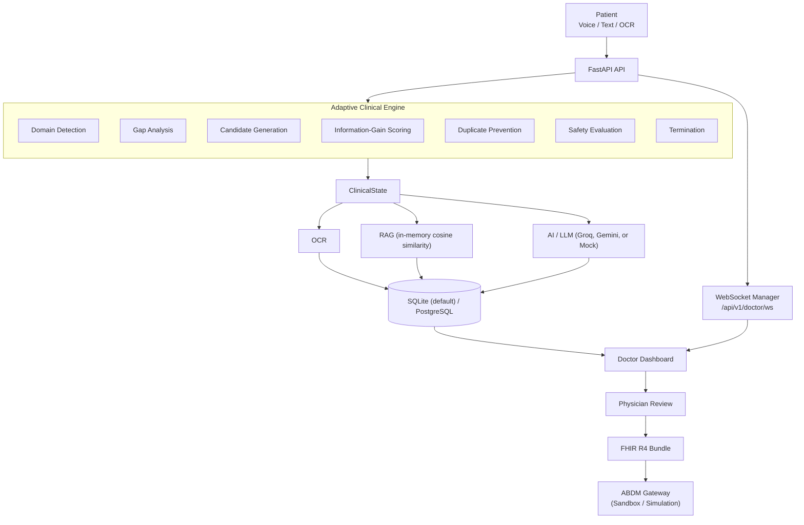

---

## Tech Stack

**Frontend**

| Component | Technology |
|---|---|
| Framework | React 19.1 + TypeScript |
| Build Tool | Vite 7 |
| Styling | Tailwind CSS v4 |
| UI Components | Radix UI / shadcn-style components |
| Data Fetching | TanStack (React) Query |
| Routing | Wouter |

**Backend**

| Component | Technology |
|---|---|
| Framework | Python 3.12 + FastAPI |
| API Style | REST-style HTTP APIs + WebSockets |
| Server | Uvicorn |
| Validation | Pydantic |
| ORM | SQLAlchemy 2.0 |
| Migrations | Alembic |

**Data, AI and Speech**

| Component | Technology |
|---|---|
| Database | PostgreSQL (Supabase) |
| Vector Storage & Search | JSON column + in-memory cosine similarity (no pgvector dependency; works on both SQLite and Postgres) |
| Knowledge Retrieval | RAG, backed by the above in-memory similarity search |
| LLM Providers | Groq, Gemini, Mock (default) |
| Speech (STT / TTS) | Sarvam AI + browser speech/voice layer + Mock |
| OCR | PaddleOCR, Mock (default) |
| Document Storage | Local filesystem (`./private_uploads/`) |
| Realtime Transport | WebSockets (FastAPI native) |

**Interoperability**

| Component | Status |
|---|---|
| FHIR R4 (NRCES India Core) | Implemented — OPConsultRecord bundle generation & validation |
| ABDM (ABHA, HIP push) | Implemented — Sandbox / Simulation gateway modes |

---

## Core Data Flow

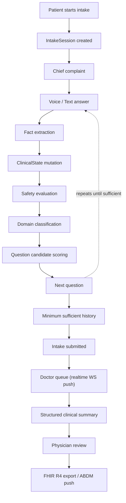

---

## Core Data Model

Conceptually:

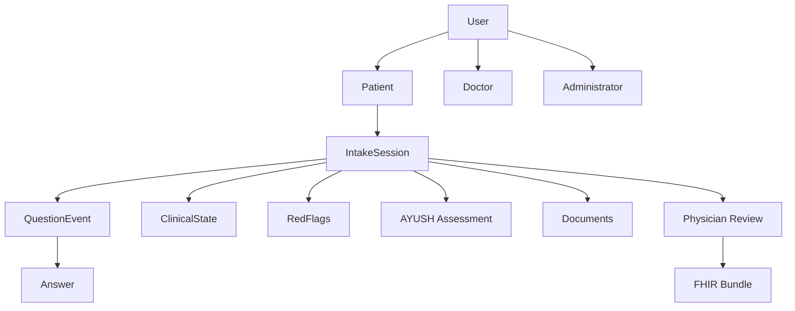

The intake session connects the conversation, structured clinical state, evidence, and physician review.

---

## AI Design Philosophy

> **Keep the AI probabilistic, but keep product control deterministic.**

**The AI can:**
- Understand natural language
- Extract candidate facts
- Formulate questions
- Summarize structured information

**The application controls:**
- Authorization
- Validation
- State persistence
- Question eligibility
- Duplicate prevention
- Safety rules
- Contradiction handling
- Termination
- Physician confirmation

The LLM does not independently decide whether a patient is safe, diagnosed, or finished with the clinical workflow.

---

## Reliability Principles

SwasthyaVaani is designed around several reliability safeguards:

- **Canonical dimensions** — Equivalent concepts, such as onset and duration, resolve to the same clinical dimension.
- **Duplicate prevention** — Previously resolved dimensions and explored areas do not reappear.
- **Session isolation** — One patient's ClinicalState never leaks into another patient's session.
- **Non-informative responses** — Unclear responses do not corrupt state or cause infinite loops.
- **Ambiguous answers** — A broad "yes" to a multi-part question does not automatically mark every proposition as true.
- **Early stopping** — The maximum question count is a safety ceiling, not the target.

---

## Product Modules

```mermaid
flowchart TD
    ROOT[SwasthyaVaani]

    ROOT --> PP[Patient Portal]
    PP --> PP1[Language Selection]
    PP --> PP2[Voice Intake]
    PP --> PP3["Chat / Touch Intake"]
    PP --> PP4[Adaptive Questions]
    PP --> PP5[Patient Profile]
    PP --> PP6[Records]
    PP --> PP7["ABHA QR Login"]

    ROOT --> DP[Doctor Portal]
    DP --> DP1["Dashboard (Realtime)"]
    DP --> DP2[Patient Queue]
    DP --> DP3[Clinical Summary]
    DP --> DP4[Conversation]
    DP --> DP5[Red Flags]
    DP --> DP6["Records & Attachments"]
    DP --> DP7[AYUSH Assessment]

    ROOT --> AP[Admin Portal]
    AP --> AP1[Hospital Management]
    AP --> AP2[Department Management]
    AP --> AP3[Doctor Management]
    AP --> AP4[Monitoring]
    AP --> AP5["Audit / QA"]
```

---

## Environment Configuration

Never commit API keys or secrets. The real template lives at **`backend/.env.example`** (there is no root-level `.env.example`).

| Category | Key Variables |
|---|---|
| Security & Auth | `SECRET_KEY`, `ACCESS_TOKEN_EXPIRE_MINUTES`, `SEED_USER_DOC_01_PASSWORD`, `SEED_USER_ADMIN_01_PASSWORD` |
| AI Provider Selection | `PROVIDER_LLM`, `PROVIDER_SPEECH`, `PROVIDER_OCR`, `EMBEDDING_PROVIDER`, `LLM_PROVIDER`, `GROQ_API_KEY`, `GEMINI_API_KEY`, `OPENAI_API_KEY` |
| Speech & Audio | `SARVAM_API_KEY`, `BHASHINI_API_KEY`, `BHASHINI_USER_ID` |
| Document Intelligence | `DOCUMENT_STORAGE_DIR`, `DOCUMENT_MAX_FILE_SIZE_BYTES`, `DOCUMENT_MAX_PAGE_COUNT`, `DOCUMENT_AUTO_PROCESS`, `KUNAL_DOCUMENT_EXTRACTOR_PROVIDER`, `KUNAL_GROQ_API_KEY`, `KUNAL_GROQ_DOCUMENT_MODEL`, `KUNAL_GEMINI_API_KEY`, `KUNAL_GEMINI_DOCUMENT_MODEL` |
| ABDM Gateway | `ABDM_GATEWAY_MODE`, `ABDM_GATEWAY_BASE_URL`, `ABDM_CLIENT_ID`, `ABDM_CLIENT_SECRET`, `ABDM_FACILITY_ID`, `ABDM_HIP_ID` |
| Guardrails | `MAX_QUESTIONS_DEFAULT`, `MAX_CONSECUTIVE_LOW_PROGRESS` |

By default, `PROVIDER_LLM`, `PROVIDER_SPEECH`, `PROVIDER_OCR`, and `EMBEDDING_PROVIDER` are all set to `mock`, and the database URL defaults to a local SQLite file (`sqlite:///./swasthyavaani.db`) — no keys or external database are required to run the project locally.

---

## Verification, Testing and Benchmarking

| Command | Purpose |
|---|---|
| `pytest` (run from `backend/`) | Backend test suite (50+ test files, 180+ tests) |
| `npm test` | Frontend unit tests (QR parser, intake components) |
| `npm run typecheck` | Static TypeScript validation (`tsc --noEmit`) |
| `npm run build` | Production Vite build |
| `python benchmark.py` (from `backend/`) | LLM provider benchmarking — see `BENCHMARK_RESULTS.md` |
| `alembic upgrade head` (from `backend/`) | Apply database migrations |
| `ruff check .` (from `backend/`) | Python linting |

---

## Documentation

| Document | Purpose |
|---|---|
| [`README.md`](./README.md) | Project overview, setup & positioning |
| [`docs/SwasthyaVaani_PRD.md`](./docs/SwasthyaVaani_PRD.md) | What the product must do |
| [`docs/SwasthyaVaani_architecture.md`](./docs/SwasthyaVaani_architecture.md) | How the system is structured |
| [`docs/SwasthyaVaani_TRD.md`](./docs/SwasthyaVaani_TRD.md) | Technical implementation details |
| [`docs/SwasthyaVaani_backend_schema.md`](./docs/SwasthyaVaani_backend_schema.md) | Data models & API contracts |
| [`docs/SwasthyaVaani_rules.md`](./docs/SwasthyaVaani_rules.md) | Adaptive engine & safety rules |
| [`docs/SwasthyaVaani_appflow.md`](./docs/SwasthyaVaani_appflow.md) | UX / application flow |
| [`docs/SwasthyaVaani_AYUSH_Specification.md`](./docs/SwasthyaVaani_AYUSH_Specification.md) | AYUSH / Dashavidha Pariksha spec |
| [`docs/SwasthyaVaani_Current_Project_State.md`](./docs/SwasthyaVaani_Current_Project_State.md) | Snapshot of current build status |
| [`docs/TEAM_CONTRACTS.md`](./docs/TEAM_CONTRACTS.md) | Team roles & domain ownership |
| [`CURRENT_OCR_FLOW.md`](./CURRENT_OCR_FLOW.md) | Document upload & OCR pipeline |
| [`BENCHMARK_RESULTS.md`](./BENCHMARK_RESULTS.md) | LLM provider benchmark results |

---

## Troubleshooting

- **Frontend can't reach the API** — confirm the backend is running on port 8000 before starting the frontend; Vite's dev server proxies `/api` and WebSocket traffic to it.
- **`pip install` fails on PaddleOCR** — make sure you're installing a build compatible with your Python version and platform; if you don't need real OCR locally, leave `PROVIDER_OCR=mock` (the default) and skip it.
- **venv activation fails on Windows** — use `.venv\Scripts\activate` in PowerShell/cmd, not the macOS/Linux `source` form.
- **Can't log in as Doctor/Admin** — use the [seed credentials](#5-seed-test-credentials) above; they're created automatically the first time the backend starts against a fresh database.
- **Wrong database in use** — check `DATABASE_URL` in `backend/.env`; if unset, SQLite is used automatically.

---

## Roadmap

### Implemented

- Patient intake (voice/text), adaptive clinical questioning, ClinicalState
- Modern clinical history + baseline and full AYUSH assessment (Dashavidha Pariksha)
- Doctor dashboard with realtime WebSocket updates
- Deterministic safety/red-flag rules (cardiac, pain severity, febrile respiratory, GI bleed)
- OCR/document pipeline with local secure storage
- ABDM gateway (Sandbox/Simulation) and FHIR R4 (NRCES) export
- Kiosk privacy safeguards (inactivity purge)
- LLM provider benchmarking suite

### In Development / Proposed

- Acute visual-threat and neurological red-flag rules
- Deeper authentication and verification, TEE-based secure processing
- Production ABDM registration (beyond sandbox/simulation)
- Expanded audit capabilities
- Additional Indian languages beyond the current 13
- Advanced document intelligence
- Additional hospital administration capabilities

---

## What Makes SwasthyaVaani Different

SwasthyaVaani is not primarily trying to be another:

- Symptom chatbot
- Generic AI medical assistant
- Static digital form
- Medical document OCR tool

Its central focus is **adaptive first-mile clinical data collection**.

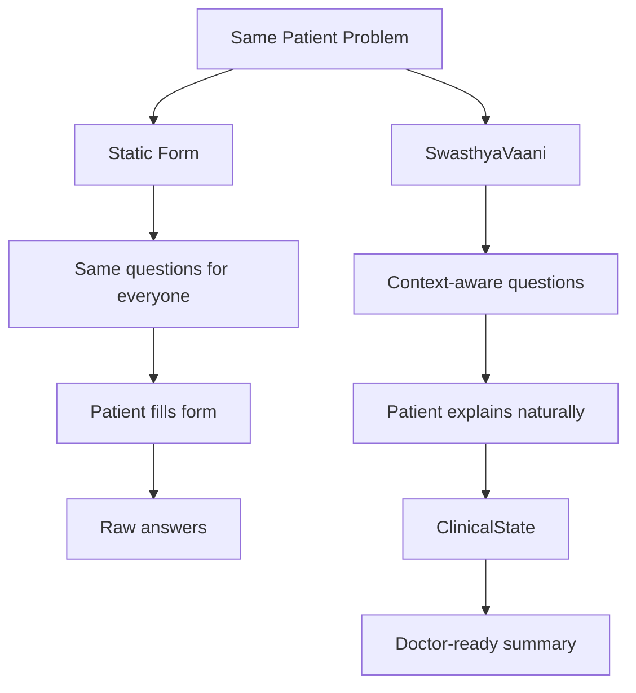

The value lies in improving the **patient-to-doctor handoff** before the consultation begins.

---

## Clinical Safety Philosophy

SwasthyaVaani is a clinical intake assistant, not an autonomous clinician.

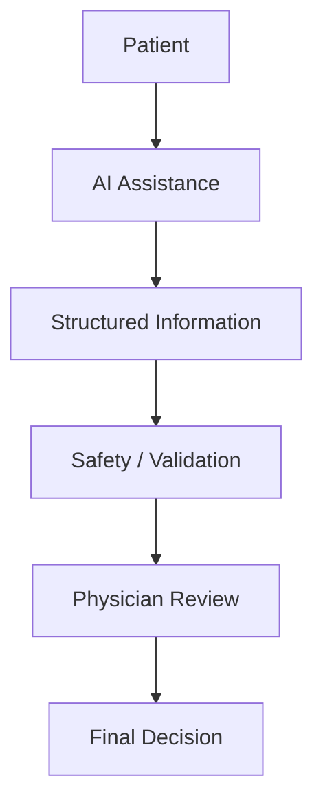

The physician remains responsible for diagnosis, treatment, and clinical decision-making.

---

## Project Status

**SwasthyaVaani is an evolving prototype built for Smart India Hackathon 2026, Problem Statement 26047.**

Core intake, safety, AYUSH, ABDM, and FHIR functionality is implemented and testable locally today (see [Quickstart](#quickstart-under-2-minutes)); some capabilities remain in development (see [Roadmap](#roadmap)). The project prioritizes:

1. Patient usability
2. Clinical usefulness
3. Adaptive questioning
4. Safety
5. Physician control
6. Data integrity
7. Multilingual accessibility
8. Interoperability

---

## Team

Developed as a collaborative project for **Smart India Hackathon 2026 (Problem Statement 26047)**.

| Name | Role |
|---|---|
| Omkar Dhakane | Backend, orchestration & system integration |
| Ishwari | Adaptive AI, ClinicalState & AYUSH |
| Ishita | Patient frontend, voice UX & AI interaction |
| Jaskeerat Singh Gill | Doctor frontend, realtime workflow & API integration |
| Kunal Bharadi | OCR & document processing |
| Rohan | Admin UI, testing, demo data & QA |

---

## License

No license file is currently included in this repository. Until one is added, all rights are reserved by the authors — add a `LICENSE` file (e.g. MIT or Apache 2.0) before any public or production distribution.

---

## Disclaimer

> SwasthyaVaani is a software prototype for pre-consultation clinical information collection and physician support. It is not a substitute for professional medical advice, diagnosis, or treatment. AI-generated information must be reviewed and validated by an appropriately qualified healthcare professional.

---

## Vision

> **Make every patient's story easier for a doctor to understand — before the consultation even begins.**

<div align="center">

**SwasthyaVaani**
*Care, Understood.*

</div>
