<div align="center">

# SwasthyaVaani

### AI-Assisted Clinical Intake for Faster, Structured Doctor Consultations

**Your story, structured before the consultation.**

</div>

SwasthyaVaani is an AI-assisted pre-consultation clinical intake platform designed for healthcare workflows in India. It collects a patient's symptoms and medical context through voice or text, adapts its questions based on the evolving clinical story, structures the information into a **ClinicalState**, and presents a concise, physician-reviewable summary before the consultation.

**Patient explains naturally → AI structures the story → Doctor reviews and decides.**

---

## Table of Contents

- [The Problem](#the-problem)
- [Our Approach](#our-approach)
- [Key Features](#key-features)
  - [Multilingual Voice and Text Intake](#multilingual-voice-and-text-intake)
  - [Adaptive Clinical Interview](#adaptive-clinical-interview)
  - [Structured ClinicalState](#structured-clinicalstate)
- [Safety and Red-Flag Awareness](#safety-and-red-flag-awareness)
- [Medical Document Intelligence](#medical-document-intelligence)
- [Modern Medicine and AYUSH](#modern-medicine-and-ayush)
- [Doctor Dashboard](#doctor-dashboard)
- [Multilingual Clinical Handoff](#multilingual-clinical-handoff)
- [Security and Privacy Direction](#security-and-privacy-direction)
- [Healthcare Interoperability](#healthcare-interoperability)
- [System Architecture](#system-architecture)
- [Tech Stack](#tech-stack)
- [Core Data Flow](#core-data-flow)
- [Core Data Model](#core-data-model)
- [AI Design Philosophy](#ai-design-philosophy)
- [Reliability Principles](#reliability-principles)
- [Product Modules](#product-modules)
- [Getting Started](#getting-started)
- [Environment Configuration](#environment-configuration)
- [Roadmap](#roadmap)
- [What Makes SwasthyaVaani Different](#what-makes-swasthyavaani-different)
- [Clinical Safety Philosophy](#clinical-safety-philosophy)
- [Project Status](#project-status)
- [Team](#team)
- [Documentation](#documentation)
- [Disclaimer](#disclaimer)
- [Vision](#vision)

---

## The Problem

A large part of a clinical consultation can be spent collecting basic patient history: the main complaint, onset, severity, location, associated symptoms, aggravating or relieving factors, medicines, allergies, and previous records.

Traditional digital forms often solve this with the same long checklist for everyone. This leads to:

- Irrelevant questions for the patient
- Fragmented information for the doctor
- Poor accessibility for patients who prefer voice or regional Indian languages
- Valuable consultation time spent on repetitive history-taking

SwasthyaVaani treats this as an **adaptive clinical intake problem**, rather than simply another medical chatbot.

---

## Our Approach

**Traditional intake:**

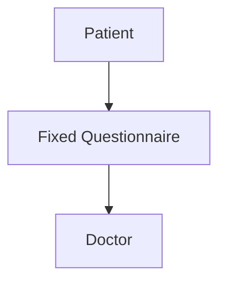

**SwasthyaVaani's intake:**

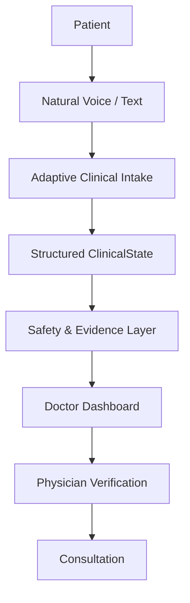

The system aims for **Minimum Sufficient History**: ask enough relevant questions to make the patient's story useful, without forcing every patient through the same checklist.

---

## Key Features

### Multilingual Voice and Text Intake

Patients can communicate through voice or text in supported languages, including Indian languages.

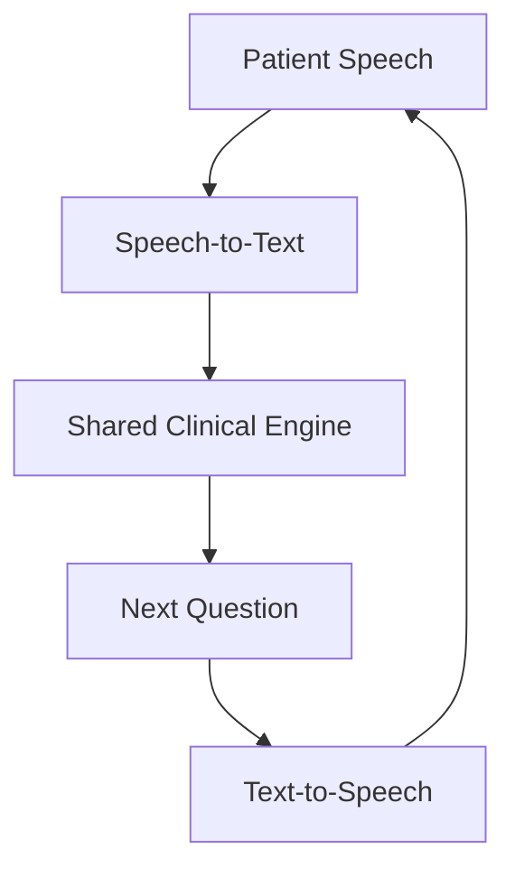

Voice and text use the same underlying clinical reasoning and state-management system.

### Adaptive Clinical Interview

The interview is designed to be adaptive rather than a rigid questionnaire. For each meaningful response, the system can:

1. Extract clinical facts
2. Update ClinicalState
3. Identify the relevant clinical domain
4. Recalculate information gaps
5. Generate candidate follow-ups
6. Score candidates using relevance, information gain, and safety priority
7. Prevent redundant questions
8. Decide whether more information is useful
9. Ask the next question or complete the intake

**Example:**

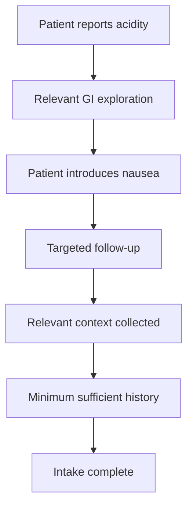

### Structured ClinicalState

Instead of keeping the patient's story only as an unstructured transcript, SwasthyaVaani maintains a structured representation of the evolving clinical information.

ClinicalState can capture:

- Chief complaint
- Duration / onset
- Severity
- Location
- Character
- Associated symptoms
- Aggravating / relieving factors
- Medical history
- Medications
- Allergies
- Safety findings
- Contradictions
- Uncertainty
- AYUSH information
- Document-derived facts
- Provenance

Each dimension is tracked as one of the following states:

`UNKNOWN` · `KNOWN_TRUE` · `KNOWN_FALSE` · `AMBIGUOUS` · `KNOWN_WITH_VALUE`

This prevents missing or ambiguous information from being treated as confirmed fact.

---

## Safety and Red-Flag Awareness

Safety evaluation runs throughout the intake.

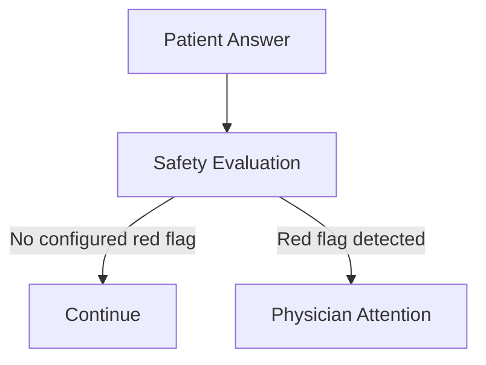

The safety layer is designed to be deterministic and configurable, rather than relying solely on an LLM. Relevant safety areas include:

- Acute visual threats
- Severe respiratory distress
- Cardiac emergency indicators
- Neurological red flags
- Gastrointestinal bleeding indicators

A red flag is an attention signal — **not an autonomous diagnosis**.

---

## Medical Document Intelligence

Patients can attach relevant previous records such as prescriptions and diagnostic reports.

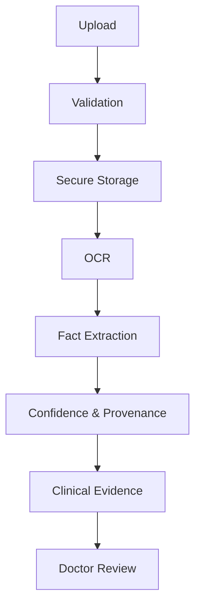

OCR-derived information remains reviewable evidence rather than unquestionable truth.

---

## Modern Medicine and AYUSH

SwasthyaVaani is designed to support modern clinical history-taking and AYUSH-oriented assessment within one platform.

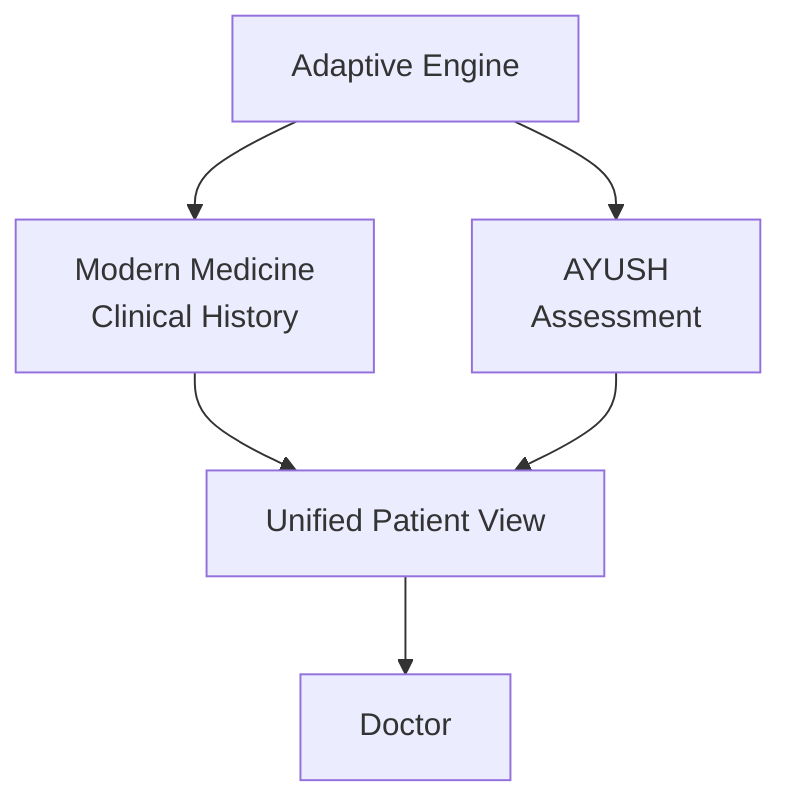

Baseline AYUSH concepts include **Prakriti**, **Vikriti**, **Agni**, and **Koshtha**.

The expanded design considers **Dashavidha Pariksha**, including Sara, Samhanana, Pramana, Satmya, Sattva, Ahara Shakti, Vyayama Shakti, and Vaya, with relevant Ahara-Vihara context.

AYUSH information supports physician review and is not intended for autonomous diagnosis or treatment.

---

## Doctor Dashboard

The patient-side intake becomes a structured clinical handoff. Doctors can view:

- Patient information
- Main concern
- AI-structured clinical summary
- Relevant clinical facts
- Red flags
- Uncertainty
- Contradictions
- Conversation / transcript
- Uploaded records
- OCR-derived information
- AYUSH assessment, where applicable
- Intake status and priority

The doctor remains the final clinical authority.

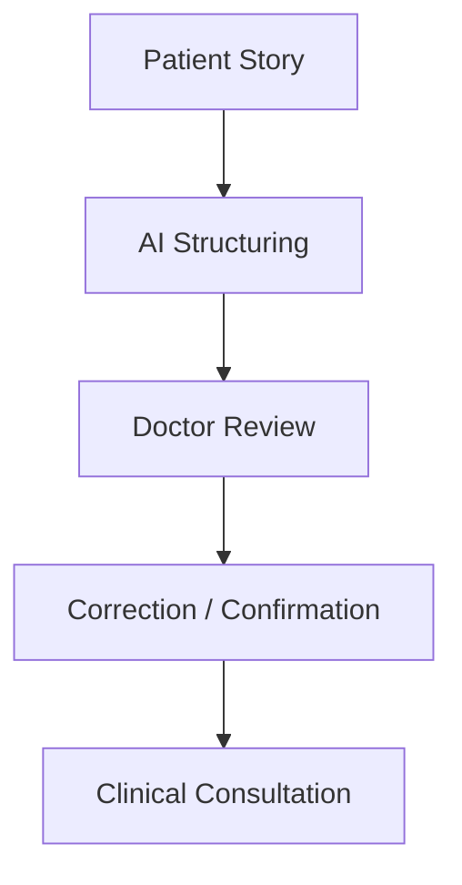

---

## Multilingual Clinical Handoff

Patient interaction language and doctor-facing structured language can be different. For example:

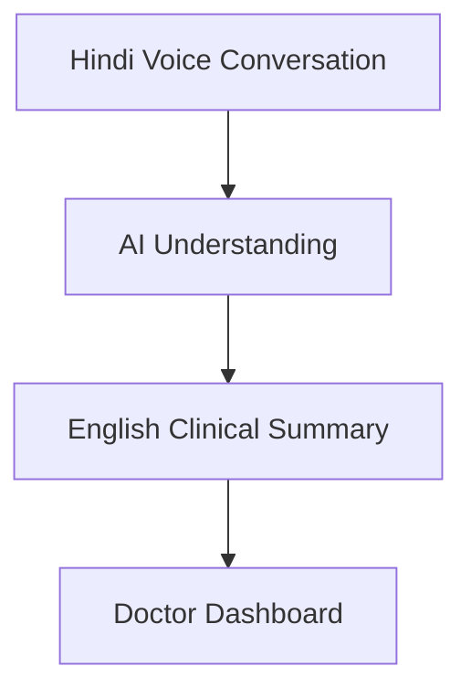

The original patient transcript remains available as evidence, while the doctor receives a standardized English summary.

---

## Security and Privacy Direction

The platform is designed with healthcare data protection in mind. The broader product direction includes:

- Authentication
- Role-based authorization
- Patient / doctor verification
- Session isolation
- Consent-aware workflows
- Auditability
- Secure document handling
- Provider secret protection
- Privacy-preserving processing
- TEE-based secure processing, where implemented

Planned capabilities are not represented as production-ready features until implemented and tested.

---

## Healthcare Interoperability

SwasthyaVaani is designed toward structured healthcare interoperability.

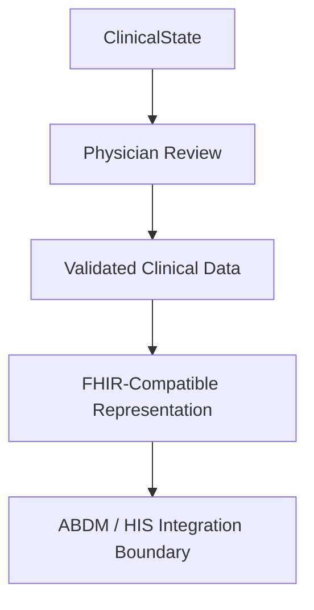

Live ABDM/HIS connectivity should only be claimed when an actual integration is implemented and tested.

---

## System Architecture

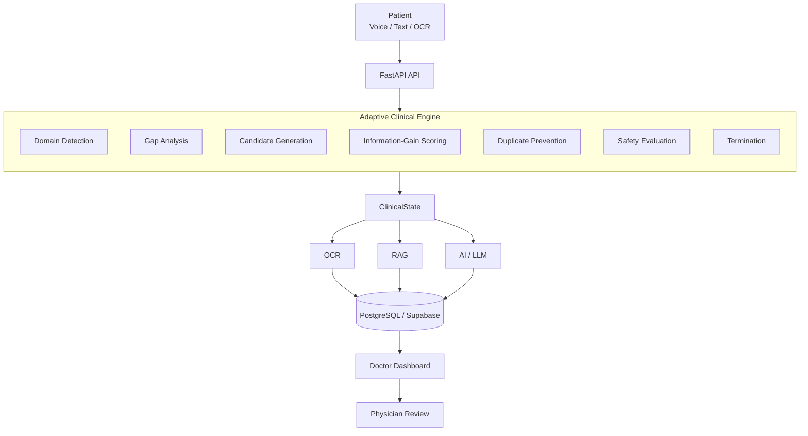

---

## Tech Stack

**Frontend**

| Component | Technology |
|---|---|
| Framework | React + TypeScript |
| Build Tool | Vite |
| Styling | Tailwind CSS |
| UI Components | Radix UI / shadcn-style components |
| Data Fetching | React Query |

**Backend**

| Component | Technology |
|---|---|
| Framework | Python + FastAPI |
| API Style | REST-style HTTP APIs |
| Server | Uvicorn |
| Validation | Pydantic |
| ORM | SQLAlchemy |
| Migrations | Alembic |

**Data, AI and Speech**

| Component | Technology |
|---|---|
| Database | PostgreSQL / Supabase |
| Vector Search | pgvector |
| LLM Providers | Groq, Gemini |
| Speech (STT / TTS) | Sarvam AI |
| OCR | PaddleOCR |
| Knowledge Retrieval | RAG (pgvector-backed) |

**Interoperability**

| Component | Direction |
|---|---|
| Health Data Standard | FHIR |
| National Registry | ABDM |

---

## Core Data Flow

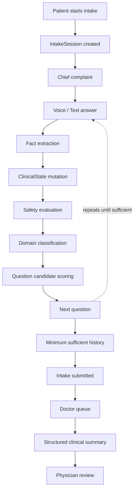

---

## Core Data Model

Conceptually:

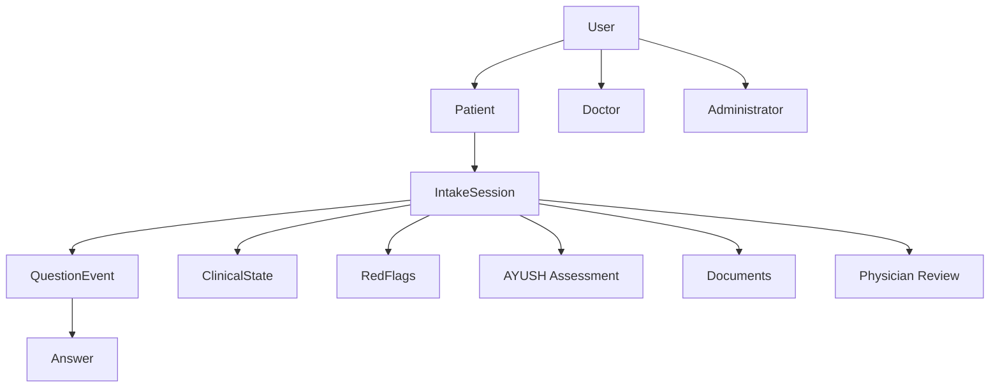

The intake session connects the conversation, structured clinical state, evidence, and physician review.

---

## AI Design Philosophy

> **Keep the AI probabilistic, but keep product control deterministic.**

**The AI can:**
- Understand natural language
- Extract candidate facts
- Formulate questions
- Summarize structured information

**The application controls:**
- Authorization
- Validation
- State persistence
- Question eligibility
- Duplicate prevention
- Safety rules
- Contradiction handling
- Termination
- Physician confirmation

The LLM does not independently decide whether a patient is safe, diagnosed, or finished with the clinical workflow.

---

## Reliability Principles

SwasthyaVaani is designed around several reliability safeguards:

- **Canonical dimensions** — Equivalent concepts, such as onset and duration, resolve to the same clinical dimension.
- **Duplicate prevention** — Previously resolved dimensions and explored areas do not reappear.
- **Session isolation** — One patient's ClinicalState never leaks into another patient's session.
- **Non-informative responses** — Unclear responses do not corrupt state or cause infinite loops.
- **Ambiguous answers** — A broad "yes" to a multi-part question does not automatically mark every proposition as true.
- **Early stopping** — The maximum question count is a safety ceiling, not the target.

---

## Product Modules

```mermaid
flowchart TD
    ROOT[SwasthyaVaani]

    ROOT --> PP[Patient Portal]
    PP --> PP1[Language Selection]
    PP --> PP2[Voice Intake]
    PP --> PP3["Chat / Touch Intake"]
    PP --> PP4[Adaptive Questions]
    PP --> PP5[Patient Profile]
    PP --> PP6[Records]

    ROOT --> DP[Doctor Portal]
    DP --> DP1[Dashboard]
    DP --> DP2[Patient Queue]
    DP --> DP3[Clinical Summary]
    DP --> DP4[Conversation]
    DP --> DP5[Red Flags]
    DP --> DP6["Records & Attachments"]
    DP --> DP7[AYUSH Assessment]

    ROOT --> AP[Admin Portal]
    AP --> AP1[Hospital Management]
    AP --> AP2[Department Management]
    AP --> AP3[Doctor Management]
    AP --> AP4[Monitoring]
    AP --> AP5["Audit / QA"]
```

---

## Getting Started

### Prerequisites

Typical development requirements:

- Node.js
- npm
- Python
- PostgreSQL / Supabase
- Required AI provider API keys
- Required speech/OCR configuration

### Clone the Repository

```bash
git clone <your-repository-url>
cd SwasthyaVaani
```

### Backend Setup

```bash
cd backend
python -m venv .venv
```

**Windows**
```bash
.venv\Scripts\activate
```

**macOS / Linux**
```bash
source .venv/bin/activate
```

Install dependencies:

```bash
pip install -r requirements.txt
```

Configure environment variables using the project's `.env.example`, then run:

```bash
uvicorn app.main:app --reload
```

### Frontend Setup

From the frontend/project directory:

```bash
npm install
npm run dev
```

> Exact commands may vary with the current repository structure. Treat repository configuration and `.env.example` files as the source of truth.

---

## Environment Configuration

Never commit API keys or secrets.

Typical configuration categories include:

```env
DATABASE_URL=
GROQ_API_KEY=
GEMINI_API_KEY=
SARVAM_API_KEY=
```

Use the actual variable names present in the repository.

---

## Roadmap

### Core

- Patient intake
- Voice/text interaction
- Adaptive clinical questioning
- ClinicalState
- Modern clinical history
- Doctor dashboard
- Structured summaries
- Baseline safety/red-flag handling
- OCR/document pipeline
- Baseline AYUSH concepts

### Expanded

- Expanded Dashavidha Pariksha
- Deeper authentication and verification
- TEE-based secure processing, where appropriate
- FHIR mapping
- ABDM/HIS integration
- Expanded audit capabilities
- Additional Indian languages
- Advanced document intelligence
- Additional hospital administration capabilities

Features are described according to their actual implementation status: **implemented**, **in development**, or **proposed**.

---

## What Makes SwasthyaVaani Different

SwasthyaVaani is not primarily trying to be another:

- Symptom chatbot
- Generic AI medical assistant
- Static digital form
- Medical document OCR tool

Its central focus is **adaptive first-mile clinical data collection**.

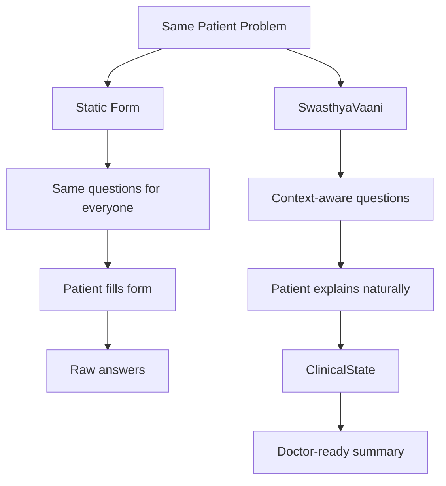

The value lies in improving the **patient-to-doctor handoff** before the consultation begins.

---

## Clinical Safety Philosophy

SwasthyaVaani is a clinical intake assistant, not an autonomous clinician.

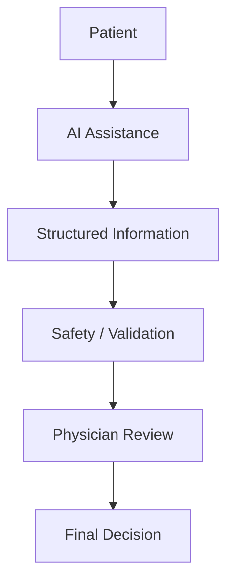

The physician remains responsible for diagnosis, treatment, and clinical decision-making.

---

## Project Status

**SwasthyaVaani is an evolving prototype built for Smart India Hackathon 2026.**

Some capabilities are implemented, while others are in development or proposed. The project prioritizes:

1. Patient usability
2. Clinical usefulness
3. Adaptive questioning
4. Safety
5. Physician control
6. Data integrity
7. Multilingual accessibility
8. Interoperability

---

## Team

Developed as a collaborative project for **Smart India Hackathon 2026**.

| Name | Role |
|---|---|
| Omkar Dhakane | Backend, orchestration & system integration |
| Ishwari | Adaptive AI, ClinicalState & AYUSH |
| Ishita | Patient frontend, voice UX & AI interaction |
| Jaskeerat Singh Gill | Doctor frontend, realtime workflow & API integration |
| Kunal Bharadi | OCR & document processing |
| Rohan | Admin UI, testing, demo data & QA |

---

## Documentation

Recommended project documentation:

```text
README.md
PRD.md
architecture.md
TRD.md
API / DB documentation
AI / Clinical Engine documentation
Security documentation
UX / Application Flow documentation
```

Keep each document focused:

| Document | Purpose |
|---|---|
| `README.md` | Project overview, setup & positioning |
| `PRD.md` | What the product must do |
| `architecture.md` | How the system is structured |
| `TRD.md` | Technical implementation details |
| AI / Clinical spec | Adaptive reasoning & clinical-state behavior |
| API / DB spec | Data models & API contracts |
| Security spec | Authentication, authorization & privacy |

---

## Disclaimer

> SwasthyaVaani is a software prototype for pre-consultation clinical information collection and physician support. It is not a substitute for professional medical advice, diagnosis, or treatment. AI-generated information must be reviewed and validated by an appropriately qualified healthcare professional.

---

## Vision

> **Make every patient's story easier for a doctor to understand — before the consultation even begins.**

<div align="center">

**SwasthyaVaani**
*Care, Understood.*

</div>
