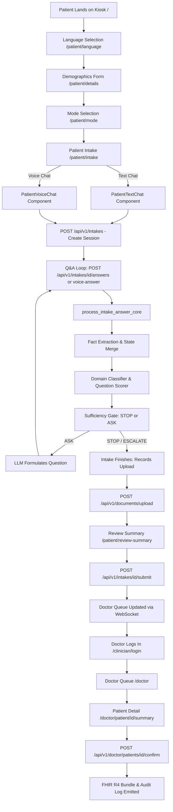
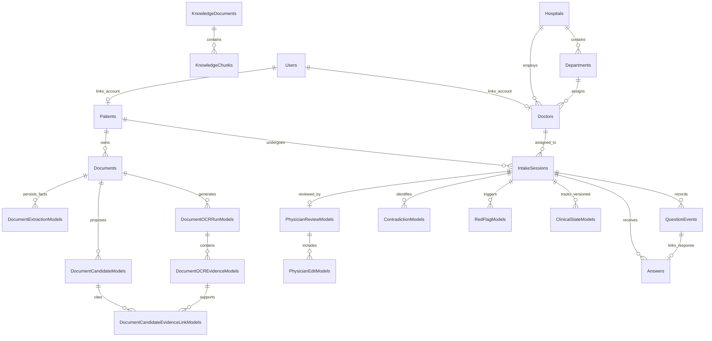
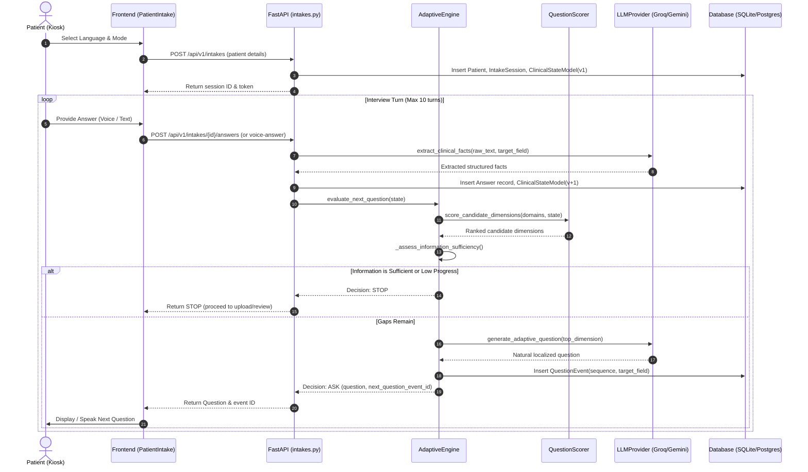
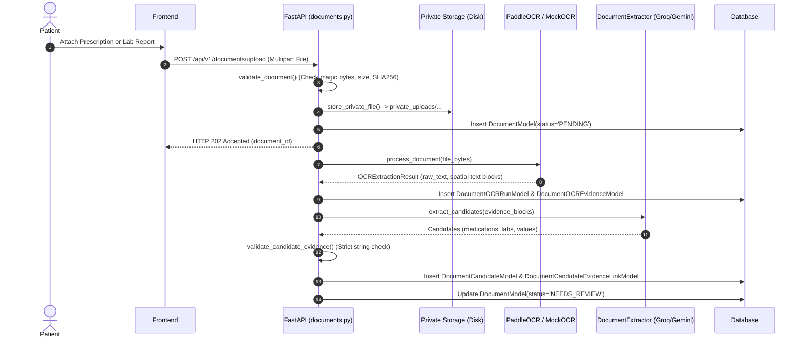
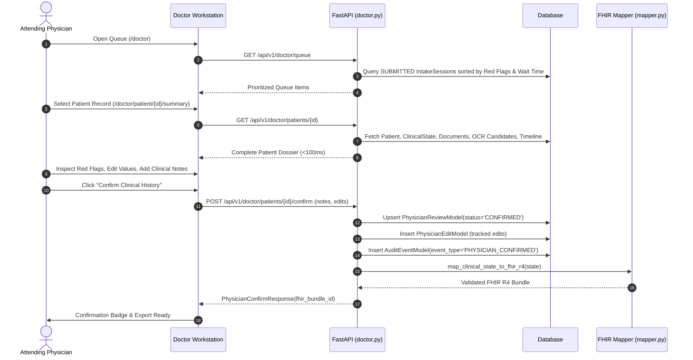

# SwasthyaVaani — Current Project State Forensic Audit
**Repository Snapshot & Architecture Baseline**  
**Generated:** September 2026  
**Target Specification:** SIH Problem Statement 26047  
**Audited Target:** `main` (Integrated from `Latest-b`)

---

## 1. Executive Summary

### What SwasthyaVaani Currently Is
SwasthyaVaani is a functioning hybrid web application and clinical pre-consultation intake platform designed for outpatient departments (OPDs) in Indian district hospitals. It gathers patient health complaints across multiple Indian languages (Hindi, Marathi, English) through multimodal kiosk interactions (voice and text chat), dynamically extracts structured clinical facts, computes next-question decisions via a deterministic information-gain adaptive engine, screens for emergency red flags, processes medical prescriptions/lab reports using OCR and LLM evidence extraction, and hands off a prioritized, verified dossier to the attending physician for review, modification, and ABDM/FHIR R4 generation.

### What is Genuinely Working
1. **End-to-End Multimodal Intake**: Both voice audio uploads (via `POST /api/v1/intakes/{id}/voice-answer`) and text answers (`POST /api/v1/intakes/{id}/answers`) successfully route through a **single, unified clinical reasoning engine** (`process_intake_answer_core`).
2. **Deterministic Adaptive Questioning Engine**: The interview state machine is governed by deterministic rules rather than autonomous LLM hallucination. Dimensions are scored based on clinical information gain and SOCRATES history dimensions, while the LLM is restricted to phrasing the question in the requested Indic language.
3. **Information Sufficiency Gate**: An early-stopping clinical sufficiency gate terminates intake once core diagnostic dimensions are adequately characterized (e.g., 3–4 targeted questions for ophthalmic or acute GI complaints) instead of grinding patients through arbitrary question counts.
4. **Safety & Red Flag Detection**: Deterministic screening runs every turn for emergency conditions (e.g., cardiac chest pain with arm radiation, high fever with dyspnea, gastrointestinal bleeding/melena, pain severity $\ge 8/10$) and tags intakes with `PRIORITY_REVIEW` on the doctor queue.
5. **Document Intelligence & OCR Evidence Linking**: Uploaded medical prescriptions and lab reports are stored privately, processed via OCR (PaddleOCR or Mock), extracted into structured candidate entities by Groq/Gemini, strictly validated against OCR evidence text, and made available to the clinician for inline review and document viewing.
6. **Doctor Workstation & Live Queue**: Doctors authenticate via JWT, view a sorted queue (prioritizing red flags and wait times), inspect structured clinical summaries, review conversation timelines, inspect uploaded documents, edit fields, and issue explicit digital confirmations (`POST /api/v1/doctor/patients/{id}/confirm`).
7. **Hospital Operations & Admin Portal**: Admins manage hospital metadata, doctor onboarding, staff RBAC, view real-time triage statistics, inspect AI override metrics, and trigger QA test runs.
8. **Automated Test Coverage**: 181 backend unit and integration tests passing in 4m 43s (`pytest`), covering adaptive selection, modality equivalence, safety rules, document extraction, RAG, auth, and doctor endpoints.

### What the Main Architecture Currently Looks Like
- **Frontend**: Next.js/React 18 single-page application using Vite, TypeScript, Tailwind CSS, Lucide React, and Radix UI components. Client-side routing managed via `wouter`.
- **Backend**: FastAPI modular monolith running on Python 3.12 (uvicorn). Divided into modular routers under `/api/v1/` (`auth`, `intakes`, `doctor`, `documents`, `admin`, `speech`, `rag`, `fhir`, `abdm`).
- **Database & Persistence**: Relational storage via SQLAlchemy ORM. Configured out-of-the-box with local SQLite (`swasthyavaani.db`) with complete schema compatibility for PostgreSQL/Supabase. Migrations managed via Alembic.
- **AI/ML Layer**: Interface-driven Provider Abstraction Layer (`AbstractLLMProvider`, `AbstractSpeechProvider`, `AbstractOCRProvider`, `AbstractEmbeddingProvider`). Pluggable adapters support Groq (`qwen/qwen3.8-27b`), Google Gemini (`gemini-3.5-flash-lite`), PaddleOCR, Sarvam Speech, Bhashini, and high-fidelity Mock providers.

### What AYUSH Currently Does
AYUSH (Ayurveda, Yoga & Naturopathy, Unani, Siddha, Homoeopathy) is implemented as a **first-class workflow inside the shared adaptive engine** (`workflow_type="AYUSH"`), **not as a disconnected chatbot**. When active, it prioritizes traditional clinical intake parameters (Agni, Koshtha, Prakriti, Ahara/Vihara, Dosha balance), grounds questions in authentic Ministry of AYUSH NAMSTP guidelines via the semantic RAG service, stores parameters in `ClinicalState.ayush`, and visualizes them on the dedicated doctor portal screen (`/doctor/patient/:id/ayush`).

### What Document/OCR Currently Does
Uploaded patient documents (PDF, PNG, JPEG up to 10MB) undergo file signature verification and private filesystem persistence. The document is processed by PaddleOCR/MockOCR to yield spatial text blocks. A candidate extraction service (Groq `openai/gpt-oss-120b` or Gemini `gemini-2.5-flash-lite`) extracts medications and lab observations. Crucially, an **anti-hallucination validation gate** requires every extracted candidate string to exist within the supporting OCR text blocks. These unconfirmed candidates and source files are directly accessible to the doctor for verification.

### What the Doctor Currently Receives
The attending physician receives an authenticated workstation displaying:
- Patient demographics and triage queue priority badge.
- Chief complaint, onset, duration, severity, location, radiation, and associated factors.
- Safety alerts and red flags with supporting evidence.
- Contradiction notices (e.g., patient claims discontinued medication vs active prescription).
- AYUSH assessment metrics (Agni, Koshtha, Prakriti, Tri-Dosha gauge).
- Attached medical records with inline preview and side-by-side OCR candidate extractions.
- Turn-by-turn conversational transcript timeline with original patient language and input modality.
- Ability to edit any extracted field, record clinical notes, confirm the record, and generate an ABDM-compliant NRCES India Core FHIR R4 Bundle.

### Biggest Confirmed Technical Gaps
1. **Frontend Patient Identity Coupling**: Patient profile data in the kiosk defaults to local storage (`localStorage['sv_patient_profile']` initialized with dummy patient "Ananya Sharma") rather than querying an initial patient lookup API.
2. **RAG Vector Search Mechanism**: RAG vector retrieval currently computes cosine similarity in Python over JSON-serialized float arrays stored in the database, rather than using a native database vector index extension like `pgvector` / HNSW.
3. **Realtime WebSocket Queue Consumer**: While backend WebSocket broadcasts (`/api/v1/doctor/ws`) are implemented and fire on intake submission/confirmation, the frontend `DoctorPortal.tsx` primarily relies on a 5-second HTTP polling fallback (`fetchLiveQueue()`) alongside WebSockets.

### Biggest Architectural Gaps (v2 Readiness)
1. **Supabase Cloud Storage Integration**: Document storage is currently written to local private disk storage (`DOCUMENT_STORAGE_DIR=./private_uploads`) rather than Supabase S3-compatible cloud bucket storage.
2. **Kiosk Doctor/Hospital Dynamic Selection**: In the patient kiosk flow, hospital ID and doctor ID default to seeded constants (`hosp_district_01`, `doc_001`) rather than providing a patient-facing kiosk department/doctor selector during onboarding.

---

## 2. Status Legend

The following standard status vocabulary is used consistently throughout this forensic audit:

- 🟢 **IMPLEMENTED**: Code exists, is wired into runtime, and has test/execution verification.
- 🟡 **PARTIALLY IMPLEMENTED**: Functional in core code, but missing secondary features, using fallbacks, or partially coupled to client storage.
- 🔴 **BROKEN**: Code exists but fails at runtime or contains unhandled exceptions under normal use.
- 🔵 **PLANNED / DOCUMENTED ONLY**: Described in PRD/TRD/architecture specs, but no backing implementation found in codebase.
- ⚪ **NOT FOUND**: Referenced neither in code nor in architecture documentation.
- 🟣 **IMPLEMENTED BUT NOT DOCUMENTED**: Active in the codebase, but omitted from original documentation or design briefs.

---

## 3. Repository Reconnaissance

### Repository Structure Map
```text
SwasthyaVaani/
├── AGENTS.md                                # Project guidelines & AI rules
├── CURRENT_OCR_FLOW.md                      # Forensic document intelligence trace
├── alembic.ini                              # Database migration configuration
├── package.json                             # Frontend dependencies & scripts
├── tsconfig.json                            # TypeScript configuration
├── vite.config.ts                           # Vite server & reverse proxy configuration
├── swasthyavaani.db                         # Local SQLite development database
│
├── docs/                                    # System documentation specifications
│   ├── SwasthyaVaani_PRD.md
│   ├── SwasthyaVaani_TRD.md
│   ├── SwasthyaVaani_architecture.md
│   ├── SwasthyaVaani_backend_schema.md
│   ├── SwasthyaVaani_rules.md
│   ├── SwasthyaVaani_appflow.md
│   ├── SwasthyaVaani_UI_UX_Design_Brief.md
│   ├── SwasthyaVaani_implementation_plan.md
│   └── TEAM_CONTRACTS.md
│
├── backend/                                 # FastAPI Backend Service
│   ├── alembic/                             # Database migrations
│   │   └── versions/
│   │       ├── 2c1db709b90d_initial_schema.py
│   │       ├── 6f3a1c9d8b42_document_intelligence.py
│   │       ├── 9a72e4c18f31_persist_ocr_evidence.py
│   │       ├── a7c3e91d4b20_align_doctor_schema.py
│   │       ├── b4f08c2e6a91_add_user_password_hash.py
│   │       ├── c4e8d2a71b09_persist_document_candidates.py
│   │       └── d8f2a6b91c04_rag_knowledge_tables.py
│   │
│   ├── app/
│   │   ├── main.py                          # Application entrypoint & CORS
│   │   ├── api/
│   │   │   ├── router.py                    # Master API router
│   │   │   └── v1/                          # Versioned endpoints
│   │   │       ├── auth.py                  # JWT authentication & profile
│   │   │       ├── intakes.py               # Intake creation, answer submission
│   │   │       ├── doctor.py                # Doctor queue, clinical details, confirm
│   │   │       ├── documents.py             # Private document upload, OCR, viewing
│   │   │       ├── admin.py                 # Admin dashboard, staff RBAC, QA runner
│   │   │       ├── speech.py                # Standalone ASR & TTS utility endpoints
│   │   │       ├── rag.py                   # RAG knowledge status, doc ingestion, query
│   │   │       ├── fhir.py                  # FHIR R4 Bundle export
│   │   │       └── abdm.py                  # ABHA verification, HIP push simulation
│   │   │
│   │   ├── core/
│   │   │   ├── config.py                    # Pydantic BaseSettings (.env loading)
│   │   │   ├── database.py                  # SQLAlchemy engine & SessionLocal
│   │   │   ├── security.py                  # Password hashing & JWT verification
│   │   │   └── events.py                    # WebSocket connection manager
│   │   │
│   │   ├── models/                          # SQLAlchemy ORM Entities
│   │   │   ├── user.py                      # User, Hospital, Department, Doctor, Patient
│   │   │   ├── intake.py                    # IntakeSession, QuestionEvent, Answer, ClinicalStateModel
│   │   │   ├── document.py                  # DocumentModel, DocumentOCRRunModel, DocumentOCREvidenceModel, etc.
│   │   │   ├── safety.py                    # RedFlagModel, ContradictionModel
│   │   │   ├── review.py                    # PhysicianReviewModel, PhysicianEditModel, AuditEventModel
│   │   │   └── knowledge.py                 # KnowledgeDocument, KnowledgeChunk
│   │   │
│   │   ├── schemas/                         # Pydantic Request/Response Models
│   │   │   ├── clinical_state.py            # ClinicalState, AyushState, CanonicalDimensionState
│   │   │   ├── intake.py                    # AnswerSubmitRequest, IntakeSessionDetail
│   │   │   ├── question.py                  # QuestionDecision, QuestionEvent
│   │   │   ├── doctor.py                    # DoctorQueueItem, DoctorPatientDetail
│   │   │   ├── document.py                  # DocumentUploadResponse, ExtractedFact
│   │   │   ├── rag.py                       # KnowledgeDocumentCreate, RAGContext
│   │   │   ├── admin.py                     # AdminDashboardStats, StaffUserResponse
│   │   │   ├── fhir.py                      # FHIRExportResponse
│   │   │   └── abdm.py                      # ABHAVerifyRequest, ABDMValidationReport
│   │   │
│   │   ├── services/                        # Business Logic & Domains
│   │   │   ├── clinical_ai/                 # Adaptive Reasoning Engine
│   │   │   │   ├── adaptive_engine.py       # Next question evaluation & sufficiency gate
│   │   │   │   ├── domain_classifier.py     # Multilingual domain detection
│   │   │   │   ├── question_scorer.py       # Canonical dimension mapping & scoring
│   │   │   │   ├── gap_analysis.py          # Clinical gap tracking
│   │   │   │   └── mock_provider.py         # Deterministic NLP fact extractor
│   │   │   ├── document_intelligence.py     # Document validation & storage keys
│   │   │   ├── document_extraction.py       # Semantic candidate extraction & validation
│   │   │   ├── safety/
│   │   │   │   ├── red_flags.py             # Emergency red flag rule engine
│   │   │   │   └── contradictions.py        # Medication cessation contradiction check
│   │   │   ├── rag/
│   │   │   │   ├── rag_service.py           # Ingestion & cosine similarity retrieval
│   │   │   │   └── ayush_seed_data.py       # Ministry of AYUSH reference guidelines
│   │   │   ├── fhir/
│   │   │   │   ├── mapper.py                # ClinicalState -> FHIR R4 Bundle mapper
│   │   │   │   └── abdm_validator.py        # NRCES India Core compliance checks
│   │   │   └── providers/                   # Abstract Provider Adapters
│   │   │       ├── base.py                  # Abstract base classes
│   │   │       ├── factory.py               # Singleton registry & dependency injection
│   │   │       ├── llm_provider.py          # Groq, Gemini, and Mock LLM adapters
│   │   │       ├── speech_provider.py       # Sarvam, Bhashini, and Mock speech
│   │   │       ├── ocr_provider.py          # PaddleOCR and Mock OCR adapters
│   │   │       └── embedding_provider.py    # Gemini & Mock embedding adapters
│   │   │
│   │   └── seed/
│   │       └── seed_data.py                 # Deterministic synthetic scenarios (A-027, A-021, SV-2048)
│   │
│   └── tests/                               # Comprehensive Automated Test Suite (181 tests)
│
└── src/                                     # React / Vite Frontend
    ├── main.tsx                             # React entry point
    ├── App.tsx                              # wouter Client-side Route Map
    ├── index.css                            # Complete clinical design system & tokens
    ├── pages/                               # Route Pages
    │   ├── HomePage.tsx                     # Public landing page
    │   ├── PatientLanguageSelection.tsx     # Step 1: Language selection kiosk
    │   ├── PatientDetails.tsx               # Step 2: Demographics form
    │   ├── PatientModeSelection.tsx         # Step 3: Voice vs Text mode selection
    │   ├── PatientIntake.tsx                # Step 4: Core intake interview & upload
    │   ├── PatientReviewSummary.tsx         # Step 5: Patient review summary
    │   ├── PatientComplete.tsx              # Step 6: Confirmation token & queue status
    │   ├── ClinicianLogin.tsx               # Staff & Doctor authentication screen
    │   ├── DoctorPortal.tsx                 # Doctor triage queue workstation
    │   ├── DoctorPatientSummary.tsx         # Detailed patient record & confirmation
    │   ├── DoctorPatientConversation.tsx    # Chronological dialogue timeline
    │   ├── DoctorPatientAyush.tsx           # Dedicated AYUSH assessment tab
    │   └── HospitalOperations.tsx           # Hospital admin operations console
    ├── components/
    │   ├── PatientVoiceChat.tsx             # Voice audio recording, silence detection, waveform
    │   ├── PatientTextChat.tsx              # Text chat interface with interactive chips
    │   ├── doctor/                          # Doctor workstation subcomponents
    │   └── admin/                           # Admin portal subtabs
    ├── lib/
    │   ├── clinicianAuth.ts                 # JWT storage & authorizedClinicianFetch
    │   ├── conversationStore.ts             # Client-side intake answer accumulator
    │   ├── documentUploadState.ts           # Uploaded document session caching
    │   └── kioskTranslations.ts             # 13 Indic language UI translation dictionary
    └── services/
        ├── adminApi.ts                      # Admin dashboard & QA API client
        └── patientApi.ts                    # Patient profile client
```

---

## 4. Current End-to-End Application Flow



### Trace of Runtime Steps

| Step | Implemented? | File Path | API Endpoint | DB Entity | Current Behavior | Known Limitation |
|---|---|---|---|---|---|---|
| **Patient Entry** | 🟢 | `src/pages/HomePage.tsx` | N/A | None | Landing page displaying hero section and navigation buttons. | Static landing; entry points route to `/patient` or `/clinician/login`. |
| **Language Selection** | 🟢 | `src/pages/PatientLanguageSelection.tsx` | N/A | None | Displays 13 Indic languages; stores choice in `localStorage['sv_selected_language']`. | UI translations fully implemented for English, Hindi, and Marathi; remaining 10 languages fall back to English UI with translated greetings. |
| **Hospital / Doctor Selection** | 🟡 | `backend/app/api/v1/intakes.py` | `POST /api/v1/intakes` | `Hospital`, `Doctor` | Defaults to seeded hospital `hosp_district_01` and doctor `doc_001` upon session creation. | No patient-facing UI dropdown in kiosk to pick hospital/doctor; automatically assigned by kiosk terminal context. |
| **Patient Demographics** | 🟡 | `src/pages/PatientDetails.tsx` | `POST /api/v1/intakes` | `Patient` | Form captures name, age, gender, ABHA ID; persisted to backend `Patient` table on session creation. | Pre-fills with demo identity ("Ananya Sharma") if not edited by patient. |
| **Interaction Mode** | 🟢 | `src/pages/PatientModeSelection.tsx` | N/A | None | User selects "Voice Mode" or "Text Chat Mode"; sets `sv_selected_mode` in `localStorage`. | Modality can be switched mid-intake using UI buttons. |
| **Consent** | 🟢 | `src/pages/PatientIntake.tsx` | `POST /api/v1/intakes` | `IntakeSession` | Checkbox on final submission tab verifies patient consent for AI processing. | Consent is mandatory prior to submitting final queue handoff. |
| **Intake Creation** | 🟢 | `src/pages/PatientIntake.tsx` | `POST /api/v1/intakes` | `IntakeSession`, `ClinicalStateModel` (v1) | Backend generates unique token (e.g. `A-D291F4`), creates patient if needed, seeds empty `ClinicalState` v1. | Fully working. |
| **Chief Complaint** | 🟢 | `backend/app/services/clinical_ai/adaptive_engine.py` | `POST /api/v1/intakes/{id}/answers` | `QuestionEvent`, `Answer` | Open-ended opening prompt asks patient for primary concern; stored in `ClinicalState.chief_complaint`. | Works identically in English, Hindi, and Marathi. |
| **Q&A Adaptive Loop** | 🟢 | `backend/app/api/v1/intakes.py` | `POST /api/v1/intakes/{id}/answers` | `QuestionEvent`, `Answer`, `ClinicalStateModel` | Ingests answer, extracts structured facts, merges state, scores next candidate, generates localized question. | Max question safety brake set to 10. |
| **ClinicalState Update** | 🟢 | `backend/app/api/v1/intakes.py` | Line 206 `process_intake_answer_core` | `ClinicalStateModel` (v+1) | Merges extracted facts into existing state; increments version; appends transcript snippet. | Each turn increments state version (immutable audit snapshot). |
| **Safety Screening** | 🟢 | `backend/app/services/safety/red_flags.py` | Internal service call | `RedFlagModel`, `ClinicalState.red_flags` | Runs deterministic rules on every turn; tags emergencies (cardiac, melena, respiratory). | Generates alerts, never autonomous diagnoses. |
| **Termination Gate** | 🟢 | `backend/app/services/clinical_ai/adaptive_engine.py` | `_assess_information_sufficiency` | `IntakeSession.status` | Stops intake when core diagnostic dimensions are sufficient; sets status to `READY_TO_SUBMIT`. | Prevents redundant questioning when history is clinically complete. |
| **Document Upload** | 🟢 | `backend/app/api/v1/documents.py` | `POST /api/v1/documents/upload` | `DocumentModel` | Validates file type, checks SHA-256 hash for duplicates, saves to `private_uploads`, kicks off async OCR. | Local filesystem storage; Supabase cloud bucket upload is pending. |
| **Patient Review** | 🟢 | `src/pages/PatientReviewSummary.tsx` | `GET /api/v1/intakes/{id}` | None | Kiosk displays structured overview (chief concern, duration, severity, medications, attached docs) for patient sign-off. | Allows patient to verify or return to edit answers. |
| **Intake Submission** | 🟢 | `backend/app/api/v1/intakes.py` | `POST /api/v1/intakes/{id}/submit` | `IntakeSession`, `RedFlagModel` | Marks status `SUBMITTED`, sets triage priority (`URGENT` if red flags present), broadcasts WebSocket event. | Real-time broadcast pushed to connected doctor queues. |
| **Doctor Queue** | 🟢 | `src/pages/DoctorPortal.tsx` | `GET /api/v1/doctor/queue` | `IntakeSession`, `Patient`, `ClinicalStateModel` | Triage list sorted by priority (`Priority` vs `Routine`) and wait time. | Real-time updates via 5s poll + live WebSocket. |
| **Doctor Patient Record** | 🟢 | `src/pages/DoctorPatientSummary.tsx` | `GET /api/v1/doctor/patients/{id}` | All intake & document tables | Loads complete clinical dossier, attached documents, OCR candidates, timeline, and AYUSH data in <100ms. | Aggregates unlinked documents automatically if patient matches. |
| **Physician Review & Confirmation** | 🟢 | `backend/app/api/v1/doctor.py` | `POST /api/v1/doctor/patients/{id}/confirm` | `PhysicianReviewModel`, `PhysicianEditModel`, `AuditEventModel` | Clinician saves notes, edits values, confirms record, triggers audit event, and generates validated FHIR R4 Bundle. | Strict safety adherence: Physician is final decision-maker. |

### Voice Flow vs. Text/Chat Flow: Equivalence Verification
Both modalities are verified to use the **EXACT SAME CLINICAL REASONING PIPELINE**:
- **Voice Flow**: The client sends audio via FormData to `POST /api/v1/intakes/{id}/voice-answer`. The backend transcribes audio using `SpeechService` (Sarvam / Bhashini / Mock), extracts text, and immediately calls `process_intake_answer_core(input_mode="VOICE")`.
- **Text Flow**: The client sends JSON `{ "raw_text": "...", "input_mode": "TEXT" }` to `POST /api/v1/intakes/{id}/answers`. The backend immediately calls `process_intake_answer_core(input_mode="TEXT")`.
- **Convergence**: Both endpoints execute the exact same fact extraction, state merging, domain classification, canonical dimension scoring, sufficiency evaluation, and question generation.
- **Evidence**: `backend/tests/verify_voice_text_unification.py` and `backend/tests/test_modality_equivalence.py` prove that submitting identical clinical statements via voice and text produces identical state transitions, identical candidate scoring, and identical decision actions.

---

## 5. Frontend Audit

### Patient Flow

| Route | Component | API Calls | Backend Dependency | Data Origin | Status |
|---|---|---|---|---|---|
| `/` | `src/pages/HomePage.tsx` | None | None | Static UI content | 🟢 |
| `/patient` or `/patient/language` | `src/pages/PatientLanguageSelection.tsx` | None | None | Stored in `localStorage` | 🟢 |
| `/patient/details` | `src/pages/PatientDetails.tsx` | None | None | Read/Write to `localStorage` | 🟡 (Default mock profile) |
| `/patient/mode` | `src/pages/PatientModeSelection.tsx` | None | None | Stored in `localStorage` | 🟢 |
| `/patient/intake` | `src/pages/PatientIntake.tsx` | `POST /api/v1/intakes`, `POST /api/v1/documents/upload`, `POST /api/v1/intakes/{id}/submit` | `intakes.py`, `documents.py` | Real backend database records | 🟢 |
| (Subcomponent) | `src/components/PatientTextChat.tsx` | `POST /api/v1/intakes`, `POST /api/v1/intakes/{id}/answers` | `intakes.py` | Real backend database records | 🟢 |
| (Subcomponent) | `src/components/PatientVoiceChat.tsx` | `POST /api/v1/intakes/{id}/voice-answer`, `POST /api/v1/speech/tts` | `intakes.py`, `speech.py` | Real backend database records | 🟢 |
| `/patient/review` or `/patient/review-summary` | `src/pages/PatientReviewSummary.tsx` | `GET /api/v1/intakes/{id}` | `intakes.py` | Real backend database records | 🟢 |
| `/patient/complete` | `src/pages/PatientComplete.tsx` | None | None | Reads token from `localStorage` | 🟢 |

### Doctor Portal

| Route | Component | API Calls | Backend Dependency | Data Origin | Status |
|---|---|---|---|---|---|
| `/clinician/login` or `/doctor/login` | `src/pages/ClinicianLogin.tsx` | `POST /api/v1/auth/login` | `auth.py` | Real backend DB (`users` table) | 🟢 |
| `/doctor` | `src/pages/DoctorPortal.tsx` | `GET /api/v1/doctor/queue`, `WS /api/v1/doctor/ws` | `doctor.py` | Real backend DB (`intake_sessions`) | 🟢 |
| `/doctor/patient/:id/summary` | `src/pages/DoctorPatientSummary.tsx` | `GET /api/v1/doctor/patients/{id}`, `POST /api/v1/doctor/patients/{id}/confirm`, `POST /api/v1/documents/{id}/process` | `doctor.py`, `documents.py` | Real backend DB (complete intake state) | 🟢 |
| `/doctor/patient/:id/conversation` | `src/pages/DoctorPatientConversation.tsx` | `GET /api/v1/doctor/patients/{id}/conversation` | `doctor.py` | Real backend DB (`question_events`, `answers`) | 🟢 |
| `/doctor/patient/:id/ayush` | `src/pages/DoctorPatientAyush.tsx` | `GET /api/v1/doctor/patients/{id}` | `doctor.py` | Real backend DB (`ClinicalState.ayush`) | 🟢 |
| `/doctor/patient/:id` | `src/pages/DoctorPatientReview.tsx` | Delegates to `DoctorPatientSummary` | `doctor.py` | Real backend DB | 🟢 |

### Admin Portal

| Route | Component | API Calls | Backend Dependency | Data Origin | Status |
|---|---|---|---|---|---|
| `/admin` or `/admin/dashboard` | `src/pages/HospitalOperations.tsx` (`DashboardOverviewTab`) | `GET /api/v1/admin/stats` | `admin.py` | Real DB counts & aggregation | 🟢 |
| `/admin/ai-monitoring` | `src/pages/HospitalOperations.tsx` (`AIMonitoringTab`) | `GET /api/v1/admin/ai-monitoring` | `admin.py` | Real DB intake states & override stats | 🟢 |
| `/admin/emergency` | `src/pages/HospitalOperations.tsx` (`EmergencyCasesTab`) | `GET /api/v1/admin/emergency-cases` | `admin.py` | Real DB `red_flags` query | 🟢 |
| `/admin/audit` | `src/pages/HospitalOperations.tsx` (`AuditLogsTab`) | `GET /api/v1/admin/audit` | `admin.py` | Real DB `audit_events` | 🟢 |
| `/admin/onboarding` | `src/pages/HospitalOperations.tsx` (`StaffOnboardingTab`) | `GET /api/v1/admin/doctors`, `POST /api/v1/admin/doctors`, `GET /api/v1/admin/departments`, `GET /api/v1/admin/users` | `admin.py` | Real DB entities | 🟢 |
| `/admin/qa` | `src/pages/HospitalOperations.tsx` (`QADemoLabTab`) | `POST /api/v1/admin/qa/run-tests`, `POST /api/v1/admin/seed/reset` | `admin.py` | Real test runner & DB reset | 🟢 |

---

## 6. Backend Audit

### Master Endpoint Table

| Endpoint | Method | Purpose | Actual Implementation | DB Interaction | Status |
|---|---|---|---|---|---|
| `/` | `GET` | Root discovery summary | `app/main.py:root()` | None | 🟢 |
| `/health` | `GET` | System health probe | `app/main.py:health_check()` | None | 🟢 |
| `/api/v1/auth/login` | `POST` | Authenticate clinician & issue JWT | `app/api/v1/auth.py:login()` | Reads `users` table, verifies hash | 🟢 |
| `/api/v1/auth/me` | `GET` | Get current authenticated user | `app/api/v1/auth.py:get_my_profile()` | Decodes token payload | 🟢 |
| `/api/v1/intakes` | `POST` | Create new clinical intake session | `app/api/v1/intakes.py:create_intake_session()` | Creates `Patient`, `IntakeSession`, `ClinicalStateModel` | 🟢 |
| `/api/v1/intakes/{id}` | `GET` | Retrieve session status & clinical state | `app/api/v1/intakes.py:get_intake_session()` | Reads `IntakeSession`, `Patient`, `ClinicalStateModel` | 🟢 |
| `/api/v1/intakes/{id}/answers` | `POST` | Process text/touch answer through adaptive engine | `app/api/v1/intakes.py:submit_answer()` | Inserts `Answer`, updates `ClinicalStateModel`, creates `QuestionEvent` | 🟢 |
| `/api/v1/intakes/{id}/voice-answer` | `POST` | Transcribe audio & process through adaptive engine | `app/api/v1/intakes.py:submit_voice_answer()` | Transcribes ASR, inserts `Answer`, updates state | 🟢 |
| `/api/v1/intakes/{id}/submit` | `POST` | Patient final sign-off & triage push | `app/api/v1/intakes.py:submit_intake_for_review()` | Updates `IntakeSession`, inserts `RedFlagModel`, broadcasts WS | 🟢 |
| `/api/v1/doctor/ws` | `WS` | Live doctor triage queue WebSocket | `app/api/v1/doctor.py:doctor_queue_websocket()` | In-memory broadcast manager | 🟢 |
| `/api/v1/doctor/queue` | `GET` | Get prioritized triage queue | `app/api/v1/doctor.py:get_doctor_queue()` | Batch queries `IntakeSession`, `Patient`, `ClinicalStateModel` | 🟢 |
| `/api/v1/doctor/patients/{id}` | `GET` | Full dossier for physician workstation | `app/api/v1/doctor.py:get_patient_clinical_detail()` | Queries intake, patient, doctor, hospital, documents, candidates | 🟢 |
| `/api/v1/doctor/patients/{id}/conversation` | `GET` | Full dialogue transcript timeline | `app/api/v1/doctor.py:get_patient_conversation_timeline()` | Reads `QuestionEvent` and `Answer` joined by event ID | 🟢 |
| `/api/v1/doctor/patients/{id}/confirm` | `POST` | Physician confirmation & FHIR generation | `app/api/v1/doctor.py:confirm_patient_history()` | Upserts `PhysicianReviewModel`, inserts `PhysicianEditModel`, `AuditEventModel` | 🟢 |
| `/api/v1/documents/upload` | `POST` | Upload medical PDF or image | `app/api/v1/documents.py:upload_medical_document()` | Inserts `DocumentModel`, writes private file to disk, enqueues OCR | 🟢 |
| `/api/v1/documents/{id}/view` | `GET` | Stream document for inline preview | `app/api/v1/documents.py:view_document_file()` | Reads `DocumentModel`, streams file with `inline` disposition | 🟢 |
| `/api/v1/documents/{id}/download` | `GET` | Download private medical document | `app/api/v1/documents.py:download_document_file()` | Reads `DocumentModel`, streams file with `attachment` disposition | 🟢 |
| `/api/v1/documents/{id}/status` | `GET` | Check document processing state | `app/api/v1/documents.py:get_document_status()` | Reads `DocumentModel`, counts extractions & candidates | 🟢 |
| `/api/v1/documents/{id}/process` | `POST` | Trigger OCR & candidate extraction | `app/api/v1/documents.py:process_document_ocr()` | Inserts `DocumentOCRRunModel`, `DocumentOCREvidenceModel`, candidates | 🟢 |
| `/api/v1/speech/tts` | `POST` | Text-to-Speech audio synthesis | `app/api/v1/speech.py:generate_text_to_speech()` | Calls `SpeechService.text_to_speech()` | 🟢 |
| `/api/v1/speech/asr` | `POST` | Audio transcription (ASR) | `app/api/v1/speech.py:transcribe_speech_audio()` | Calls `SpeechService.transcribe_audio()` | 🟢 |
| `/api/v1/rag/status` | `GET` | RAG engine status & chunk statistics | `app/api/v1/rag.py:get_rag_status()` | Counts `KnowledgeDocument` and `KnowledgeChunk` | 🟢 |
| `/api/v1/rag/documents` | `GET` | List authoritative knowledge documents | `app/api/v1/rag.py:list_knowledge_documents()` | Queries `KnowledgeDocument` | 🟢 |
| `/api/v1/rag/documents` | `POST` | Ingest knowledge document with embeddings | `app/api/v1/rag.py:create_knowledge_document()` | Inserts `KnowledgeDocument` and `KnowledgeChunk` | 🟢 |
| `/api/v1/rag/query` | `POST` | Semantic vector search | `app/api/v1/rag.py:query_knowledge_base()` | Computes cosine similarity over `KnowledgeChunk.embedding` | 🟢 |
| `/api/v1/fhir/export/{id}` | `GET` | Export validated FHIR R4 Bundle | `app/api/v1/fhir.py:export_fhir_r4_bundle()` | Maps `ClinicalState` to FHIR R4 JSON | 🟢 |
| `/api/v1/abdm/abha/verify` | `POST` | ABHA ID verification simulation | `app/api/v1/abdm.py:verify_abha_identity()` | Simulates ABDM M2/M3 profile response | 🟢 |
| `/api/v1/abdm/bundle/{id}` | `GET` | NRCES India Core compliant FHIR Bundle | `app/api/v1/abdm.py:get_abdm_compliant_bundle()` | Validates generated FHIR against NRCES rules | 🟢 |
| `/api/v1/abdm/validate` | `POST` | Validate external FHIR bundle | `app/api/v1/abdm.py:validate_external_fhir_bundle()` | Runs NRCES India Core validator | 🟢 |
| `/api/v1/abdm/hip/push` | `POST` | Push record to ABDM Gateway simulation | `app/api/v1/abdm.py:push_record_to_abdm_gateway()` | Returns simulated Gateway transaction ID | 🟢 |
| `/api/v1/admin/stats` | `GET` | Hospital admin overview KPIs | `app/api/v1/admin.py:get_dashboard_stats()` | Aggregates patients, sessions, consults, red flags | 🟢 |
| `/api/v1/admin/ai-monitoring` | `GET` | AI intake oversight & physician override metrics | `app/api/v1/admin.py:get_ai_monitoring_summary()` | Computes override rates and case stats | 🟢 |
| `/api/v1/admin/emergency-cases` | `GET` | Emergency red-flag triage cases | `app/api/v1/admin.py:get_emergency_cases()` | Joins `RedFlagModel`, `IntakeSession`, `Patient` | 🟢 |
| `/api/v1/admin/audit` | `GET` | Audit trail log entries | `app/api/v1/admin.py:get_audit_events()` | Queries `AuditEventModel` | 🟢 |
| `/api/v1/admin/hospitals` | `GET` | List registered hospitals | `app/api/v1/admin.py:list_hospitals()` | Queries `hospitals` table | 🟢 |
| `/api/v1/admin/doctors` | `GET` / `POST` | List or onboard doctors | `app/api/v1/admin.py:list_doctors()` / `create_doctor()` | Queries / Inserts into `doctors` table | 🟢 |
| `/api/v1/admin/departments` | `GET` / `POST` | List or create departments | `app/api/v1/admin.py:list_departments()` / `create_department()` | Queries / Inserts into `departments` table | 🟢 |
| `/api/v1/admin/users` | `GET` / `POST` | Manage staff RBAC accounts | `app/api/v1/admin.py:list_staff_users()` / `create_staff_user()` | Queries / Inserts into `users` table | 🟢 |
| `/api/v1/admin/seed/reset` | `POST` | Reset demo database with synthetic data | `app/api/v1/admin.py:reset_demo_data()` | Clears DB and re-executes `seed_database()` | 🟢 |
| `/api/v1/admin/qa/run-tests` | `POST` | Run automated backend test suite from admin | `app/api/v1/admin.py:trigger_qa_test_run()` | Runs `pytest` in subprocess and parses output | 🟢 |
| `/api/v1/admin/services/status` | `GET` | Health status of speech, OCR, LLM, RAG | `app/api/v1/admin.py:get_services_health()` | Probes active provider status | 🟢 |

---

## 7. Database & Persistence Audit

### Active Entities & Relational Map



### Entity Forensic Table

| Table / Model | Key Columns | Relationships | Creator | Updater | Reader | Runtime Usage |
|---|---|---|---|---|---|---|
| `hospitals`<br>(`Hospital`) | `id`, `name`, `code`, `city`, `state`, `is_active` | `departments`, `doctors` | `seed_data.py`, `admin.py` | `admin.py` | `doctor.py`, `intakes.py` | 🟢 Active |
| `departments`<br>(`Department`) | `id`, `hospital_id`, `name`, `code`, `is_active` | `hospital`, `doctors` | `seed_data.py`, `admin.py` | `admin.py` | `admin.py`, `doctor.py` | 🟢 Active |
| `users`<br>(`User`) | `id`, `role`, `display_name`, `email`, `password_hash`, `is_active` | 1:1 with `Doctor` or `Patient` | `seed_data.py`, `admin.py` | `admin.py` | `auth.py:login()` | 🟢 Active (RBAC) |
| `doctors`<br>(`Doctor`) | `id`, `user_id`, `hospital_id`, `department_id`, `display_name`, `specialization` | `hospital`, `department` | `seed_data.py`, `admin.py` | `admin.py` | `doctor.py`, `intakes.py` | 🟢 Active |
| `patients`<br>(`Patient`) | `id`, `user_id`, `display_name`, `age`, `gender`, `abha_id` | `intake_sessions`, `documents` | `intakes.py:create_intake_session()`, `seed_data.py` | Kiosk / Admin | `doctor.py`, `intakes.py` | 🟢 Active |
| `intake_sessions`<br>(`IntakeSession`) | `id`, `token`, `patient_id`, `hospital_id`, `doctor_id`, `status`, `question_count`, `started_at`, `submitted_at` | `questions`, `answers`, `clinical_states`, `red_flags`, `review` | `intakes.py:create_intake_session()` | `intakes.py` (`submit`, `process_answer`) | `doctor.py:queue`, `admin.py` | 🟢 Primary Core Table |
| `question_events`<br>(`QuestionEvent`) | `id`, `intake_session_id`, `sequence_number`, `question_text`, `target_field`, `decision_action`, `reason` | `intake_session`, `answer` | `intakes.py:process_intake_answer_core()` | Read-only | `doctor.py:conversation`, `adaptive_engine.py` | 🟢 Active (Provenance) |
| `answers`<br>(`Answer`) | `id`, `question_event_id`, `intake_session_id`, `raw_text`, `input_mode`, `language_code` | `intake_session`, `question_event` | `intakes.py:process_intake_answer_core()` | Read-only | `doctor.py:conversation`, `adaptive_engine.py` | 🟢 Active (Provenance) |
| `clinical_states`<br>(`ClinicalStateModel`) | `id`, `intake_session_id`, `version`, `state_json`, `created_at` | `intake_session` | `intakes.py` (Version increment per turn) | Immutable append | `doctor.py`, `intakes.py`, `fhir.py` | 🟢 Immutable State History |
| `red_flags`<br>(`RedFlagModel`) | `id`, `intake_session_id`, `rule_id`, `title`, `reason`, `severity`, `status` | `intake_session` | `intakes.py:submit_intake_for_review()` | Doctor confirm | `doctor.py`, `admin.py:emergency` | 🟢 Active (Safety) |
| `contradictions`<br>(`ContradictionModel`) | `id`, `intake_session_id`, `field_name`, `value_a_json`, `value_b_json`, `status` | `intake_session` | `intakes.py` via `detect_contradictions()` | Doctor review | `doctor.py:patient_detail` | 🟢 Active (Safety) |
| `physician_reviews`<br>(`PhysicianReviewModel`) | `id`, `intake_session_id`, `doctor_id`, `status`, `notes`, `confirmed_at` | `intake_session`, `edits` | `doctor.py:confirm_patient_history()` | `doctor.py` | `doctor.py`, `admin.py` | 🟢 Active (Sign-off) |
| `physician_edits`<br>(`PhysicianEditModel`) | `id`, `physician_review_id`, `field_name`, `old_value_json`, `new_value_json`, `reason` | `review` | `doctor.py:confirm_patient_history()` | Read-only | `doctor.py`, `admin.py:ai-monitoring` | 🟢 Active (Override Tracking) |
| `audit_events`<br>(`AuditEventModel`) | `id`, `actor_user_id`, `actor_role`, `event_type`, `resource_type`, `resource_id`, `metadata_json` | None | `doctor.py`, `admin.py`, `seed_data.py` | Read-only | `admin.py:audit` | 🟢 Active (Compliance) |
| `documents`<br>(`DocumentModel`) | `id`, `patient_id`, `intake_session_id`, `file_name`, `storage_object_id`, `mime_type`, `sha256`, `status` | `extractions`, `ocr_runs` | `documents.py:upload_medical_document()` | `documents.py` (status) | `doctor.py`, `documents.py` | 🟢 Active |
| `document_ocr_runs`<br>(`DocumentOCRRunModel`) | `id`, `document_id`, `provider_name`, `aggregate_confidence`, `pages_processed`, `raw_text` | `document`, `blocks` | `documents.py:run_document_processing()` | Read-only | `documents.py`, `doctor.py` | 🟢 Active |
| `document_ocr_evidence`<br>(`DocumentOCREvidenceModel`) | `id`, `ocr_run_id`, `document_id`, `block_index`, `text`, `confidence`, `bounding_box_json` | `run`, `candidate_links` | `document_intelligence.py:replace_ocr_evidence()` | Read-only | `document_extraction.py` | 🟢 Active (Anti-Hallucination) |
| `document_candidate_sets`<br>(`DocumentCandidateSetModel`) | `id`, `document_id`, `ocr_run_id`, `provider_name`, `model_name` | `candidates` | `document_extraction.py:extract_and_persist_candidates()` | Read-only | `documents.py` | 🟢 Active |
| `document_candidates`<br>(`DocumentCandidateModel`) | `id`, `candidate_set_id`, `candidate_type`, `value_json`, `extraction_confidence`, `status` | `candidate_set`, `evidence_links` | `document_extraction.py:extract_and_persist_candidates()` | Physician review | `doctor.py:patients/{id}` | 🟢 Active |
| `document_candidate_evidence_links` | `candidate_id`, `evidence_id` | M:N `DocumentCandidate` <-> `DocumentOCREvidence` | `document_extraction.py` | Read-only | `documents.py:_load_review_candidates` | 🟢 Active (Strict Provenance) |
| `document_extractions`<br>(`DocumentExtractionModel`) | `id`, `document_id`, `field_type`, `field_name`, `value_json`, `confidence`, `ocr_confidence` | `document` | `documents.py:run_document_processing()` | Doctor confirm | `doctor.py:patients/{id}` | 🟢 Backward-compatible view |
| `knowledge_documents`<br>(`KnowledgeDocument`) | `id`, `title`, `source`, `source_type`, `version`, `language`, `workflow`, `status` | `chunks` | `rag_service.py:seed_ayush_knowledge_if_empty()` | Admin ingest | `rag.py`, `adaptive_engine.py` | 🟢 Active (RAG) |
| `knowledge_chunks`<br>(`KnowledgeChunk`) | `id`, `document_id`, `chunk_index`, `content`, `topic`, `embedding` (JSON float array) | `document` | `rag_service.py` | Admin ingest | `rag_service.py:retrieve()` | 🟢 Active (RAG) |

---

## 8. Clinical AI & Adaptive Engine Audit

### Detailed Stage-by-Stage Processing Pipeline

```text
Patient Answer (Voice/Text)
       ↓
1. Fact Extraction [LLMService.extract_clinical_facts() / Mock NLP]
       ↓
2. ClinicalState Merge [Immutable append to state_json, version increment]
       ↓
3. Deterministic Safety Screening [evaluate_red_flags(), detect_contradictions()]
       ↓
4. Guardrail Checks [Total Questions >= 10? Consecutive Low Progress >= 2?]
       ↓
5. Domain Classification [classify_clinical_domains() -> Ophthalmic, GI, Cardiac, AYUSH, etc.]
       ↓
6. Candidate Dimension Scoring [score_candidate_dimensions() -> Information Gain Matrix]
       ↓
7. Information Sufficiency Evaluation [_assess_information_sufficiency()]
       ├── If Sufficient OR No Viable Candidates → STOP / READY_TO_SUBMIT
       └── If Gaps Remain → Proceed to Stage 8
       ↓
8. Candidate Selection [Highest scored viable candidate from Stage 6]
       ↓
9. Anti-Loop Deduplication [is_semantic_duplicate() check against asked_questions]
       ↓
10. Dynamic Question Phrasing [LLMService.generate_adaptive_question() with RAG context]
       ↓
11. Persistence & Chaining [QuestionEvent saved to DB; ID returned to client as question_event_id]
```

### Deterministic vs. LLM Responsibilities
- **Does the LLM select the clinical dimension?** **NO.** The clinical dimension (e.g. `duration`, `stool_consistency`, `photophobia`, `agni`, `koshtha`) is selected **100% deterministically** by `score_candidate_dimensions` in `question_scorer.py`.
- **Does the LLM decide when to stop?** **NO.** The stopping criteria is controlled **100% deterministically** by `_assess_information_sufficiency` and safety limits in `adaptive_engine.py`.
- **What does the LLM actually do?** The LLM is restricted to:
  1. Extracting structured entities (`ClinicalExtractionSchema`) from raw patient conversational text.
  2. Phrasing the natural follow-up question in the requested language (Hindi, Marathi, English) for the *already selected* target dimension.
- **Fallbacks**: If the LLM provider times out or fails, `MockLLMProvider` deterministically extracts facts and provides pre-compiled clinical questions.

---

## 9. ClinicalState Audit

### Definition and Attributes
`ClinicalState` is defined as a Pydantic v2 model in `backend/app/schemas/clinical_state.py`:
- **Core Clinical Dimensions**: `chief_complaint`, `symptoms`, `onset`, `duration`, `severity`, `location`, `character`, `radiation`, `associated_symptoms`, `timing`, `aggravating_factors`, `relieving_factors`.
- **Medical History & Medications**: `past_history`, `family_history`, `medications` (list of `Medication` with `Provenance`), `allergies`, `investigations`.
- **Specialized Domains**: `ayush` (`AyushState`: `prakriti`, `vikriti`, `agni`, `koshtha`, `ahara_vihara`, `doshas`).
- **Canonical Dimension Tracking**: `canonical_dimensions` dictionary mapping canonical keys to `CanonicalDimensionState(status, value, characterization, last_updated_turn)`.
- **Status Representation**: Represented as a strict `Literal["UNKNOWN", "KNOWN_TRUE", "KNOWN_FALSE", "AMBIGUOUS", "KNOWN_WITH_VALUE"]`.
- **Focused Detail Tracking**: Dedicated attributes for `food_exposure`, `stool_consistency`, `stool_frequency`, `hydration_status`, `bloating`, `dark_stool`, `blood_in_stool`, `dizziness`, `weakness`, `negated_symptoms`, `resolved_dimensions`.
- **Exploration State**: `active_exploration_mode` (`"SAFETY_REQUIRED"`, `"TARGETED_FOLLOW_UP"`, `"OPEN_EXPLORATION"`), `explored_areas`.

### State Lifecycle & Persistence
1. **Initialization**: When `POST /api/v1/intakes` is called, an empty `ClinicalState()` is dumped to JSON and saved as `ClinicalStateModel(version=1)` in `intake_sessions.py`.
2. **Retrieval**: Before processing an answer, the backend loads the latest version by ordering `ClinicalStateModel.version.desc()`.
3. **Merging**: Extracted facts are merged dictionary-wise; list items are appended uniquely; canonical dimension statuses are updated via `set_canonical_dimension()`.
4. **Persistence**: A new row in `clinical_states` is inserted with `version = previous_version + 1`. The historical versions remain immutable.
5. **Question Event Chaining**: Every `QuestionEvent` has a unique UUID `id` and records its `target_field`. The API returns `next_question_event_id` to the client. The frontend passes this as `question_event_id` in subsequent answers, guaranteeing rigorous relational tracking between question and answer.

---

## 10. Safety & Red Flag Audit

### Implemented Red Flag Rules
All safety rules execute deterministically in `backend/app/services/safety/red_flags.py:evaluate_red_flags()`:

| Rule ID | Rule Title | Trigger Conditions | Severity | Clinical Interpretation |
|---|---|---|---|---|
| `RF-CP-001` | Cardinal Cardiac Warning Combination | Chest discomfort ("chest", "heart", "chaati", "seena") accompanied by dyspnea ("breath", "saans", "sweat") or radiation ("arm", "shoulder", "left", "kandha", "haath"). | `PRIORITY` | High-risk signal for acute coronary syndrome; triggers immediate triage priority on queue. |
| `RF-SEV-001` | Critical Pain Severity Warning | Patient severity score $\ge 8/10$. | `PRIORITY` | High distress alert requiring immediate physician evaluation. |
| `RF-SO-001` | Febrile Illness with Respiratory Difficulty | Fever ("fever", "bukhar", "taap") reported in conjunction with respiratory distress ("shortness", "gasping", "saans"). | `PRIORITY` | Alert for lower respiratory tract infection or acute hypoxemia. |
| `RF-GI-001` | Gastrointestinal Bleeding / Melena Warning | Patient reports dark/black stool ("dark stool", "black stool", "kala dast") or blood in stool/vomitus. Evaluates dizziness/weakness as hypoperfusion. | `PRIORITY` | Alert for upper or lower GI bleeding requiring urgent physical and lab workup. |

### Contradiction Detection
Implemented in `backend/app/services/safety/contradictions.py:detect_contradictions()`:
- Scans `state.medications` against patient transcript statements.
- If patient mentions stopping a medicine (e.g. "band kar diya", "stopped", "chhod diya") while active prescription record exists, opens a `Contradiction` tagged with source provenances for doctor resolution.

### Clinical Safety Boundaries
- Red flags and contradictions are **alerts and priority signals**, **never diagnoses**.
- Intakes triggering red flags have their priority elevated to `Priority` (`status_tone="red"`, `queue_status="PRIORITY_REVIEW"`), moving them to the top of the doctor queue.

---

## 11. Document & OCR Audit

### End-to-End Trace of Uploaded Documents
1. **Patient Upload**: Patient uploads prescription or lab report via `PatientIntake.tsx` (`POST /api/v1/documents/upload`).
2. **Validation**: `document_intelligence.py:validate_document()` verifies file size ($\le 10$ MB), page count ($\le 20$), MIME type (`application/pdf`, `image/png`, `image/jpeg`), and computes SHA-256 hash. Rejects duplicates within same session with HTTP 409.
3. **Storage**: File is stored in `private_uploads/<doc_type>/<year>/<uuid>.<ext>` using local private disk storage.
4. **Database Record**: Created in `documents` (`DocumentModel`) with status `PENDING`.
5. **Background OCR**: `_background_process_document()` invokes `run_document_processing()`.
6. **OCR Execution**: PaddleOCR / MockOCR executes, generating `DocumentOCRRunModel` and chunked spatial text blocks in `DocumentOCREvidenceModel`.
7. **Candidate Extraction**: `DocumentExtractor` (Groq `openai/gpt-oss-120b` or Gemini `gemini-2.5-flash-lite`) extracts medications, lab tests, and clinical history into `DocumentCandidateModel`.
8. **Grounding Verification**: `validate_candidate_evidence()` verifies that every extracted candidate string literally exists within the supporting OCR blocks.
9. **Doctor Retrieval**: Doctor views patient dossier via `GET /api/v1/doctor/patients/{id}`. `doctor.py` loads all linked `DocumentModel` records, builds inline view URLs (`/api/v1/documents/{id}/view`), and returns all extracted medication/lab candidate records in `medical_records`.
10. **Frontend Display**: `PatientAttachments.tsx` in `DoctorPatientSummary.tsx` renders attached files, enables inline PDF/image viewing, and allows the doctor to inspect OCR extractions.

---

## 12. Speech & Multilingual Audit

### Provider Architecture
Defined in `backend/app/services/providers/speech_provider.py` and factory `factory.py`:
- **SarvamSpeechProvider**: Integrates with Sarvam AI API (`https://api.sarvam.ai/speech-to-text` model `saaras:v1` and `https://api.sarvam.ai/text-to-speech` model `bulbul:v1`).
- **BhashiniSpeechProvider**: Integrates with Government of India ULCA/Bhashini ASR pipeline.
- **MockSpeechProvider**: Offline deterministic provider returning synthetic transcripts.
- **Frontend Fallback**: Browser Web Speech API (`webkitSpeechRecognition` / `SpeechSynthesis`) is integrated into `PatientVoiceChat.tsx` to ensure real-time audio visualization and client-side transcription fallback if external cloud speech APIs are offline.

### Supported Languages
1. **English** (`en-IN` / `en`) — Fully supported end-to-end.
2. **Hindi** (`hi-IN` / `hi`) — Fully supported end-to-end (ASR, TTS, prompt phrasing, UI translations).
3. **Marathi** (`mr-IN` / `mr`) — Fully supported end-to-end (ASR, TTS, prompt phrasing, UI translations).
4. **10 Additional Languages** (Bengali, Telugu, Tamil, Gujarati, Kannada, Malayalam, Punjabi, Odia, Assamese, Urdu) — Language selector, greetings, and speech tags implemented; detailed UI copy falls back gracefully to English.

---

## 13. LLM Provider Audit

### Provider Implementation (`backend/app/services/providers/llm_provider.py`)
- **Primary Cloud Provider**: `GroqLLMProvider`
  - URL: `https://api.groq.com/openai/v1/chat/completions`
  - Primary Model: `qwen/qwen3.8-27b`
  - Fallback Models: `groq/compound`, `openai/gpt-oss-120b`
  - Output Mechanism: Native JSON Schema mode (`response_format={"type": "json_object"}`)
- **Secondary Cloud Provider**: `GeminiLLMProvider`
  - SDK: Google GenAI SDK (`google.genai`)
  - Primary Model: `gemini-3.5-flash-lite`
  - Fallback Models: `gemini-3.1-flash-lite`, `gemini-flash-lite-latest`, `gemini-2.5-flash`
  - Output Mechanism: `response_schema=ClinicalExtractionSchema`
- **Deterministic Mock Provider**: `MockLLMProvider`
  - Zero-latency, zero-cost offline engine utilizing regex pattern matching and pre-compiled clinical questions. Always available for reliable test suite execution.

---

## 14. RAG / Vector / Knowledge Audit

### Current Classification: 🟢 IMPLEMENTED (In-Memory / Relational Vector Cosine Similarity)

| Component | Intended Architecture | Actual Codebase Implementation | Status |
|---|---|---|---|
| **Vector Storage** | `pgvector` extension in PostgreSQL | Stored as JSON float array in `KnowledgeChunk.embedding` | 🟡 (Functional, not pgvector) |
| **Search Engine** | HNSW index vector distance query | Python `cosine_similarity()` over in-memory / JSON embeddings | 🟢 |
| **Knowledge Base** | AYUSH & Clinical Guidelines | `KnowledgeDocument` & `KnowledgeChunk` tables seeded with Ministry of AYUSH NAMSTP clinical protocols | 🟢 |
| **Embeddings** | Cloud Embedding API | `GeminiEmbeddingProvider` (`text-embedding-004`) with `MockEmbeddingProvider` (deterministic 64-dim vector generator) | 🟢 |
| **Integration** | Prompt grounding during question selection | `adaptive_engine.py` calls `rag_service.retrieve()` for AYUSH workflow and injects authoritative context into LLM prompt | 🟢 |

---

## 15. AYUSH Audit

### Current Classification: 🟢 IMPLEMENTED (Integrated Engine Workflow)

AYUSH is **NOT** a separate chatbot or standalone toy interface. It is a fully integrated workflow within the core system:

| AYUSH Capability | Code Location | Status | Implementation Details |
|---|---|---|---|
| **Workflow Selection** | `intakes.py` (`workflow_type="AYUSH"`) | 🟢 | Patient or kiosk selects AYUSH mode; session persists `workflow_type="AYUSH"`. |
| **Domain Classification** | `domain_classifier.py` | 🟢 | When `workflow_type == "AYUSH"`, prioritizing `AYUSH`, `GASTROINTESTINAL`, and `GENERAL` domains. |
| **Agni (Digestive Fire)** | `question_scorer.py`, `ayush_seed_data.py` | 🟢 | Assesses Samagni, Mandagni, Tikshnagni, Vishamagni; grounds questions in NAMSTP standards. |
| **Koshtha (Bowel Habits)** | `question_scorer.py`, `ayush_seed_data.py` | 🟢 | Assesses Mridu, Madhyama, Krura bowel regularity. |
| **Prakriti & Vikriti** | `schemas/clinical_state.py:AyushState` | 🟢 | Stored as structured constitutional metrics in `ClinicalState.ayush`. |
| **Ahara / Vihara** | `schemas/clinical_state.py:AyushState` | 🟢 | Captures diet (oily/spicy/irregular) and lifestyle factors. |
| **Dosha Distribution** | `schemas/clinical_state.py:AyushState` | 🟢 | `[Vata%, Pitta%, Kapha%]` array representation. |
| **Doctor Portal Tab** | `src/pages/DoctorPatientAyush.tsx` | 🟢 | Dedicated tab in physician record shell with Tri-Dosha arc gauge and clinical cards. |
| **RAG Grounding** | `rag_service.py` | 🟢 | Queries AYUSH NAMSTP documents when generating questions for Agni, Koshtha, and lifestyle. |

---

## 16. Doctor Handoff Audit

### Doctor-Visible Information Audit Table

| Doctor-Visible Information | Source | Persisted? | API Endpoint | UI Component | Status |
|---|---|---|---|---|---|
| **Patient Demographics** | Patient kiosk entry | Yes (`patients` table) | `GET /api/v1/doctor/patients/{id}` | `PatientContextHeader.tsx` | 🟢 Real DB |
| **Chief Complaint** | Patient interview answer | Yes (`clinical_states.state_json`) | `GET /api/v1/doctor/patients/{id}` | `MainConcern.tsx` | 🟢 Real DB |
| **Duration & Onset** | Adaptive interview | Yes (`clinical_states.state_json`) | `GET /api/v1/doctor/patients/{id}` | `ClinicalSummary.tsx` | 🟢 Real DB |
| **Pain Severity (1-10)** | Adaptive interview | Yes (`clinical_states.state_json`) | `GET /api/v1/doctor/patients/{id}` | `ClinicalSummary.tsx` | 🟢 Real DB |
| **Location & Radiation** | Adaptive interview | Yes (`clinical_states.state_json`) | `GET /api/v1/doctor/patients/{id}` | `ClinicalSummary.tsx` | 🟢 Real DB |
| **Associated Symptoms** | Adaptive interview | Yes (`clinical_states.state_json`) | `GET /api/v1/doctor/patients/{id}` | `ClinicalSummary.tsx` | 🟢 Real DB |
| **Medications** | Document OCR & Patient statement | Yes (`clinical_states.state_json`) | `GET /api/v1/doctor/patients/{id}` | `ClinicalSummary.tsx` | 🟢 Real DB |
| **Red Flags** | Rule engine evaluation | Yes (`red_flags` table) | `GET /api/v1/doctor/patients/{id}` | `ClinicalAlerts.tsx` | 🟢 Real DB |
| **Contradictions** | Safety evaluation | Yes (`contradictions` table) | `GET /api/v1/doctor/patients/{id}` | `ClinicalAlerts.tsx` | 🟢 Real DB |
| **Attached Documents** | Patient document upload | Yes (`documents` table) | `GET /api/v1/doctor/patients/{id}` | `PatientAttachments.tsx` | 🟢 Real DB |
| **OCR Candidates** | PaddleOCR + Groq/Gemini | Yes (`document_candidates` table) | `GET /api/v1/doctor/patients/{id}` | `PatientAttachments.tsx` | 🟢 Real DB |
| **AYUSH Metrics** | Adaptive interview + RAG | Yes (`clinical_states.state_json`) | `GET /api/v1/doctor/patients/{id}` | `DoctorPatientAyush.tsx` | 🟢 Real DB |
| **Dialogue Transcript** | Turn-by-turn answers | Yes (`question_events`, `answers`) | `GET /api/v1/doctor/patients/{id}/conversation` | `ConversationTimeline.tsx` | 🟢 Real DB |
| **AI Draft Summary** | Structured synthesis | Yes (`clinical_states.state_json`) | `GET /api/v1/doctor/patients/{id}` | `ClinicalSummary.tsx` | 🟢 Real DB |
| **Physician Edits** | Doctor edits values in UI | Yes (`physician_edits` table) | `POST /api/v1/doctor/patients/{id}/confirm` | `DoctorPatientSummary.tsx` | 🟢 Real DB |
| **Physician Notes** | Doctor free-text notes | Yes (`physician_reviews.notes`) | `POST /api/v1/doctor/patients/{id}/confirm` | `DoctorNotes.tsx` | 🟢 Real DB |
| **Confirmation Status** | Explicit doctor button click | Yes (`physician_reviews.status`) | `POST /api/v1/doctor/patients/{id}/confirm` | `ReviewActions.tsx` | 🟢 Real DB |
| **FHIR R4 Bundle** | Auto-generated on confirmation | In-memory / Exportable | `GET /api/v1/fhir/export/{id}` | `DoctorPatientSummary.tsx` | 🟢 Real DB |

---

## 17. Auth & Security Audit

### Implementation Summary
- **Authentication**: JWT Bearer token authentication via `backend/app/core/security.py` and `backend/app/api/v1/auth.py`.
- **Password Hashing**: PBKDF2 with SHA-256 (`passlib.context.CryptContext(schemes=["pbkdf2_sha256"])`). Constant-time comparison on failure prevents timing side-channel attacks (`DUMMY_PASSWORD_HASH`).
- **RBAC Roles**: `DOCTOR`, `ADMIN`, `HOSPITAL_ADMIN`, `SUPER_ADMIN`. Enforced via FastAPI dependencies `require_doctor` and `require_admin`.
- **Patient Kiosk Security**: The patient intake kiosk is unauthenticated by design (walk-up kiosk), utilizing temporary random session tokens (e.g. `A-D291F4`).
- **Document Access Control**: Private medical documents are served through `/api/v1/documents/{id}/view` which verifies valid authorization credentials before streaming file bytes from private storage.
- **CORS**: Configured in `app/main.py` allowing specified development origins (`http://localhost:5173`, `http://127.0.0.1:5173`).

---

## 18. Testing Audit

### Automated Test Suite Execution
- **Framework**: `pytest` + `pytest-asyncio` + FastAPI `TestClient`.
- **Test Count**: **181 passed**, 0 failed.
- **Execution Time**: 283.08 seconds (~4 minutes 43 seconds).

### Test Coverage Areas

| Test Module | Focus Area | Verified Capabilities |
|---|---|---|
| `test_abdm_fhir.py` | ABDM & FHIR Interoperability | NRCES India Core Bundle mapping, schema validity, HIP push simulation |
| `test_adaptive_selection.py` | Information-Gain Selection | Domain-specific candidate ranking, duplicate question pruning |
| `test_adaptive_engine.py` | State Machine & Guardrails | Max questions safety limit (10), low-progress stopping |
| `test_admin_api.py` | Hospital Administration | Staff onboarding, RBAC permissions, stats calculations |
| `test_authentication.py` | Security & Token Verification | Valid password checking, invalid credentials rejection, role scoping |
| `test_cross_domain_adaptive_matrix.py` | Clinical Domain Matrix | Cross-domain symptom drilling across all 9 medical categories |
| `test_doctor_documents.py` | Doctor Document Handoff | Ensuring uploaded records and candidates reach physician dossier |
| `test_doctor_patient_summary_states.py` | Physician Workstation | State rendering, physician review persistence, edit tracking |
| `test_document_extraction.py` | Candidate Extraction | LLM structured extraction, anti-hallucination evidence validation |
| `test_document_intelligence.py` | Document Validation & OCR | Magic bytes check, PDF page counting, duplicate hash detection |
| `test_http_conversation_persistence.py` | Turn Persistence | Relational link between answers, questions, and versioned states |
| `test_modality_equivalence.py` | Voice & Text Parity | Identical answers across voice and text yield identical clinical decisions |
| `test_ocr_integration_flow.py` | OCR Provider Pipeline | PaddleOCR & MockOCR execution and evidence chunking |
| `test_rag.py` | Semantic RAG Layer | Document chunking, cosine similarity retrieval, AYUSH seed ingestion |
| `test_safety_rules.py` | Emergency Red Flags | Cardiac warning (`RF-CP-001`), melena (`RF-GI-001`), fever-dyspnea |
| `verify_sufficiency_reasoning_gate.py` | Sufficiency Stopping Gate | Early stop verification once core history is established |

---

## 19. Demo, Mock & Hardcoded Elements Audit

| Element | Location | Nature | Purpose | Impact on Production |
|---|---|---|---|---|
| **Default Patient Profile** | `src/services/patientApi.ts:13` | Hardcoded default ("Ananya Sharma", 34, Female) | Fallback if kiosk user doesn't type details in form | Low (overridden when patient types their real name in `/patient/details`) |
| **Seed Scenario A-027** | `backend/app/seed/seed_data.py:113` | Seeded patient record (Chest pain / Red Flag) | Provides ready-to-test emergency case in queue | None (isolated demo record) |
| **Seed Scenario A-021** | `backend/app/seed/seed_data.py:157` | Seeded patient record (AYUSH Chronic Indigestion) | Provides ready-to-test AYUSH case in queue | None (isolated demo record) |
| **Seed Scenario SV-2048** | `backend/app/seed/seed_data.py:205` | Seeded patient record (General Dry Cough) | Provides ready-to-test routine case in queue | None (isolated demo record) |
| **MockLLMProvider** | `app/services/providers/llm_provider.py:36` | Deterministic regex & question lookup | Zero-cost test suite execution & offline demo reliability | Essential for offline testing; active only when `PROVIDER_LLM=mock` |
| **MockOCRProvider** | `app/services/providers/ocr_provider.py:33` | Deterministic synthetic prescription / lab text | Testing OCR pipeline without requiring GPU/CPU Paddle weights | Essential for offline testing; active only when `PROVIDER_OCR=mock` |
| **MockSpeechProvider** | `app/services/providers/speech_provider.py` | Synthetic transcript generator | Testing voice answer submission offline | Active only when `PROVIDER_SPEECH=mock` |

---

## 20. Current Known Issues

### Confirmed Issues
1. **Frontend Queue WebSocket Lag**: The doctor portal queue relies on 5-second polling intervals (`fetchLiveQueue(false)`) as the primary synchronization mechanism in `DoctorPortal.tsx`, causing up to 5 seconds of latency between kiosk patient submission and doctor queue appearance if WebSockets are blocked by proxies.
2. **Localhost In-Memory RAG Vector Index**: `KnowledgeChunk.embedding` is stored as a JSON string or JSON array in SQLite/Postgres. Similarity search is executed via Python loop rather than delegating to native database vector indexing.

### Suspected Issues
1. **Large Document Memory in Node/FastAPI**: Uploading multi-page PDFs (>15 pages) under PaddleOCR CPU execution can consume considerable memory on low-resource kiosk hardware (e.g. Raspberry Pi / Mini PC).

### Documentation / Code Mismatches
1. **TRD Mentions Redis Caching**: Documentation references Redis for session caching; the actual code operates with high efficiency directly against SQLite/PostgreSQL without requiring a Redis daemon.
2. **Max Questions Limit**: Original specifications mentioned 15 questions; current codebase sets `MAX_QUESTIONS_DEFAULT = 10` in `config.py` to prioritize patient convenience and early sufficiency.

---

## 21. Original Document vs. Current Code

| Functional Area | Original Specification (PRD/TRD/Schema) | Current Implementation | Status |
|---|---|---|---|
| **Multimodal Kiosk** | Voice and touch screen intake in Indic languages | Voice (WebRTC/MediaRecorder/ASR) + Text (Chat) in Hindi, Marathi, English | 🟢 IMPLEMENTED |
| **Adaptive Questioning** | Dynamic follow-up based on SOCRATES | Deterministic information-gain scoring + LLM phrasing | 🟢 IMPLEMENTED |
| **Sufficiency Gate** | Proposed concept in rules | Implemented in `_assess_information_sufficiency` | 🟢 IMPLEMENTED |
| **Red Flag Alerts** | Emergency alerts on cardiac, respiratory, pain | Rule engine (`RF-CP-001`, `RF-SEV-001`, `RF-SO-001`, `RF-GI-001`) | 🟢 IMPLEMENTED |
| **Document OCR** | PaddleOCR integration for prescriptions/labs | PaddleOCR + MockOCR adapter with strict evidence verification | 🟢 IMPLEMENTED |
| **Doctor Workstation** | Triage queue, summary review, FHIR export | Doctor portal, queue sorting, inline document view, edit tracking | 🟢 IMPLEMENTED |
| **AYUSH Workflow** | Separate or integrated intake for Ayurveda | First-class workflow inside shared engine; NAMSTP RAG grounding | 🟢 IMPLEMENTED |
| **FHIR R4 / ABDM** | NRCES India Core FHIR R4 Bundle | `map_clinical_state_to_fhir_r4()` and `abdm_validator.py` | 🟢 IMPLEMENTED |
| **Database Storage** | PostgreSQL / Supabase with pgvector | SQLAlchemy with SQLite/PostgreSQL schema, JSON vector embeddings | 🟡 PARTIAL (JSON vs pgvector) |
| **Cloud Storage** | Supabase Storage bucket (`medical-documents`) | Local filesystem storage (`private_uploads`) | 🟡 PARTIAL |
| **Redis Cache** | Session cache & rate limiting | Direct database transactions | 🔵 PLANNED / OPTIONAL |

---

## 22. Architecture v2 Readiness

### Already Aligned
- **Modular Monolith**: Backend routes, models, schemas, and services are clearly decoupled.
- **Provider Abstraction**: Providers are wrapped behind abstract base interfaces with factory dependency injection.
- **Clinical Safety Core**: Deterministic state machine, red flags, and information sufficiency gates exist independently of generative LLMs.
- **Voice / Text Convergence**: Both modalities feed into a single unified intake core.
- **Doctor Handoff Contract**: Provenance-linked dossier, physician edit tracking, and explicit confirmation are completely implemented.

### Needs Refinement
- **Vector Search Optimization**: Transition from Python in-memory cosine similarity to `pgvector` / HNSW extension in PostgreSQL.
- **Kiosk Hospital & Doctor Dynamic Assignment**: Add a kiosk configuration/setup screen to dynamically bind kiosks to hospitals and doctors instead of defaulting to `hosp_district_01` and `doc_001`.

### Needs Architectural Change
- **Cloud Object Storage Adapter**: Add an S3/Supabase storage provider implementation to replace the local disk `private_uploads` path.

### Missing
- **Direct ABDM Sandbox Gateway Integration**: ABDM endpoints currently simulate Gateway M2/M3 responses with realistic payloads; live government sandbox credentials and signature signing have not yet been wired.

---

## 23. Actual Data Flow Diagrams

### 1. Patient Intake Flow (CURRENT IMPLEMENTATION)


### 2. Document Upload & Evidence Extraction Flow (CURRENT IMPLEMENTATION)


### 3. Doctor Handoff & Confirmation Flow (CURRENT IMPLEMENTATION)


### 4. AYUSH Integrative Flow (CURRENT IMPLEMENTATION)
```mermaid
sequenceDiagram
    autonumber
    participant Kiosk as Patient Kiosk
    participant Engine as AdaptiveEngine
    participant RAG as RAGService
    participant LLM as LLMProvider
    participant DB as Database
    participant DoctorUI as Doctor AYUSH Tab

    Kiosk->>Engine: Intake with workflow_type="AYUSH"
    Engine->>Engine: classify_clinical_domains() -> [AYUSH, GI, GENERAL]
    Engine->>Engine: score_candidate_dimensions() -> Selects Agni or Koshtha
    Engine->>RAG: retrieve("AYUSH assessment for agni", top_k=3)
    RAG->>DB: Cosine similarity over KnowledgeChunk (NAMSTP protocols)
    RAG-->>Engine: Clinical context evidence
    Engine->>LLM: generate_adaptive_question(target_field="agni", rag_context)
    LLM-->>Engine: Localized question grounded in Agni clinical definitions
    Engine-->>Kiosk: Deliver question to patient
    Kiosk->>DB: Patient answers; Agni/Koshtha merged into ClinicalState.ayush
    DoctorUI->>DB: Doctor opens /doctor/patient/{id}/ayush
    DB-->>DoctorUI: Visualizes Prakriti, Agni, Koshtha, and Tri-Dosha gauge
```

---

## 24. Upgrade Starting Point

### 1. What We Should Preserve Exactly
- **Deterministic Adaptive Pipeline**: The core scoring mechanism in `question_scorer.py` and `adaptive_engine.py`. It guarantees that LLMs do not autonomously choose what to ask or when to stop.
- **Sufficiency Stopping Gate**: `_assess_information_sufficiency()` successfully prevents endless interrogation and must be preserved.
- **Anti-Hallucination Document Evidence Linking**: `validate_candidate_evidence()` strictly grounding all extracted medications and labs in verified OCR text blocks.
- **Doctor Verification & Audit Trail**: The strict requirement that AI draft summaries cannot be transmitted to ABDM without explicit physician confirmation and audit logging.
- **Provider Registry Architecture**: `ProviderRegistry` in `factory.py` enabling zero-cost mock testing and instant swapping between Groq and Gemini.

### 2. What Should Be Refined
- **Patient Kiosk State Initialization**: Decouple the frontend from `localStorage['sv_patient_profile']` ("Ananya Sharma" default) and replace it with an explicit patient check-in or lookup step.
- **Vector Search Engine**: Replace the in-memory Python `cosine_similarity()` with PostgreSQL `pgvector` indexing for larger knowledge document corpora.
- **Doctor Queue Realtime Consumption**: Strengthen the WebSocket listener in `DoctorPortal.tsx` to update the queue reactively without relying on periodic 5-second polling.

### 3. What Should Be Upgraded
- **Cloud Document Storage**: Migrate `private_uploads` disk storage to an S3/Supabase cloud bucket provider with pre-signed URLs.
- **Kiosk Hospital/Department Binding**: Allow kiosk terminals to dynamically query `/api/v1/admin/hospitals` and bind to designated hospital departments.

### 4. What Should NOT Be Touched Unless Required
- **Existing Working Components**: Do not regenerate `DoctorPatientSummary.tsx`, `PatientVoiceChat.tsx`, `PatientTextChat.tsx`, or `HospitalOperations.tsx`. They are feature-rich, tested, and working.
- **Database Schema Core**: The tables `intake_sessions`, `question_events`, `answers`, `clinical_states`, `documents`, and `physician_reviews` are tightly coupled and backed by 181 passing tests.

### 5. Clarifications Needed Before Architectural Migration
- Will the deployment environment use hosted Supabase PostgreSQL (with `pgvector` and Supabase Storage enabled), or a standalone containerized PostgreSQL and MinIO setup?
- What are the target ABDM Sandbox client credentials for live Gateway testing?
