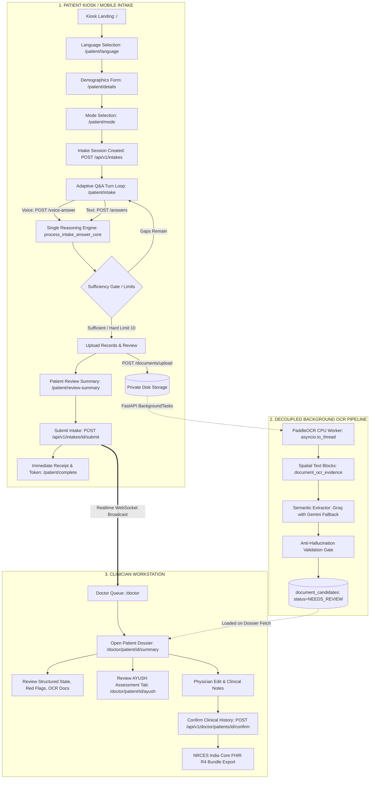
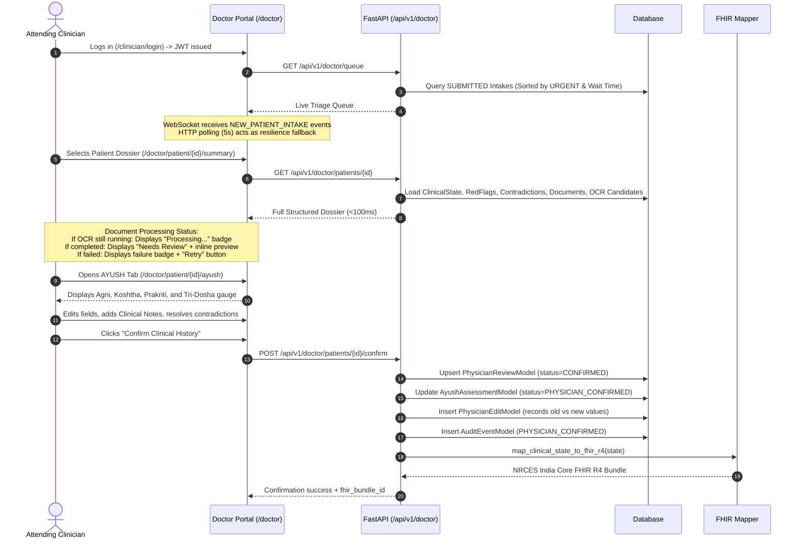

# SwasthyaVaani — End-to-End Application Flow & State Transitions

> **Status:** Canonical Application Flow Source of Truth  
> **Purpose:** Define the exact user journeys, screen transitions, backend operations, API contracts, asynchronous background boundaries, and clinical handoff state machine for SwasthyaVaani.  
> **Relationship:** Implements the product journeys defined in `SwasthyaVaani_PRD.md` according to the technical constraints of `SwasthyaVaani_TRD.md`, `SwasthyaVaani_architecture.md`, and `SwasthyaVaani_rules.md`.

---

## 1. High-Level Lifecycle Map



---

## 2. Core Operational Guarantees

1. **Decoupled Patient Submission**:
   - Patient intake submission (`POST /api/v1/intakes/{id}/submit`) is **strictly decoupled** from document OCR and semantic extraction.
   - The patient **never waits** for PaddleOCR or LLM document extraction to complete before receiving their queue confirmation token. Submission takes **< 5 seconds**.
   - Medical document OCR, candidate extraction, and evidence grounding execute independently in the background.
2. **Single Shared Adaptive Engine**:
   - Voice and text/touch modalities converge into the exact same clinical reasoning function (`process_intake_answer_core`).
   - Modern clinical dimensions and AYUSH assessment dimensions participate in the **same unified engine**, not competing chatbots.
3. **Deterministic State Machine & Safety Brake**:
   - The LLM does **not** choose clinical dimensions, decide when to stop, or control termination.
   - Candidate dimension selection is 100% deterministic via `question_scorer.py`.
   - Information sufficiency stopping is deterministic via `_assess_information_sufficiency()`.
   - Hard safety ceiling: `MAX_QUESTIONS_DEFAULT = 10` questions.
   - Safety screening runs on every turn (`evaluate_red_flags()`). Safety candidates always take absolute precedence.
4. **Physician Authority**:
   - AI outputs are untrusted candidates.
   - The physician remains the final clinical decision-maker. Confirmation is explicit and auditable.

---

## 3. Detailed Step-by-Step Flow

### Step 1: Patient Entry & Welcome
- **Route**: `/` (`src/pages/HomePage.tsx`)
- **User Actions**: Patient arrives at the hospital kiosk or scans QR code on personal mobile. Clicks "Start Intake" / "शुरू करें".
- **State**: No session exists yet. Clean client state.
- **Transition**: Navigates to `/patient` (or `/patient/language`).

### Step 2: Language Selection
- **Route**: `/patient/language` (`src/pages/PatientLanguageSelection.tsx`)
- **Options**: 13 Indic languages displayed with native scripts.
  - **Full End-to-End Multilingual**: English (`en`), Hindi (`hi`), Marathi (`mr`) (complete ASR, TTS, localized prompt phrasing, and full UI localization).
  - **UI Greeting Support**: Bengali, Telugu, Tamil, Gujarati, Kannada, Malayalam, Punjabi, Odia, Assamese, Urdu (greetings localized, interface falls back gracefully to English).
- **Client Storage**: Writes selected language code to `localStorage['sv_selected_language']`.
- **Transition**: Navigates to `/patient/details`.

### Step 3: Demographics & Context
- **Route**: `/patient/details` (`src/pages/PatientDetails.tsx`)
- **Fields Captured**:
  - Full Name (`display_name`)
  - Age (`age`)
  - Gender (`gender`)
  - Mobile Number (`phone`, optional)
  - ABHA ID (`abha_id`, optional, with QR scanning support)
- **Clinical Derivation**: Patient age is preserved to automatically seed the baseline Ayurveda `vaya` (life stage) canonical dimension upon session creation.
- **Client Storage**: Caches profile into `localStorage['sv_patient_profile']`.
- **Transition**: Navigates to `/patient/mode`.

### Step 4: Interaction Mode & Workflow Selection
- **Route**: `/patient/mode` (`src/pages/PatientModeSelection.tsx`)
- **Mode Options**:
  - **Voice Mode**: Audio recording with real-time waveform visualization, silence detection, and voice prompts.
  - **Text Chat Mode**: Conversational messaging UI with quick-response clinical chip suggestions.
- **Workflow Context**:
  - `GENERAL_CLINICAL`: Focuses on modern clinical history (SOCRATES dimensions).
  - `AYUSH`: Focuses on integrated Ayurveda assessment (Prakriti, Vikriti, Agni, Koshtha, Ahara-Vihara, Dashavidha).
  - `DUAL_SYSTEM`: Both clinical and AYUSH candidates compete in the same adaptive candidate pool.
- **Client Storage**: Writes mode to `localStorage['sv_selected_mode']`.
- **Transition**: Navigates to `/patient/intake`.

### Step 5: Intake Session Initialization
- **API Call**: `POST /api/v1/intakes`
- **Request Payload**:
  ```json
  {
    "display_name": "Rajesh Sharma",
    "age": 48,
    "gender": "male",
    "workflow_type": "GENERAL_CLINICAL",
    "language_code": "hi",
    "interaction_mode": "VOICE",
    "hospital_id": "hosp_district_01",
    "doctor_id": "doc_001"
  }
  ```
- **Backend Lifecycle**:
  1. Creates or matches `Patient` record.
  2. Generates unique session token (e.g. `A-D291F4`).
  3. Creates `IntakeSession(status="ACTIVE", question_count=0)`.
  4. Seeds initial `ClinicalStateModel` (version 1) with demographic `vaya`.
  5. If `workflow_type == "AYUSH"`, instantiates and persists `AyushAssessmentModel` with `status="PRELIMINARY"` and demographic `vaya`.
- **Response**: HTTP 200 with `IntakeSessionDetail` (contains `id`, `token`, `clinical_state`).

### Step 6: The Adaptive Clinical Interview Loop

Both Voice and Text modes execute the **exact same adaptive loop**:

```text
Turn 1: Chief Complaint Prompt
   ↓
Patient Answers (Voice or Text)
   ↓
1. Input Normalization & Audio ASR (Sarvam / Bhashini / Mock)
   ↓
2. Fact Extraction: LLMService.extract_clinical_facts() / Mock
   ↓
3. State Merge: Increment ClinicalStateModel.version (Immutable history)
   ↓
4. Safety Screening: evaluate_red_flags() -> tag RED_FLAGS if triggered
   ↓
5. Guardrail Checks: Turns >= 10? Low Progress >= 2?
   ↓
6. Domain Classification: classify_clinical_domains() -> [CARDIAC, GI, OPHTHALMIC, AYUSH, etc.]
   ↓
7. Candidate Scoring: score_candidate_dimensions() -> Information Gain Matrix
   ↓
8. Canonical Mapping & Anti-Loop: Check MAP_TO_CANONICAL and is_semantic_duplicate()
   ↓
9. Information Sufficiency Gate: _assess_information_sufficiency()
   ├── IF SUFFICIENT or NO CANDIDATES → Action: STOP
   └── IF GAPS REMAIN → Action: ASK
        ↓
10. Question Formulation: LLMService.generate_adaptive_question() [phrased in Indic language]
        ↓
11. QuestionEvent Persisted with target_field and next_question_event_id returned
        ↓
12. Patient Receives Next Question (Voice Synthesized via TTS or Text Displayed)
```

#### Modality Parity:
- **Text Endpoint**: `POST /api/v1/intakes/{id}/answers`
  - Body: `{ "raw_text": "...", "input_mode": "TEXT", "question_event_id": "..." }`
- **Voice Endpoint**: `POST /api/v1/intakes/{id}/voice-answer`
  - Multipart: `file` (audio blob), `language_code`, `question_event_id`
  - Server runs ASR, extracts text, calls `process_intake_answer_core(input_mode="VOICE")`, and if next action is `ASK`, synthesizes TTS audio returned as `audio_base64`.

#### Termination Conditions:
- **Clinical Sufficiency**: Core diagnostic dimensions fully characterized (e.g. 3–4 questions for eye redness or gastroenteritis).
- **No Viable Candidates**: All relevant domain dimensions are resolved.
- **Low Progress Brake**: $\ge 2$ consecutive non-informative answers ("idk", "what").
- **Hard Safety Ceiling**: 10 questions max (`MAX_QUESTIONS_DEFAULT = 10`). If limit is reached before complete history, status is marked `LIMITED_HISTORY`.

### Step 7: Document Upload & Decoupled Processing
- **Location**: Substep 1 inside `src/pages/PatientIntake.tsx`
- **User Action**: Patient uploads prescription, lab report, or prior discharge summary (PDF, PNG, JPEG $\le 10$ MB).
- **API Call**: `POST /api/v1/documents/upload`
- **Synchronous Actions**:
  1. Validates magic bytes, page count ($\le 20$), and MIME type.
  2. Computes SHA-256 hash to detect duplicates.
  3. Writes file to private local filesystem (`DOCUMENT_STORAGE_DIR=./private_uploads`).
  4. Inserts row into `documents` table with status `PENDING`.
  5. Enqueues background worker task: `background_tasks.add_task(_background_process_document, doc.id)`.
  6. Returns HTTP 202 Accepted with `document_id` and storage URL in **< 1.5 seconds**.
- **Asynchronous Background Processing** (Runs concurrently, unblocking the user):
  1. Concurrency lock `_ACTIVE_DOCUMENT_PROCESSING` prevents duplicate parallel runs.
  2. Updates document status to `PROCESSING`.
  3. Offloads synchronous PaddleOCR CPU inference to worker thread via `asyncio.to_thread`.
  4. Persists spatial text blocks to `document_ocr_runs` and `document_ocr_evidence`.
  5. Semantic candidate extractor (Groq with automatic Gemini fallback on HTTP 429) extracts medications, lab values, and diagnoses.
  6. Anti-hallucination validation strictly checks that every extracted candidate string is grounded in OCR text blocks.
  7. Persists `document_candidates` and links evidence.
  8. Updates document status to `NEEDS_REVIEW` (or `PROCESSING_FAILED` with error code).

### Step 8: Patient Review Summary
- **Route**: `/patient/review-summary` (`src/pages/PatientReviewSummary.tsx`)
- **Display**: Kiosk displays clean, patient-friendly summary:
  - Chief complaint and main symptoms
  - Duration and onset
  - Pain severity scale
  - Attached medical records notice: *"Document uploaded. Processing will continue in the background."*
  - Explicit consent acknowledgement checkbox
- **User Action**: Patient verifies details and clicks "Submit Intake" / "जमा करें".

### Step 9: Fast Patient Submission
- **API Call**: `POST /api/v1/intakes/{id}/submit`
- **CRITICAL ARCHITECTURE**:
  - **Does NOT await OCR or document extraction.**
  - Synchronous work:
    1. Updates `session.status = "SUBMITTED"`.
    2. Sets `session.submitted_at = now()`.
    3. Reads latest `ClinicalStateModel`. If red flags exist, persists rows to `red_flags` table and sets priority to `URGENT` (`NORMAL` otherwise).
    4. Commits database transaction.
    5. Broadcasts realtime `NEW_PATIENT_INTAKE` WebSocket event to attending doctors.
    6. Returns `IntakeSubmissionResponse` with queue token (e.g. `A-A32451`).
- **Benchmark**: Takes **< 5 seconds** (measured at 4.67s with active OCR running concurrently).
- **Transition**: Navigates to `/patient/complete`.

### Step 10: Submission Confirmation
- **Route**: `/patient/complete` (`src/pages/PatientComplete.tsx`)
- **Display**: Displays large queue token card, estimated wait time, OPD room number, and confirmation message: *"Your intake has been submitted successfully."*

---

## 4. Clinician Workflow & Handoff



---

## 5. System State Machine & Enums

### IntakeSession Status Lifecycle
```text
NOT_STARTED ──► ACTIVE ──► READY_TO_SUBMIT ──► SUBMITTED
                  │                               │
                  ▼                               ▼
            PATIENT_ABORTED               PHYSICIAN_CONFIRMED
```

### Document Status Lifecycle
```text
UPLOAD ──► PENDING ──► PROCESSING ──► NEEDS_REVIEW ──► CONFIRMED
                             │
                             ▼
                     PROCESSING_FAILED (Retryable via POST /{id}/process)
```

### AyushAssessment Status Lifecycle
```text
INITIALIZE ──► PRELIMINARY ──► NEEDS_REVIEW ──► PHYSICIAN_CONFIRMED
```

### Canonical Dimension Statuses
- `UNKNOWN`: Not yet asked or mentioned.
- `KNOWN_TRUE`: Patient confirmed positive (e.g. photophobia present).
- `KNOWN_FALSE`: Patient explicitly negated (e.g. no fever).
- `AMBIGUOUS`: Response unclear; requires clarification.
- `KNOWN_WITH_VALUE`: Characterized with quantitative/qualitative value (e.g. `severity = 7`, `duration = "3 days"`).

---

## 6. Failure & Fallback Matrix

| Component Failure | Automatic Fallback Mechanism | Impact on Patient Intake |
|---|---|---|
| **Speech ASR Fails / Timeout** | Browser Web Speech API fallback in `PatientVoiceChat.tsx` or text prompt fallback. | Intake continues; patient can switch to text chat. |
| **LLM Quota / Timeout** | Primary Groq switches to Gemini; if all fail, `MockLLMProvider` generates pre-compiled clinical questions. | Intake completes deterministically without error. |
| **Groq 8K TPM Saturation during OCR** | `FallbackDocumentExtractor` catches HTTP 429 and immediately reroutes to Google Gemini. | Document candidate extraction succeeds seamlessly. |
| **PaddleOCR Failure** | Document preserved on disk; status marked `PROCESSING_FAILED` with error code; Doctor sees "Retry" button. | **Zero impact on patient.** Intake submission proceeds normally. |
| **WebSocket Disconnection** | Frontend `DoctorPortal.tsx` automatically polls `GET /api/v1/doctor/queue` every 5 seconds. | Real-time queue remains up-to-date. |
| **Database Connection Failure** | Transaction rollback; explicit HTTP 500 returned; no corrupt data saved. | Patient alerted cleanly; no false confirmation. |
